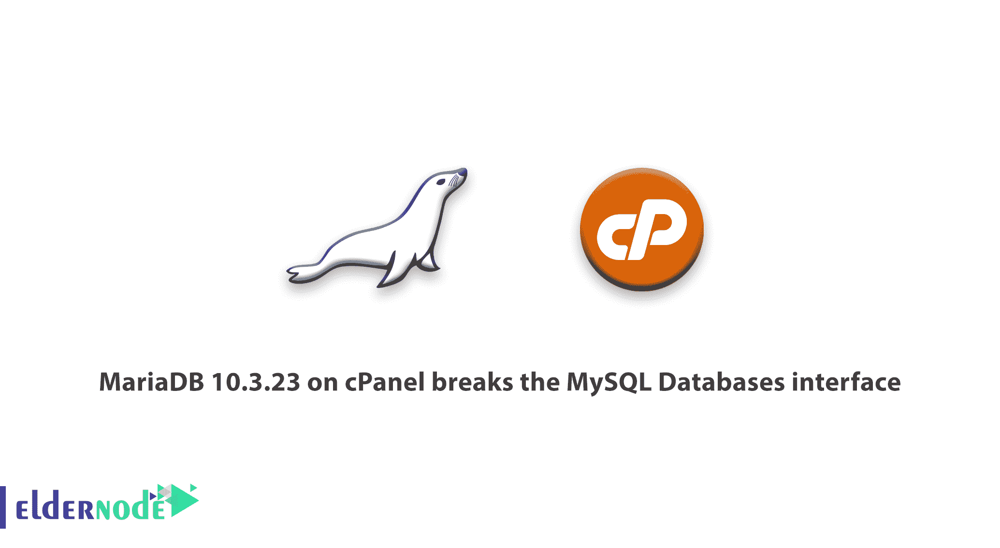

# cPanel 上的 MariaDB 10.3.23 打破了 MySQL 数据库接口- Eldernode

> 原文：<https://blog.eldernode.com/mariadb-10-3-23-on-cpanel-breaks-the-mysql/>



我们想让您知道，我们已经意识到从 MariaDB 10.3.22 更新到 10.3.23 的一个问题。这是显示打破 **cPanel - > MySQL 数据库接口** 。当用包含对 MariaDB 10.3 支持的版本更新 [cPanel](https://blog.eldernode.com/tag/cpanel/) 时，这个 MariaDB 更新自动发生。

## cPanel 上的 MariaDB 10.3.23 在更新后中断

错误症状:

cPanel -> MySQL 数据库界面将显示这些错误:

“MySQL 服务器目前处于离线状态。”

"提取数据时遇到错误:在主机' localhost ' dbdisksused CP USER _ USER 0 disk used 0 DB CP USER _ USER 用户 cpuser_db 上没有为用户' cpses_username '定义此类权限"

#### 如何解决问题:

您需要使用以下命令将 [MariaDB](https://mariadb.org/) 数据库更改为一个较低的版本。

```
yum downgrade MariaDB-server MariaDB-common MariaDB-shared MariaDB-client MariaDB-compat MariaDB-devel 
```

**注意:** 当 cPanel 上的 MariaDB 10.3.23 崩溃，并且您在客户数据库页面上看到如上所示的错误时，此解决方案有效。所以当你想降级你的 MariaDB 的时候一定要小心。

如有疑问，可在[问长辈节点](https://eldernode.com/ask/)提问。