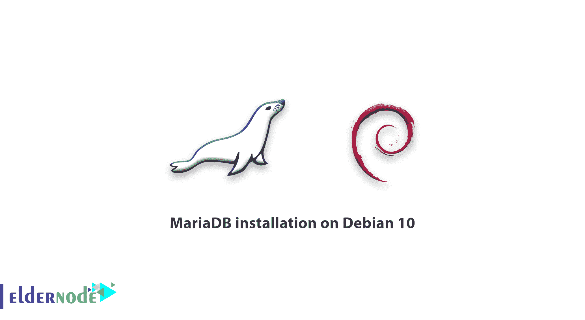

# 教程在 Debian 10 上安装 MariaDB 在 Debian 10 上安装 MariaDB

> 原文：<https://blog.eldernode.com/mariadb-installation-on-debian-10/>



正如你在最近的文章中已经了解到的那样，我们将在 Debian 1 **0 上展示**教程 MariaDB 安装。**介绍一下最流行的开源数据库管理系统之一 MariaDB，我们可以说它是用于流行 LAMP (Linux、Apache、MySQL、PHP/Python/Perl)栈的 MySQL 部分的一个常用替代方案。也是大多数云产品的一部分，也是大多数 Linux 发行版的默认选项。如果你试图安装与 MySQL 服务器相关的包，你应该收到兼容的 MariaDB 替换版本。**

我们将回顾以下步骤，直到安装指南完成。

*   使用 apt 更新您的包索引
*   使用 apt 安装 mariadb-server 包。这个包还引入了相关的工具来与 MariaDB 交互
*   运行附带的MySQL _ secure _ installation安全脚本来限制对服务器的访问

**先决条件**

如果您知道以下内容，本教程可能会更有用:

## 教程在 Debian 10 上安装 MariaDB

### 1- 安装 MariaDB

用 apt 更新你的服务器上的包索引来安装它

```
sudo apt update 
```

要安装软件包，请执行以下操作:

```
sudo apt install mariadb-server 
```

### 2- 配置 MariaDB

运行安全脚本:

```
sudo mysql_secure_installation 
```

此后，您可能会看到一系列提示，要求您对 MariaDB 安装的安全选项进行一些更改。当提示您输入当前数据库 **root** 密码时，请按回车以显示“无”。

下一个提示是关于设置数据库 **root** 密码。键入 N 然后按进入。在 Debian 中，MariaDB 的**根**帐户与自动化系统维护紧密相关。

要接受所有后续问题的默认设置，您可以按下 Y ，然后按下 ENTER，删除一些匿名用户和测试数据库，禁用远程 **root** 登录。

[购买 Linux 虚拟私有服务器](https://eldernode.com/linux-vps/)

### 3- 调整用户认证和权限

您应该创建一个名为 admin 的新帐户，该帐户具有与根帐户相同的功能，但是配置了密码验证。换句话说，**，**从您的终端打开 MariaDB 提示符，运行以下命令。

```
sudo mysql 
```

要创建具有 **root** 权限和基于密码的访问权限的新用户，请更改用户名和密码以匹配您的偏好。

```
MariaDB [(none)]> GRANT ALL ON *.* TO 'admin'@'localhost' IDENTIFIED BY 'password' WITH GRANT OPTION; 
```

您可以刷新权限，以确保它们已保存并在当前会话中可用。

```
MariaDB [(none)]> FLUSH PRIVILEGES; 
```

现在您可以退出 MariaDB shell 了:

```
MariaDB [(none)]> exit 
```

### 4-测试 MariaDB

在安装完默认的存储库之后，MariaDB 应该会自动开始运行。使用下面的命令来测试它。

```
sudo systemctl status mariadb 
```

输出将显示如下。

```
mariadb.service - MariaDB 10.3.15 database server     Loaded: loaded (/lib/systemd/system/mariadb.service; enabled; vendor preset: enabled)     Active: active (running) since Fri 2019-07-12 20:35:29 UTC; 47min ago       Docs: man:mysqld(8)             https://mariadb.com/kb/en/library/systemd/   Main PID: 2036 (mysqld)     Status: "Taking your SQL requests now..."      Tasks: 30 (limit: 2378)     Memory: 76.1M     CGroup: /system.slice/mariadb.service             └─2036 /usr/sbin/mysqld    Jul 12 20:35:29 deb-mariadb1 /etc/mysql/debian-start[2074]: Phase 6/7: Checking and upgrading tables  Jul 12 20:35:29 deb-mariadb1 /etc/mysql/debian-start[2074]: Running 'mysqlcheck' with connection arguments: --socket='/var/run/mysqld/mysqld.sock' --host='localhost' --socket='/var/run/mysqld/mysqld.sock' --host='localhost' --socket='/var/run/mysqld/mysqld.sock'  Jul 12 20:35:29 deb-mariadb1 /etc/mysql/debian-start[2074]: # Connecting to localhost...  Jul 12 20:35:29 deb-mariadb1 /etc/mysql/debian-start[2074]: # Disconnecting from localhost...  Jul 12 20:35:29 deb-mariadb1 /etc/mysql/debian-start[2074]: Processing databases  Jul 12 20:35:29 deb-mariadb1 /etc/mysql/debian-start[2074]: information_schema  Jul 12 20:35:29 deb-mariadb1 /etc/mysql/debian-start[2074]: performance_schema  Jul 12 20:35:29 deb-mariadb1 /etc/mysql/debian-start[2074]: Phase 7/7: Running 'FLUSH PRIVILEGES'  Jul 12 20:35:29 deb-mariadb1 /etc/mysql/debian-start[2074]: OK  Jul 12 20:35:30 deb-mariadb1 /etc/mysql/debian-start[2132]: Triggering myisam-recover for all MyISAM tables and aria-recover for all Aria tables
```

您可以在使用sudo system CTL start MariaDB命令运行之后启动 Maria db，但是要进行更多检查，请尝试使用 mysqladmin 工具连接到数据库。此外，例如，下面的命令意味着以 root 身份连接到 MariaDB。并使用 Unix 套接字返回版本:

```
sudo mysqladmin version 
```

应该会显示类似下面的输出。

`输出`

```
`mysqladmin  Ver 9.1 Distrib 10.3.15-MariaDB, for debian-linux-gnu on x86_64  Copyright (c) 2000, 2018, Oracle, MariaDB Corporation Ab and others.    Server version      10.3.15-MariaDB-1  Protocol version    10  Connection      Localhost via UNIX socket  UNIX socket     /var/run/mysqld/mysqld.sock  Uptime:         48 min 14 sec    Threads: 7  Questions: 474  Slow queries: 0  Opens: 177  Flush tables: 1  Open tables: 31  Queries per second avg: 0.163`
```

`在配置的情况下，单独的管理用户进行密码验证。之后，通过运行下面的命令执行相同的操作。`

```
`mysqladmin -u admin -p version` 
```

`**总之**，MariaDB 已启动并运行，您的用户现在能够成功认证。`

`亲爱的用户，我们希望您喜欢本教程，您可以在评论区提出关于本次培训的问题，或者解决[老年节点培训](https://eldernode.com/blog/)领域的其他问题，请参考[提问页面](https://eldernode.com/ask)部分并在其中提出您的问题。`

`**建议改为**`

`[教程 Ubuntu 上的 Mariadb 安装](https://eldernode.com/mariadb-installation-on-ubuntu/)`

`[用 Debian 10 初始设置](https://eldernode.com/initial-setup-with-debian-10/)`