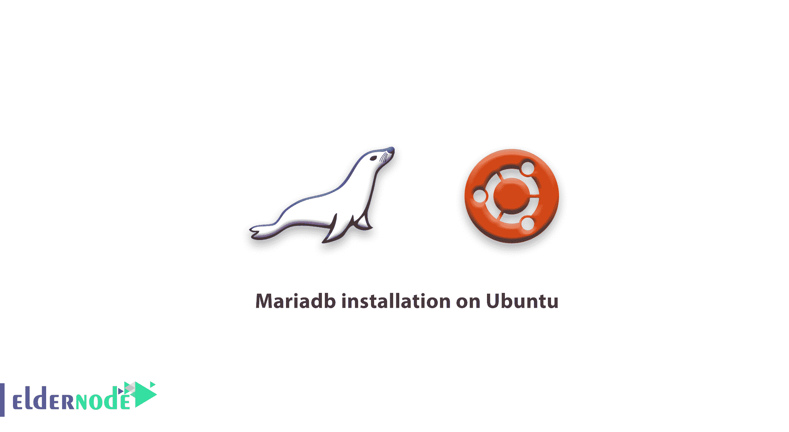

# 教程 Mariadb 在 Ubuntu 上的安装

> 原文：<https://blog.eldernode.com/mariadb-installation-on-ubuntu/>



之前，我们解释了 Mariadb，在这篇文章中，你可以阅读教程 MariaDB 在 Ubuntu 上的安装。

[MariaDB](https://eldernode.com/mariadb-10-3-23-on-cpanel-breaks-the-mysql/) 是一个使用 MySQL 分支，使用 MariaDB 存储引擎作为存储引擎的数据库系统。
在数据库进入市场之初，专家和程序员并不欢迎它，认为它不具备与 MySQL 竞争的力量，但没过多久程序员就开始使用这个数据库

因为他们发现，MariaDB 数据库的中央核心类似于 MySQL，所以它与这个数据库一起工作没有任何问题。

最后，MariaDB 数据库的其他新优势，以及它在某些类型的数据上比 MySQL 更好的性能，使这个数据库成为一个好地方，您可以在文章中找到更多信息

## 教程在 Ubuntu 上安装 MariaDB】

在这篇文章中，我们将向你学习如何安装这个流行的数据库。你可以通过输入一些简单的 [Linux](https://de.wikipedia.org/wiki/Linux) 命令在 Ubuntu 上轻松安装它。

在 Ubuntu 和 Linux 上安装 [MariaDB](https://eldernode.com/whats-mariadb-how-it-works/) 非常简单，因为 MariaDB 包在 Ubuntu 的存储库中，所以输入几个命令就可以完成安装。

### 如何在 Ubuntu 上安装 MariaDB

要处理一个完美的安装，您需要回顾两个步骤。

1-首先，**输入下面的命令，确保**Ubuntu 已经更新。

```
apt-get update –y 
```

2-更新后，从存储库中下载并安装 MariaDB 文件。

```
apt-get install mariadb-server
```

### 安装后

如你所见，你简单地安装了 MariaDB！当您完成安装时，您可以输入以下命令来验证您是否已经正确和完整地执行了安装。

```
mysql -u root -p 
```

然后，在运行 MariaDB 服务之前，它会询问您在安装过程中输入的密码。

最后，MariaDB 在 Ubuntu 上的安装已经完成，您可以通过输入以下命令来启动该服务。

```
service mysql start 
```

尊敬的用户，我们希望您喜欢本教程，您可以在评论区提出关于本次培训的问题，或者解决 [Eldernode](https://bit.ly/2Y5rVUu) 培训领域的其他问题，请参考 [提问页面](https://eldernode.com/ask) 部分，并尽快提出您的问题。腾出时间给其他用户和专家来回答你的问题。