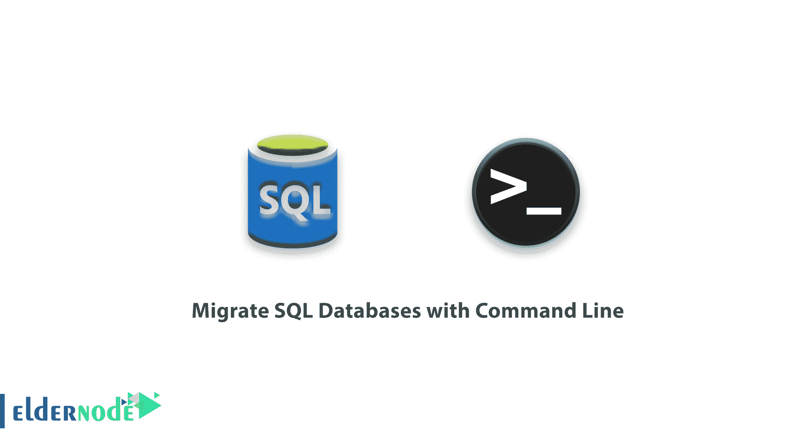
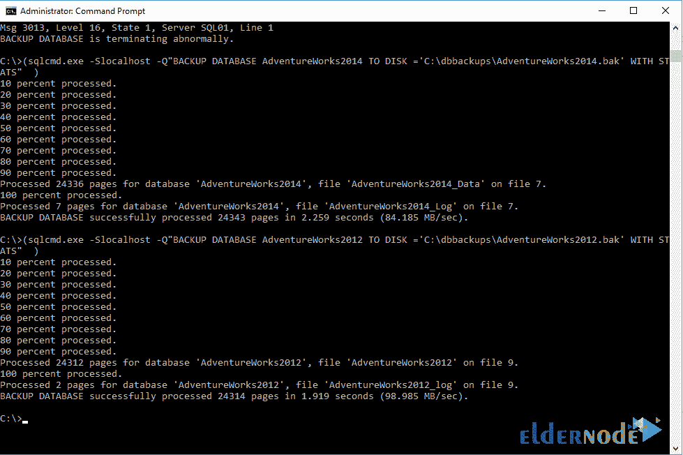

# 如何使用命令行迁移 SQL 数据库-windows VPS 服务器

> 原文：<https://blog.eldernode.com/migrate-sql-databases/>



如何用命令行迁移 [SQL](https://en.wikipedia.org/wiki/SQL) 数据库？今天我们想体验一下通过命令行使用 SQL 数据库的工作。我发现通过命令行运行一些查询来操纵一个表或创建一个数据库或查看表中的信息是非常令人愉快的。本文的目的是提供一种不需要人工干预就可以导出和导入所有数据库的方法。

[**买 Windows VPS 托管，便宜的 Windows VPS**](https://eldernode.com/windows-vps/)

## 如何备份源服务器上的数据库

**1。** 第一步，在**源服务器**上打开 **SSMS** ( 微软 SQL Server Management Studio )。

**a.** 登录到 **SQL 实例**并**打开** a 新建查询窗口。

**b.** 运行下面的查询。这个命令将输出服务器上所有 MSSQL 数据库的列表。

```
SELECT name FROM master.sys.databases
```

**c.** 你可以在结果中的任意位置**点击**，使用键盘快捷键CTRL+A(Mac 用户使用 Command + A )选择所有数据库将此列表复制出来。

**d .右键单击**并在高亮显示所有数据库后选择复制。

**2。** 打开记事本文本编辑器。

**a.** 将粘贴到您的结果中，并删除您不希望迁移的所有数据库(在新复制的记事本文本中)，同时删除以下条目:

主人

临时数据库

型号

msdb

**b.** 这些条目是系统的数据库，没有必要复制。

[**虚拟主机计划**](https://eldernode.com/linux-hosting/)

确保删除所有内容，除了您需要迁移的数据库。

现在，您应该有一个由一行分隔的所有必需数据库的列表。即

冒险家 2012

冒险家 2014

AdventureWorks2016

**3。** 将这个结果在电脑上保存为 **C:\databases.txt** 。

**4。T3 创建一个新记事本窗口。**

复制 / 粘贴以下内容到文档中保存为 **C:\db-backup.bat**

```
mkdir %systemdrive%\dbbackups  for /F "tokens=*" %%a in (databases.txt) do ( sqlcmd.exe -Slocalhost -Q"BACKUP DATABASE %%a TO DISK ='%systemdrive%\dbbackups\%%a.bak' WITH STATS" )
```

**5。** 在你将文件保存为 C:\db-backup.bat 后，导航到开始菜单并键入 cmd 和**在命令提示符上右击**选择以管理员身份运行。

键入以下命令并点击回车:

```
cd C:\
```

**再次输入** db-backup.bat 并点击回车。

此时，您的数据库已经开始导出，您将看到每个数据库导出的进度百分比，如下图所示:



注意任何失败的数据库，因为当它完成时，您可以重新运行批处理文件，只使用可能已经失败的数据库。

如果数据库备份失败，请注意在命令提示符中显示的错误消息。

通过修改现有的 **C:\databases.txt** 文件以仅包含失败的数据库，并重新运行 db-backup.bat 直到所有数据库都成功导出来解决错误。

## 如何将数据库恢复到目标服务器

您有包含的文件夹 **C:\dbbackups\** 。为您想要迁移的每个数据库 bak 文件。

你需要复制文件夹和你的 **C:\databases.txt** 文件到目的服务器。

有许多方法可以将数据移动到目标服务器。比如，可以用 **USB** 、 **Robocopy** ，或者 **FTP** 。
目标服务器的 C 驱动器上的文件夹应该叫做 C:\dbbackups 。准确命名文件很重要，因为我们的脚本将寻找。bak 文件在这里。

[**VPS 托管计划**](https://eldernode.com/vps-hosting/)

如何用命令行迁移 SQL 数据库？

确保目标服务器也有您的 **C:\databases.txt** 文件，因为我们的脚本将在这里寻找数据库名称。

**1。** 再次打开一个记事本文本编辑器。

然后复制 / 粘贴以下内容到文档中保存为 C:\db-restore.bat

```
for /F "tokens=*" %%a in (C:\databases.txt) do (  sqlcmd.exe -E -Slocalhost -Q"RESTORE DATABASE %%a FROM DISK='%systemdrive%\dbbackups\%%a.bak' WITH RECOVERY"  )
```

**2。** 将文件另存为 **C:\db-restore.bat**

**3。导航**到开始菜单并键入 cmd 。

**4。** **在命令提示符上右击**，选择以管理员身份运行。

**5。** 输入下面的命令，按回车:

```
cd C:\
```

**6。** 键入 db-restore.bat 并敲击回车。

您的数据库现在已经开始导入。

现在，您将看到每个数据库的恢复百分比，以及针对每个已成功处理的数据库的消息RESTORE DATABASE successfully processed。

记下任何失败的数据库，因为当批处理文件完成后，您可以**重新运行**批处理文件，只使用失败的数据库。

如果数据库无法备份，请记下命令提示符中显示的错误消息，解决错误(您可以根据需要更改批处理文件)，修改 **C:\databases.txt** 以仅包含失败的数据库，并重新运行 db-restore.bat ，直到所有数据库都成功导出。

**亦作，见:**

[教程在 Windows Server 上安装 SQL Server 2019 开发者版](https://eldernode.com/install-sql-server-developer-edition-on-windows-server/)

**尊敬的用户**，我们希望您能喜欢这个[教程](https://eldernode.com/category/tutorial/)，您可以在评论区提出关于本次培训的问题，或者解决[老年人节点培训](https://eldernode.com/blog/)领域的其他问题，请参考[提问页面](https://eldernode.com/ask)部分，并尽快提出您的问题。腾出时间给其他用户和专家来回答你的问题。

好运。