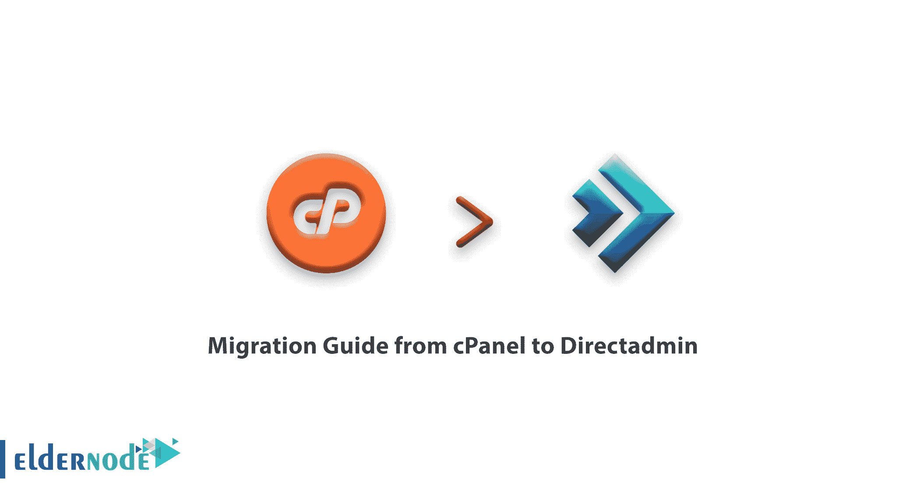

# 教程如何从 cPanel 迁移到 Directadmin - Eldernode

> 原文：<https://blog.eldernode.com/migration-guide-from-cpanel-to-directadmin/>



从 cPanel 到 Directadmin 的迁移指南教程。

我们想知道关于从 [cPanel](https://blog.eldernode.com/tag/cpanel/) 迁移到 DirectAdmin 的信息。

### 如何将指南从 cPanel 迁移到 Directadmin

先决条件

请注意，我们将使用 root 帐户进行日志记录。在两台服务器之间传输数据时，您应该使用没有权限的帐户，因为这通常是更好的安全做法。

清单:

–确保目标服务器上的硬件高于源服务器的硬件规格。您可以从我们的[专用服务器](https://eldernode.com/dedicated-server/)或 [VPS](https://eldernode.com/vps/) 中选择不同的配置。

–确保您的订单中包含了 [DirectAdmin](https://directadmin.com/) 许可证。

–确保目标服务器上的 IPv4 地址数量与源服务器相同。

步骤 1:下载转换工具

下载 cpanel 到 DirectAdmin 帐户转换工具

```
wget https://eldernode.com/wp-content/uploads/2020/04/da.cpanel.import.9.4.tar_2.gz 
```

步骤 2:创建路径

该工具将需要用于转换的导入和导出路径。我们现在将创建导入和导出目录。

```
mkdir import export 
```

步骤 3:将文件复制到“导入”目录

我们现在将用户备份从 cPanel 复制到导入目录。

您可以在 [cPanel](https://cpanel.net/) GUI 中或使用以下命令创建备份。

```
/scripts/pkgacct USERNAME 
```

该工具将隐藏由两者创建的备份

```
the ‘/scripts/pkgacct script  cPanel’s ‘Full Backup’ GUI tool 
```

使用 cPanel 在源服务器上运行以下命令，其中需要用新 DirectAdmin 服务器的用户和 IP 地址替换[【email protected】](/cdn-cgi/l/email-protection)。

```
rsync -av /home/cpmove-USER.tar.gz [[email protected]](/cdn-cgi/l/email-protection):/import/ 
```

在本例中，备份文件的名称是 cpmove-USER.tar.gz。每个账户的情况都不一样。

步骤 4:匹配配置

编辑 defaults.conf 以匹配 DirectAdmin 目标服务器。您只能更改 IP 和名称服务器字段。

步骤 5:执行模块

使用下面的命令继续执行该模块，并按照屏幕上的说明进行操作。

```
perl da.cpanel.import.pl 
```

步骤 6:移动转换后的备份

该工具转换完备份后，将新文件从“导出”目录移动到任何 DA

```
/home/RESELLER/user_backups directory. 
```

在这种情况下，我们以用户“admin”为例。

```
mv ./export/admin.tar.gz /home/admin/user_backups/ 
```

步骤 7:恢复备份

我们现在将在 DirectAdmin GUI 中恢复备份。借助经销商级别的“管理用户备份”工具。

我们希望您发现从 cPanel 迁移到 DirectAdmin 很容易。