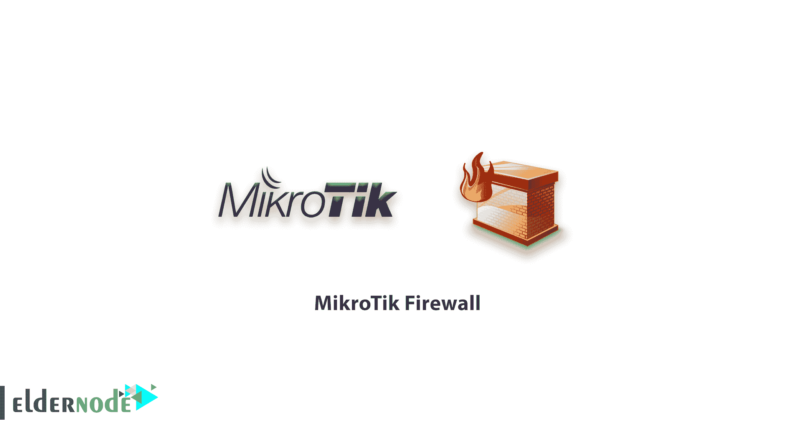
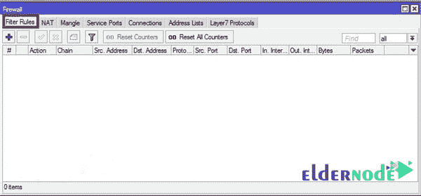
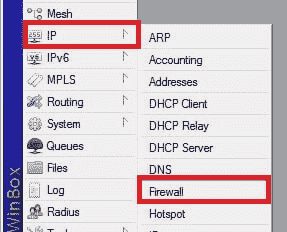
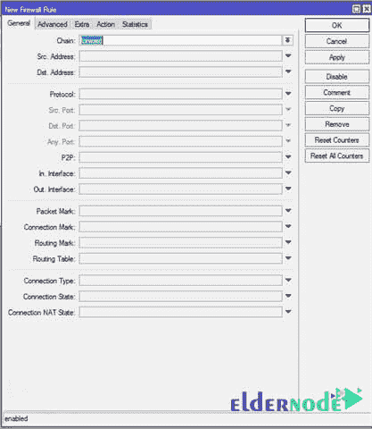
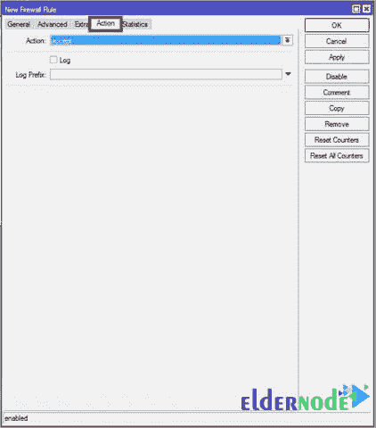
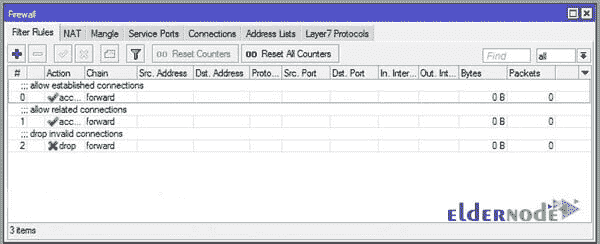

# MikroTik 防火墙-高级- ElderNode 博客

> 原文：<https://blog.eldernode.com/mikrotik-firewall/>

[MikroTik](http://eldernode.com/mikrotik-vps-server/) 防火墙；MikroTik 防火墙是该路由器使用最广泛的部分之一。虽然这种防火墙并不完美，但您可以广泛使用它来保护您的路由器。

像大多数路由器一样，MikroTik 配备了防火墙。由于 [MikroTik 公司](https://mikrotik.com/)像主要的网络设备供应商一样，没有独立的网络防火墙，它使其路由器内部的防火墙装备得更好一些。

虽然这种防火墙绝不能取代 UTM 或硬件防火墙，但它可以用于成本至关重要的项目中。

如果您有大量的防火墙卷或您正在广泛使用第 7 层防火墙，在选择正确的板路由器时要非常小心，以便您的路由器的服务质量不会受到影响。

要从左侧菜单访问 MikroTik 防火墙，首先选择 **IP** ，然后选择防火墙。在弹出窗口中，转到**过滤器角色**选项卡。

### **mikro tik 防火墙中的链定义:**

默认情况下，MikroTik 防火墙有三个链。

1.  **输入链**:当一个包的目的地是路由器本身时，这个包在输入链中。就像当你使用 MikroTik 作为 DNS 服务器时，DNS 包在输入链中。
2.  **输出链:**源地址为路由器本身的数据包。例如路由器发送到互联网以设置其时钟的 NTP 数据包。
3.  **转发链:**打算通过路由器的数据包。例如当路由器仅路由分组并且分组的源和目的地地址不是任何路由器板地址时。

为 MikroTik 添加新纸卷非常简单。

点击**添加**标志，进入**常规**选项卡。然后选择您想要的链条。根据场景填写字段。请注意，将任何字段留空意味着该字段不重要。

然后转到**操作**选项卡，选择适合该角色的包的防火墙功能类型。

三个重要的 MikroTik 动作如下:

1.  **接受:**该功能允许数据包通过。
2.  **Drop:** 此操作丢弃数据包，不将结果发送给发送方。
3.  **Reject:** 此操作丢弃数据包，并将结果报告给发送方。

为了获得更好的防火墙性能，请确保将这三个卷放在高优先级防火墙中。否则，一些辊可能无法正常工作。

要应用这些卷，只需将以下命令复制到 MikroTik 终端中:

| /ip firewall filtera)add chain = forward connection-state = established comment = "允许已建立的连接"b)add chain = forward connection-state = related comment = "允许相关连接"c)添加链=转发连接-状态=无效操作=丢弃注释= "丢弃无效连接" |

祝您好运