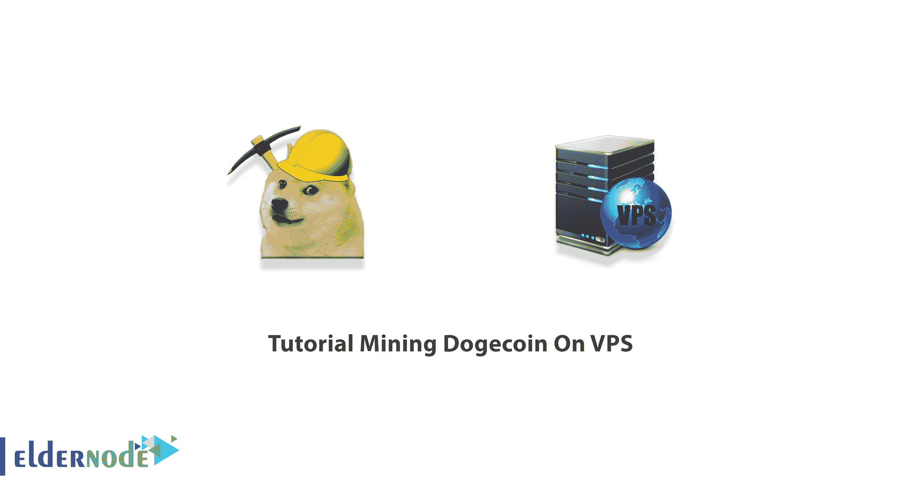
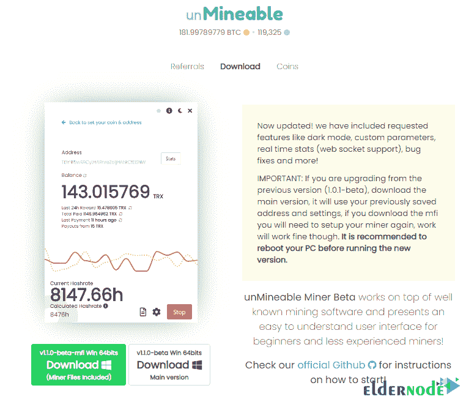
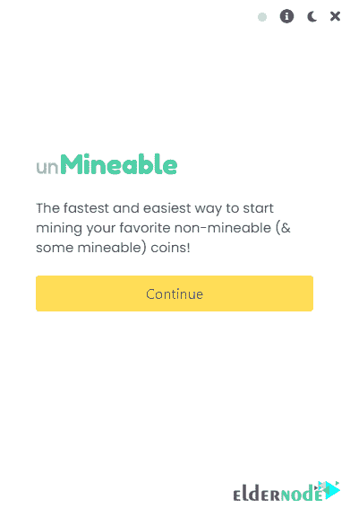
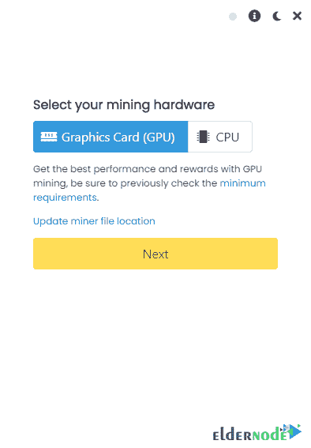
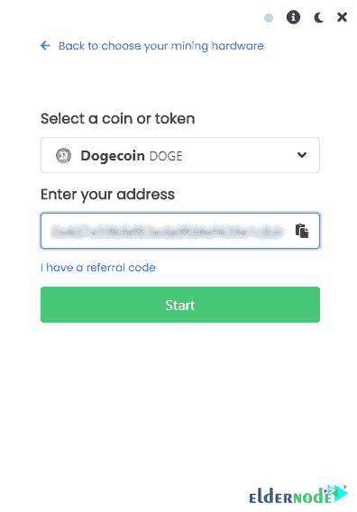

# VPS [2021]上的教程采矿 doge coin-elder node 博客

> 原文：<https://blog.eldernode.com/mining-dogecoin-on-vps/>

和比特币、以太币一样，Dogecoin 是一种加密货币。比利·马库斯和杰克逊·帕尔默在 2013 年末创建了 Dogecoin。每种加密货币都有自己的区块链。它运行在区块链技术上，像其他加密货币一样，Dogecoin 的区块链网络使用加密技术来保证所有交易的安全。加密货币市场是传统银行系统的替代品。区块链通过每天创造数百万新的狗窝来奖励矿工们的工作。所以，加入我们来回顾一下**教程 VPS** 上的采矿狗。

## **VPS**上的采矿海关关长

加密货币正在改变世界。因此，你可能喜欢能够使用数字货币，而不需要处理纸币和硬币货币的麻烦。Litecoin 和 Dogecoin 合并采矿。所以，你可以在同一个过程中开采两种硬币。虽然采矿 Dogecoin 比采矿 Litecoin 或[比特币](https://eldernode.com/bitcoin-vps/)快得多，但它的价值仍然比它们低得多。之前， [Dogecoin](https://blog.eldernode.com/dogecoin-and-buy-rdp-with-dogecoin/) 已介绍给您，您已了解如何使用 Dogecoin 在 Eldernode 上购买您认为合适的服务。现在和我们一起回顾如何在你的 VPS 上挖掘 Dogecoin。在此之前，请阅读关于挖掘本身的简要介绍，并查看一些可能有用的技巧。

### **什么是挖矿？**

由于采矿有点像挖掘黄金或钻石，所以被称为采矿。所以，你会用你的电脑来寻找加密硬币，而不是用铲子来挖掘。加密挖掘是在线论坛中的一个热门话题，它意味着通过使用计算机解决加密方程来获得加密货币。这被认为是对你完成工作的奖励。收集加密货币的过程称为加密货币挖掘，涉及验证数据块并将交易记录添加到称为区块链的公共记录中。不同的硬币使用不同的挖掘新货币的方法，并提供不同的奖励。

要知道加密采矿是否合法，你需要检查两个注意事项:

1-您的**地理位置**

2-你是否**通过合法手段挖掘密码**。

然而，总的答案是肯定的，加密挖掘是合法的。

### **Dogecoin 挖掘提示**

在当前的 Dogecoin 难度等级下，需要 0.010 天才能开采 1 个 Dogecoin，同时还需要开采散列率和区块奖励。当许多计算机同时处理同一事务块时，将新事务块添加到旧事务块的节点将获得新硬币。使用复杂的数学方程帮助您完成交易并首先获胜，然后将新确认的交易块附加到区块链的其余部分。由于大多数加密货币挖掘都是以这种方式进行的，因此 Dogecoin 挖掘在一些重要领域表现不同:

**1-** **算法:**

每种货币代码都设定了一套提取新硬币的规则。这些规则被称为挖掘或哈希算法。

**2-** **封锁时间:**

审查交易块并将其添加到区块链所需的平均时间。挖矿 Dogecoin 比挖矿莱特币或者比特币快很多。

**3-** **难度:**

一个数字，表示提取每个新块的难度。你可以通过考虑难度来计算你获得奖励的几率。提取难度可能因网络中活动矿工的数量而异，有时网络协议会设置交换代码以保持块提取时间恒定。

**4-** **奖励:**

作为奖励给予每个新区块矿工的货币数量。在 2021 年的前几个月，一万美元的奖励价值不到三十美元。

## **VPS**上采矿 Dogecoin 的先决条件

正如我们提到的，在开始 Dogecoin 挖掘之前，您需要考虑一些基础。首先，一个良好的、无盖的互联网连接是必须的。除了装有 T2 视窗 T3、OS X 或 T4 Linux T5 操作系统的电脑，你需要一个地方来存放你的狗。

### **Dogecoin 钱包**

建议您使用软件或硬件钱包，而不是**在线钱包**。使用你的钱包可以查看你的**狗狗地址**。Dogecoin 有两种钱包， *Multidoge* 和 *Dogecoin Core* 。在 Dogecoin 采矿中，您将需要一个完整的钱包( **Dogecoin Core** )。你会在“**多收**部分找到。复制并安全保存地址，以便在采矿时使用。一旦你准备好了，检查软件和硬件。一些软件钱包包括 [MyEtherWallet](https://myetherwallet.com/) 、 [Metamask Wallet](https://metamask.io/download/) 、 [Trust Wallet](https://trustwallet.com/) 和 [Coinomi Wallet](https://www.coinomi.com/en/downloads/) 。

### **采矿所需的硬件**

****1- CPU****

****2 个 GPU(显卡)****

****3- Scrypt ASIC 挖掘器****

### ****doge coin 采矿所需软件****

**一旦你准备好你考虑的硬件，回顾一下你需要使用什么软件。**

**1-如果只是想尝试挖矿，可以用电脑的 **CPU** 。否则，不值得！**

**此外，请注意，这可能会导致功能较弱的计算机过热，从而导致损坏。不过，你可以使用免费的 **CPU miner** 软件。**

**2-在用 **GPU** 挖矿的情况下，你可以找到更多的软件选项，比如***【cuda miner】******CG miner******easy miner***。**

**3-如果 **Scrypt ASIC miner** 是你的选择， ***MultiMiner*** 可能是一个理想的软件。这对于像莱特币和 Dogecoin 这样的基于加密的货币来说是很棒的。**

### ****如何成为 Dogecoin 矿工****

**选择了所需的硬件和软件后，您就可以开始挖掘 Dogecoin 了。你将有两种方式来做这件事:**单飞**和**联营**。如果你是初学者，建议你使用池道。在下文中，您将熟悉这两种方法之间的差异以及它们的优缺点。**

**当您选择**池方式**时，您将**增加**赢得确认交易比赛的几率。此外，你必须**支付费用**，但当池中的一个节点确认交易时，它会在池的用户之间平均分配奖励。与单枪匹马的矿工相比，联营采矿的次数要多得多。开采完一个区块，工具奖励的一小部分会给你。**

**很明显，如果你通过选择**单飞方式**，你将拥有**的全部奖励**而你做**而不是**必须分享它或支付费用。但是确认一笔交易可能需要很长时间(几周甚至几个月)。既然单飞的方式很难盈利，那你可能只是在电费上多花点钱。**

## ****如何在 VPS 上挖掘 doge coin****

**由于 Dogecoin 使用 Scrypt 来指导新货币的挖掘，它需要的电力要少得多。因此，更多的人将能够很容易地挖掘它，因为挖掘 Dogecoin 可以用不太强大的计算机来实现。在这一部分的继续中，加入我们来教你如何在 VPS 上挖掘 Dogecoin。做到这一点需要三个基本但非常简单的步骤:**

****1。购买[VPS](https://eldernode.com/vps/)****

****2。拥有狗币钱包地址****

****3。下载、安装和运行采矿 Dogecoin 软件****

**采矿 Dogecoin 的第一步是买一个 VPS。您可以访问 [Eldernode](https://eldernode.com/) 中提供的包来购买您想要的 VPS 服务器。在你购买了你想要的服务后，你现在应该在你的**窗口开始菜单**中搜索并运行**远程桌面连接**。打开远程桌面连接窗口后，你必须输入你的**用户名**和**密码**，点击**连接**进入 VPS 服务器环境。**

****

**下一步是运行 Chrome、Firefox 或其他浏览器。现在你需要去 **[无法通行的网站](https://www.unmineable.com/miner)** 下载软件，如下图:**

****

**下载完**无法运行的软件**后，双击它，在打开的窗口中点击**运行**。然后点击**继续**，如下图所示:**

****

**您会注意到，您有两种选择来进行挖掘:**

****1)使用显卡挖掘(GPU)****

****2)利用 CPU 挖掘****

**选择一个您想要的选项后，点击下一个的**:****

****

**下一部分是关于选择货币和输入你想要的钱包的地址。您可以点击“**选择硬币或代币**”部分中的 Dogecoin，轻松选择 Dogecoin。同样在“**输入您的地址**部分，您必须输入您的 Dogecoin 钱包地址，然后点击**开始**。**

****

*****注:*** 使用前面介绍的软件，您可以创建一个钱包，选择 Dogecoin 货币后，如上图所示输入其地址。**

**通过检查软件如何工作，并参考你的 Dogecoin 钱包，你会看到 Dogecoin 采矿是成功的。**

## **结论**

**使用加密货币有助于您实现更大的隐私和对财务的控制。在比特币区块链上，批准新区块的过程需要 10 分钟，而在区块链的 Dogecoin 上只需要 1 分钟。在本文中，我们试图让您完全熟悉术语挖掘。我们还教了你如何在 VPS 上挖矿。**