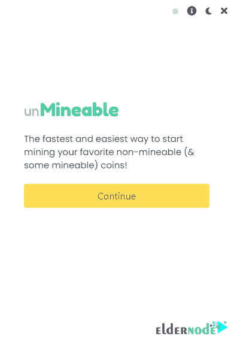

# Windows 10 VPS 上的以太坊挖掘教程- Eldernode 博客

> 原文：<https://blog.eldernode.com/mining-ethereum-on-windows-10/>

以太坊被称为数字货币女王，是市场上第二受欢迎的数字货币，它的未来充满希望。由于这个网络的流行，许多人加入了它的矿工。这是开放区块链的一个有趣的特性，每个人都可以参与挖掘和交易验证。在这篇文章中，我们将一步一步地教你关于教程**在 Windows 10 VPS 上挖掘以太坊**。

## **如何在 Windows 10 上挖掘以太坊 VPS**

一般来说，挖掘以太坊需要经过以下过程:

1-购买 [Windows 10 VPS](https://eldernode.com/windows-vps/)

2-创建一个以太坊钱包以接收开采的以太

3-通过运行采矿软件和加入采矿池开始工作

在你进入挖矿以太坊培训之前，你要知道这就像一项投资，每一项投资都是有风险的。所以，挖掘以太坊或者其他任何数字货币，并不意味着给设备加电就能发财。

以太价格、电费、硬件成本、硬件折旧等诸多因素。在采矿盈利方面发挥重要作用。此外，虽然开始挖掘似乎是一项简单的任务，但这项活动有许多技术复杂性，如果忽视这些复杂性，有时会导致硬件故障甚至火灾。

在这篇文章的续篇中，加入我们来教你如何在 [Windows](https://blog.eldernode.com/tag/windows/) 10 VPS 上挖掘以太坊。

### **采矿简介**

采矿这个词是加密货币领域广泛使用的一个常用词，一些人正在寻求进入这个领域。你可能听说过，在加密货币的世界里，采矿是一项利润丰厚、有些困难且成本高昂的活动。

因为比特币、以太坊等加密货币本质上是去中心化的，它们的网络需要世界各地的人都参与到网络的生活中，并为网络提供服务。参与其中的人肯定不会倒霉，网络以数字货币的形式为他们的服务提供奖励。这些奖励产生了比特币、以太坊等数字货币。

### **采矿类型**

挖掘可以分为三个部分:硬件、软件和平台，我们将在下面解释每一部分:

**1。硬件挖掘**

这种类型的挖掘是针对基于工作证明(POW)运行的网络；比如比特币，以太坊，等等。这种挖掘方法需要强大的硬件，如具有高处理能力的显卡和 CPU，虽然速度快，但消耗大量能量。这导致了通过显卡和 CPU 进行硬件挖掘的过时，以及功耗低得多的 ASICs 的引入。

**2。软件挖掘**

这种类型的开采不需要使用强大的硬件，而是需要参与开采过程的采矿者的资产数量。正在挖掘的网络不同于 POW 结构，它们的网络基于 POS 和 DPOS 等方法运行。在这个网络中，矿工通过在期望的网络中承诺一定数量的令牌来开始挖掘过程。

**3。站台**

这种类型的挖掘不需要强大的硬件或硬币和代币来为网络提供服务。通过嵌入式平台，可以向网络提供服务，并且可以接收数字货币形式的奖励。这些服务就像是提供一部分硬盘、CPU、显卡等。取决于每个平台的机制，如何向其网络提供服务。

## **在 Windows 10 上挖掘以太坊 VPS**

在本教程中，我们决定教你如何以一种简单的方式挖掘以太坊。在这些步骤中，第一步是拥有 Windows 10 VPS。然后你需要创建以太坊钱包的地址，最后一步，下载并运行挖掘以太坊所需的软件。请继续关注我们的这篇文章。

### **VPS 为以太坊挖掘**

用 VPS 挖掘以太坊是今天有自己粉丝的方法之一。尤其是对于那些无法提供一个[专用服务器](https://eldernode.com/dedicated-server/)并组装强大矿用系统并升级的人。

***注:*** 可以看到 [Windows VPS](https://eldernode.com/windows-vps/) 包可以在 Eldernode 进行以太坊挖矿。

总的来说，如果我们想用 VPS 研究以太坊采矿，看看选择这种方法对我们有什么好处，我们可以提到以下几点:

–您指定的资源，即硬盘、RAM 和 CPU 的数量完全由您独占。

–在选择操作系统类型方面没有限制。

–您可以随时升级指定的资源。

–以管理员身份访问是完全可能的。

–共享时非常安全。

–获得独家知识产权的能力

当你选择一个伟大的以太坊矿业服务提供商 VPS 时，一个肯定会出现并且可能会让你困惑的问题是，选择标准是什么？我们如何知道我们是否从好的服务提供商那里得到了 VPS 服务器？

我们帮助您选择最佳服务提供商，通过 VPS 服务器开始以太坊采矿:

1-所有资源都应该是独占的

安装操作系统和以太坊采矿程序是免费的

3-应向您提供管理面板

4-可以为您升级资源和服务器

5-即使支付更多费用，也可以制作备份副本

6-有一个非常强大的防火墙来维护系统安全

7-高正常运行时间，表明系统的可用性及其永久和不间断的连接。

### **如何制作以太坊钱包**

制作以太坊钱包并获取其地址的过程非常简单。有许多流行的以太坊数字货币的钱包，你可以根据自己的喜好使用。你可以把你的以太坊钱包想象成你的银行账户，可以用来接收、存储和发送以太坊。

以太坊软件钱包完全免费，可以轻松安装在手机(Android 和 iOS)或个人电脑(Windows、 [Linux](https://blog.eldernode.com/tag/linux/) 和 Mac)上。一些钱包也是基于网络的，可以连接到互联网浏览器(如 Chrome)。但更安全的硬件钱包是物理上可用的，必须购买。

以下是一些最好的以太坊钱包:

1) [我的钱包](https://myetherwallet.com/)

2) [Metamask 钱包](https://metamask.io/download/)

3) [信任钱包](https://trustwallet.com/)

4) [Coinomi 钱包](https://www.coinomi.com/en/downloads/)

不要忘记，在区块链和数字货币的世界里，每个人都要对自己的资产负责。因此，备份您的钱包非常重要，这样，如果您的钱包密码丢失或安装应用程序的设备崩溃，您就可以找回您的钱。

***注:*** 获得的数百万美元资金因缺乏后援而丢失。

钱包通常向用户显示一组 12 或 24 个英语单词作为备份，你应该把它们写在一个安全的地方。这样，拥有这些单词的用户可以很容易地访问他们在任何其他钱包中的资产。

## **如何运行软件并开始挖掘以太坊**

如前所述，以太坊挖掘过程包括设置 VPS 服务器，拥有钱包地址，运行挖掘软件。在这一节中，我们想教你如何下载和安装挖掘数字货币的软件。

第一步，你必须从**开始菜单**运行**远程桌面连接**程序。通过输入您的用户名和密码，您必须进入 VPS 服务器环境。

然后你要打开一个你想要的浏览器，去 **[无法进入的网站](https://www.unmineable.com/miner)** 下载软件。

转到下载文件的位置。然后双击下载文件并运行它。在打开的窗口中，点击**运行**。

下一步，点击**继续**。

现在你必须选择你的**采矿硬件**。所以你可以选择**显卡**或者 **CPU** 选项中的一个。

下一步是你必须**选择一枚硬币或代币**。这里你必须从可用的数字货币名称中选择**以太坊**。您还需要在“**输入您的地址**”字段中输入您的**以太坊钱包地址**。

最后点击**开始**开始以太坊挖矿过程，存入你的钱包。

## 结论

开采以太坊是否有利可图，随时随地都可能发生变化。以太币价格、电费等诸多因素。对这项活动的盈利能力有直接影响。在抽取计算器中输入显卡的总处理能力和用电成本，就可以瞬间计算出这项活动的盈利能力。在这篇文章中，我们试图教你如何在 Windows 10 VPS 上挖掘以太坊。