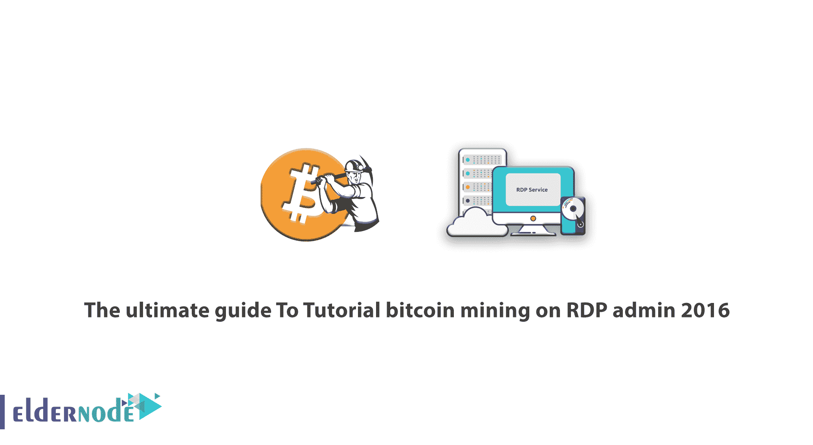

# RDP 管理员 2016 比特币挖矿教程终极指南

> 原文：<https://blog.eldernode.com/mining-on-rdp-admin-2016/>

RDP 管理 2016 年比特币挖矿教程终极指南。使用 VPS 或虚拟服务器进行比特币挖矿是当今拥有自己粉丝的方法之一，尤其是对于那些无法提供专用服务器和组装强大挖矿系统并对其进行升级的人。在本文中，我们将在 RDP 管理 2016 上向您介绍比特币挖矿的概念，以充分表达比特币作为数字货币的这种挖矿方法。您还可以访问 [Eldernode](https://eldernode.com/) 到[购买比特币 VPS](https://eldernode.com/bitcoin-vps/) 中提供的套餐。

## RDP admin 2016 上的挖矿比特币教程

在我们进入用 [VPS](https://en.wikipedia.org/wiki/Virtual_private_server) 进行比特币挖矿的问题之前，VPS 代表虚拟专用服务器，我们先来对比特币挖矿有个大概的定义。

比特币是一种数字货币，已经作为去中心化的网络推出，这意味着网络没有所有者，但这个网络的一般信息可供所有在这个网络中的人使用。

作为用您的系统连接到比特币网络的节点，您将您的系统和设备作为家庭系统或系统集(Rig)提供给比特币网络，或者提供专用服务器而不是交易。它经过处理，它们的准确性得到验证，同时网络的安全性得到保证，作为回报，你将获得比特币形式的奖励，这就是所谓的比特币挖掘的整个过程。

现在你对使用 VPS 进行比特币挖矿有所了解，因为你现在知道你需要强大的硬件来实现这一点，以便从系统组装、维修、维护和电力成本中获利，这取决于你的目标是赚很多钱。这就是比特币挖矿用 VPS 派上用场的地方。

## 如何在 RDP admin 2016 上进行比特币挖矿

*VPS 是如何产生的，我们称之为使用 VPS 服务器的比特币挖矿解决方案？*

某个管理员购买了一台专用服务器，然后在 Kvm、Xen 和 VmwareESXI 等基于 web 的虚拟化软件的帮助下，将他购买的服务器拆分成更小的部分，然后将您作为客户端。根据你的需求和通过 VPS 进行比特币挖矿的收入目标，你确定特定的资源，如 CPU、RAM 和硬盘以及操作系统(Linux、 [Windows](https://blog.eldernode.com/tag/windows/) 、Mac)，并在一段时间内租赁这些资源。

### 使用 VPS 进行比特币挖矿相对于专用服务器的优势

至此，你知道了用 VPS 提取比特币的一般方法。对于那些没有大量初始资本的人来说尤其如此，因为它总是建议你不要以任何方式通过贷款或属于你所有财产的资本进入这个行业。

所以，考虑到这个问题是对你们很多人来说的，亲爱的，知道用 VPS 进行比特币挖矿与自己建立专用服务器相比有什么优势也不错？

#### 用 computta 挖掘比特币

**1-** 用 VPS 服务器提取比特币要便宜得多，因为你不用支付硬件设备、维护等费用。

**2-** 为您提供与专用服务器相同的资源和硬件。

**3-** 信息管理变得更加容易。

**4-** 也许用 VPS 进行比特币挖矿的最大好处之一就是可以随时升级系统，而且成本要低得多。如果你自己建立一个系统，升级的成本是很高的。

另请注意，此类服务的提供商提供自我管理和非管理服务，在这种情况下，公司或组织提供设置和安装的整个过程。在第二种情况下，用户或客户负责一切。

但无论如何，要用 VPS 启动比特币挖矿，服务提供商必须给你提供你在服务器上指定的相同资源。操作系统正是您指定的类型，并且有一个专用的 IP 供您访问。

#### 完成 CoinEx 交易所培训

**–**您指定的资源，即硬盘、RAM 和 CPU 的数量完全由您独享。

**–**选择操作系统的类型没有限制。

**–**您可以随时升级指定的资源。

**–**以管理员身份访问是完全可能的。

**–**共享时安全性极高。

**–**获得独家知识产权的能力

### 选择比特币挖矿服务商的重要因素

当选择一个伟大的服务提供商来用 VPS 提取比特币时，肯定会出现并且可能会让你困惑的问题是，选择标准是什么？

我们如何知道我们是否从好的服务提供商那里得到了虚拟服务器？我们帮助您选择最佳服务提供商，通过虚拟服务器开始比特币挖掘:

**1-** 所有资源都应该是独占的

**2-** 安装操作系统和比特币提取程序免费

**3-** 为您提供一个管理面板

**4-** 可以为您升级资源和服务器

即使支付更多费用，也可以制作备份副本

有一个非常强大的防火墙来维护系统安全

**7-** 高正常运行时间，表示系统可用性及其永久不间断连接的数量

### 如何成立比特币挖矿机

如何搭建比特币挖矿硬件系统，开始制作数字货币？第一步是为工作选择合适的硬件。选择硬件时要记住两件事:功耗和哈希速率。**哈希速率**是在尝试解决与提取相关的数学问题时，您的硬件每秒可以执行的计算次数。

***–哈希速率***

以 MH/sec、GH/sec 和 TH/sec 为单位计算。散列率越高，解决事务性问题的可能性就越大。

***–能耗***

所有这些能力和计算能力都要消耗电力，而且成本很高。在选择合适的硬件时，您需要注意您想要的硬件所消耗的瓦特数。你需要确保你不会把所有的钱都花在电费上，因为数字货币的价值可能比你花的还要低。

然后你需要确定每瓦特电使用多少哈希。为此，将哈希数除以瓦特数。例如，如果你有一个 500 千兆赫/秒的设备，消耗 400 瓦的功率，你的散列将是 1.25 千兆赫/秒每瓦功率。

然而，还有一点需要考虑。有时候你把电脑当比特币挖矿硬件。请注意，在这些情况下，将专用服务器消耗的电量添加到提取比特币所需的电量中。

### 提取比特币所需的硬件

比特币挖矿的硬件主要有三组:**GPU**、**FPGA**、**ASIC**

#### 用 CPU / GPU 进行比特币挖矿

提取比特币最弱的硬件类型是你的电脑。理论上，你可以用电脑的 CPU 提取比特币。但以今天的标准来看，这太慢了，不值得做。

您可以通过在家用电脑中添加图形硬件(如带有图形处理单元(GPU)的显卡)来提高您的比特币挖矿散列率。这些图形卡旨在解决困难的数学问题，并可以执行高端计算机游戏中所需的复杂多边形的计算。此功能使这些卡能够解决与 SHA 相关的数学问题，这些问题是解决与交易和交易相关的问题所必需的。

GPU 的一个伟大之处在于，如果你使用它们，你可以自由选择数字货币的类型。不像其他硬件，可以用 GPU 提取比特币以外的数字货币。例如，Litecoin 使用了一种与比特币不同的算法，称为 Scrypt，它与 GPU 和 CPU 兼容。这使得他们成为想不时换币的矿工的好选择。

使用 GPU 的比特币挖矿现在已经过时了。随着 ASIC 挖掘方法的引入，比特币挖掘的问题变得如此之大，以至于 GPU 再也无法与之竞争。如果你想用这种方法，最好有一块可以同时使用多块板的主板，以节省为不同的板运行单独的 PSU。

#### 用 FPGA 挖掘比特币

FPGA 是一个单片电路，设计用于在构建后进行配置。利用这个电路，比特币挖矿硬件厂商可以大量购买他们需要的芯片。在将这些芯片放入提取所需的装置和设备之前，它们被定制并为提取工作做好准备。因为这些芯片针对提取进行了调整，所以它们的性能优于 GPU 和 CPU。单芯片 FPGAs 已经被证明以大约 750 兆哈希/秒的速度运行。当然，一个盒子中可以放置不止一个芯片。

#### 用 ASIC 挖掘比特币

我们现在正处于这个阶段。单片 ASIC 电路专门设计来做一件事:以相对较低的速度和相对较低的功耗提取比特币。因为这些芯片就是为了这个目的而制造的，所以生产起来既昂贵又耗时，但是提取的速度却是惊人的。

### 计算比特币挖矿的盈利能力

在购买想要提取比特币的硬件之前，使用各种盈利方法(如 Genesis Block)计算项目的盈利能力。通过提供设备成本、哈希速率、功耗、当前比特币价格等参数，可以看到这个项目需要多长时间才能让你收回投资的钱。

计算项目盈利能力的另一个关键因素是网络的难度。这表明解决事务问题的难度，并且会因网络哈希速率而异。随着市场上 ASIC 设备的出现，网络的复杂性也可能会增加，并且随着挖掘比特币的人数增加，可能需要在计算比特币挖掘盈利能力所需的参数中加入这个参数。

选择硬件后，现在必须执行以下步骤来设置 Miner:

### 下载必要的软件

根据您选择的设备，您需要下载适当的软件来使用该设备。通常在使用 GPU 和 FPGAs 时，需要一台电脑作为主机，运行两个应用:**标准比特币客户端软件**和**比特币挖矿软件**。

#### 标准比特币客户端软件

该软件将您的计算机连接到比特币客户网络，允许您与其他比特币客户进行互动，发送交易，并跟踪阻止和提取问题。下载完整的比特币区块链需要一些时间。这个软件有效地将信息从你的矿工发送到比特币网络。

#### 比特币挖掘软件

比特币挖矿软件是指导硬件做提取和解决区块和交易问题的艰苦工作的东西。根据您的操作系统，有不同类型的软件。各种软件可用于 Windows、Mac OS X 和其他系统。你可能还需要为你的 ASIC 矿机提取软件。然而，一些较新的模型承诺，未来包括比特币地址在内的一切都将被预设，所以你所要做的就是插入 miner 设备。

一个智能制造商甚至开发了一个运行在树莓 Pi 上的提取操作系统，它需要一台信用卡大小的低成本、低能耗的 Linux 计算机。该操作系统可用于连接到 USB 的 ASIC miner 中。

## 结论

有些人更喜欢在比特币提取方式中使用 VPN 而不是 VPS 服务器，我们建议你根本不要这样做，因为不像 VPS，你的 IP 连接每次都在变，安全性大大降低。给！为什么？因为交易所很容易注意到并冻结你的账户和余额。当然，在某些情况下，用户表示没有遇到过这样的问题。无论如何，风险非常高，只要有可能用 VPS 服务器提取比特币，轻松与国际交易所合作并赚钱，就不要给自己压力。在这篇文章中，我们试图解释如何在 RDP 管理 2016 中使用 VPS 服务器挖掘比特币。