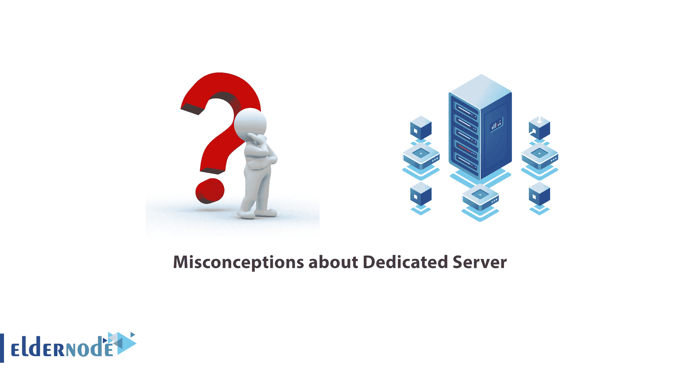

# 关于专用服务器- ElderNode 博客的误解

> 原文：<https://blog.eldernode.com/misconceptions-about-dedicated-server/>

关于[专用服务器](https://eldernode.com/dedicated-server/)的误解。在这篇文章中，我们将检查**关于专用服务器的 10 个误解**，并用逻辑和公平的推理来澄清它们，这样你就可以做出开明的决定。加入我们，从一个新的角度来看待这些**错误观念**，如果有必要就把它们放在一边。

### 误区 1) 专用服务器贵！

过去，专用主机很贵；但是像世界上许多其他服务一样，技术的进步和激烈的竞争降低了专用主机服务的成本。虽然包月是一项可预见的成本，但对于正规网站所有者来说，专用托管是一种**划算的**方式。

你一定听说过:花的钱越多，得到的服务越多。如果托管服务危及你未来的收入和企业的可持续发展，不要急于支付更多的费用。

### 【神话 2) 专用主机不可靠！

共享空间会遭受对带宽接入、处理能力和输入输出系统的竞争，导致其他共享空间用户的性能不佳。专用服务器**不会受到吵闹的邻居的干扰，因为它的资源专门供您使用。**

此外，你将**永远不会遇到** 有限资源在专门托管。(这些限制有时适用于所谓的无限制共享主机计划。)

### 【神话 3) 你在专用主机中失去控制！

在使用共享资源时，hypervisor 也**限制**你的选择和控制范围；但是在专用主机中，你被赋予**管理员权限**，因此你可以进行自己选择的设置，并在安装软件、定制和更新软件方面拥有完全的自由。

### 误区 4) 你必须是专门托管的 IT 专家！

一个 **IT 界**的基础知识还不错；但是在[主机计划](https://eldernode.com/linux-hosting/)中，你不负责硬件更新。此外，[专用托管计划](https://eldernode.com/dedicated-server/)中还有不同层次的管理，从基础管理到操作系统维护、更新、安全措施。

您还有一个广泛而实用的控制面板，可帮助您顺利工作并充分利用您的[专用服务](https://en.wikipedia.org/wiki/Dedicated_hosting_service)，而无需 IT 经验或教育。

### 神话 5) 在专用服务器上，正常运行时间只是一个数字！

没有理由邀请成千上万的访问者访问你的网站，只是为了得到一个错误页面！

**考虑一下这个场景:**有了 *98%的保证正常运行时间* ，你的网站可能一天宕机半个小时左右，这相当于一年超过 7 天才进入主机的保证范围。而在 *99.9%的保证* 下，**网站正常运行时间范围**减少到每天 1 分 44 秒，每年只有 8.8 小时，这对一个网站的成功来说是一个不小的差别！

## 对专用服务器的误解

### 【神话 6】在专用服务器中，支持被最小化！

如果你选择免费的虚拟主机，当你最终遇到问题时，没有支持服务。但是大多数著名的主机提供商优先考虑对专用主机的技术支持。

因为这份合同比较敏感，往往会让客户在**打电话**、**网上聊天、**、发邮件**和**买机票之间做出选择。

### 【神话 7) 在专用主机上，服务器规格并不重要！

想想看，在你花费了大量时间和金钱之后，仅仅因为你没有选择正确的服务器规格，对你网站的访问就会在的前 10 秒被**取消**！因此，您必须谨慎选择服务器的规格和功能。

所以要在 RAM 、存储空间和带宽之间取得恰当的平衡，以满足网站的预期需求。

做你的研究，以确保你确切地知道你从托管计划得到什么服务。

### 【神话 8) 专用主机不安全！

如果共享托管设置不当，很有可能你的数据会落入其他共享服务器用户手中；但是一个专用服务器只给你**管理员权限**来保护你的数据隐私。

主机还必须采取严格的安全防范措施来保护你免受入侵者、攻击者、垃圾邮件发送者、黑客和其他恶意网络活动的攻击。

### 误区 9) 专用服务器就像 VPS 服务器！

**不！** 在 [VPS 服务器](https://eldernode.com/vps/)中，服务器资源在不同网站或托管账户之间共享。托管计划可能会带来无限的带宽和存储空间，但不能保证高内存。因此，您可能会发现自己在安装和运行需要大量处理器和内存的模块或软件时受到限制。

但是，一台具有合同中约定的功能的专用服务器完全由您支配，可以安装和运行您成功的网站和业务所需的一切。

### 【神话 10) 任何托管都会为你的企业带来回报！

**肯定不是！**

东道主提供的质量和服务差别很大。你需要大量的研究和许多因素的考虑，仅仅比较硬件和价格是不够的。

**注:**没有理由拥有一个专用服务器如果有时由于主机过多的契约数量或者糟糕的服务器结构而遥不可及，或者如果一个低支持的好契约已经被有利于主机的方式抵消。

不要太依赖用户反馈网站，因为大多数托管公司可能会有一些负面反馈，这不应该是你离开托管公司的唯一原因。

## 结论

在这篇文章中，我们试图帮助你更清楚地看待这些误解。

向声誉良好的托管公司咨询您的业务需求。比较提议的计划，进行协商，选择最适合你的情况和预算的方案。还有，要破除对 **事业有成** 的误解！

**亦作，见:**

[什么是虚拟专用服务器？](https://eldernode.com/what-is-a-virtual-private-server/)

**尊敬的用户**，我们希望您能喜欢这个[教程](https://eldernode.com/category/tutorial/)，您可以在评论区提出关于本次培训的问题，或者解决[老年人节点培训](https://eldernode.com/blog/)领域的其他问题，请参考[提问页面](https://eldernode.com/ask)部分，并尽快提出您的问题。腾出时间给其他用户和专家来回答你的问题。

对专用服务器的误解。

好运。