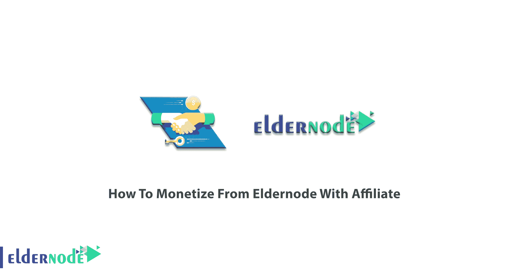
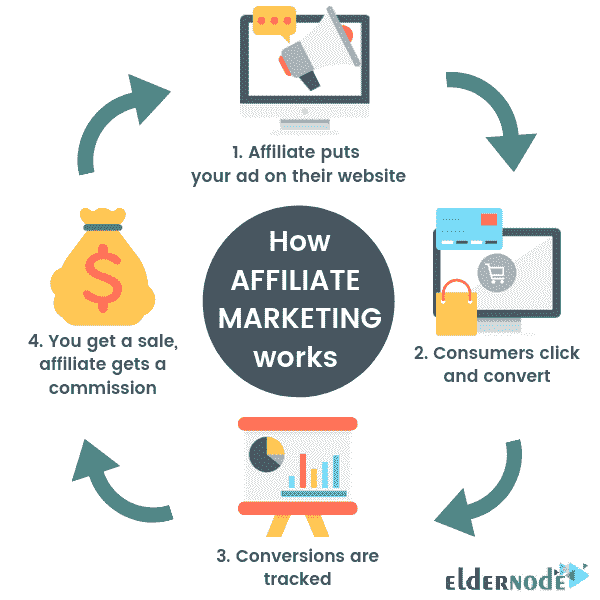
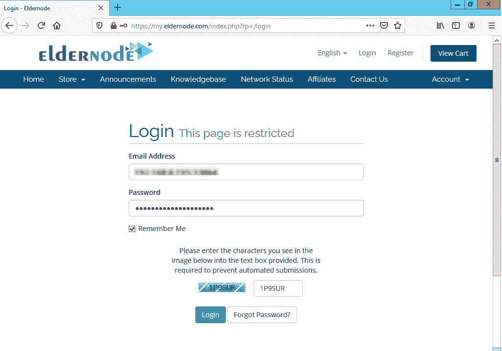
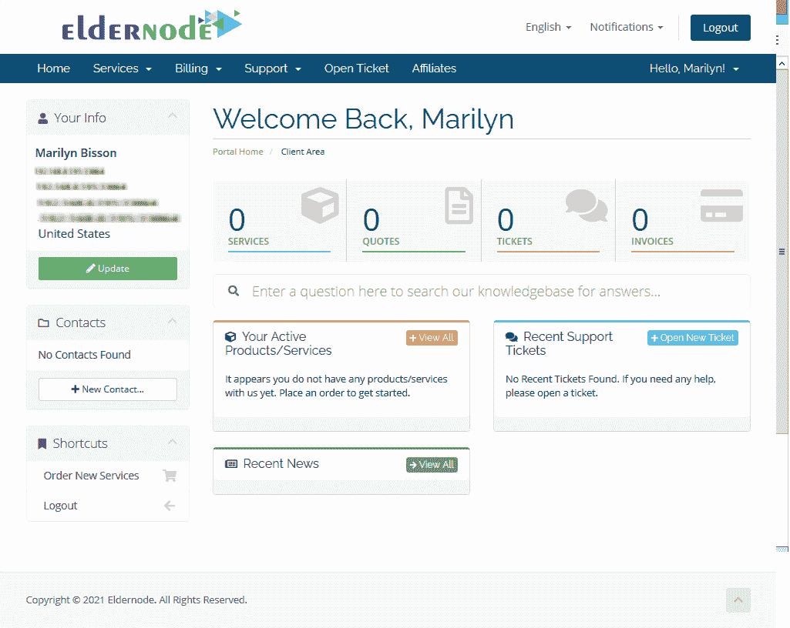
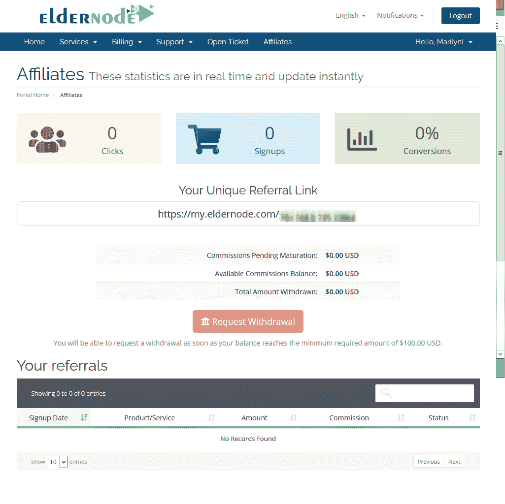

# 如何利用代销商从 Eldernode 博客中赚钱

> 原文：<https://blog.eldernode.com/monetize-from-eldernode-with-affiliate/>

企业主能够给一个或多个分支机构的奖励，以奖励每个访问者或客户所带来的分支机构自己的营销努力。换句话说，联盟营销是一种基于效果的营销。因为你和你的表现对我们来说是有价值的，在这篇文章中，我们将介绍如何从 Eldernode 和 Affiliate 赚钱。事实上，随着电子媒体互联网的普及，基于表现的广告已经变得越来越普遍，在互联网上可以测量广告导致的用户行为。另外，要知道效果营销和品牌营销是不一样的。访问 [Eldernode](https://eldernode.com/) 查看完美而经济的套餐，购买您自己的 [VPS](https://eldernode.com/vps/) 服务器或[专用服务器](https://eldernode.com/dedicated-server/)。

## **教程从会员** 的会员节点赚钱

### **加盟**简介

佣金-佣金原则是加盟制的基础。由于链接是万维网虚拟世界的基础，会员链接包含一个特殊的代码，该代码唯一地标识了商家的会员。当您通过带有合作伙伴标识的链接发送给客户时，零售商会准确地认出您。所以，你会进入盈利周期。

在在线效果广告市场中，已知有四种常见的定价模型。这些模型是:

1- **CPM** :千分成本(千分成本)

2- **CPC** :每次点击费用

3- **CPL** :每个销售线索的成本

4- **CPA** :每次广告成本(每次收购成本)

由于应用程序联盟优惠是高薪的，有一些应用程序随着他们的平台一起提供业务。以下是一些最大的附属应用。

1-微软

2-谷歌应用程序

3-苹果 Itunes

4 个应用程序主题

5-站点包络

6-特使工作室

### **隶属于**上的

[Eldernode](https://eldernode.com/) 作为一家进步的虚拟主机服务提供商，最近在网站的登录会话中增加了联盟会员部分。

首先，**在 Register 选项卡上创建一个帐户**并登录到该会员。

登录后，您可以在**面板**上工作，如下所示:

通过点击代销商选项卡，您可以激活您的**代销商账户**,以便能够通过向 Eldernode 推荐客户获得报酬。当您按下激活按钮时，您将看到以下页面:

这样，你就有了自己独特的推荐链接。您可以将其发送到您的子集，并获得**佣金**。根据您在本指南开头阅读的提到的算法，Eldernode company 会识别通过您的链接发送的所有订单。每一笔订单，你都会收到 **%5** 的佣金。

就是这样！加入轻松快速赚钱的大型用户社区。立即在 [Eldernode](https://my.eldernode.com/register.php) 上创建您自己的帐户！

## 结论

在本文中，您了解了如何从 Eldernode With Affiliate 赚钱。任何时候你点击一个代销商链接，你都会被重定向到相关零售商的页面。Cookie 跟踪允许使用 cookie 来分配和跟踪访问者。您的时间，而访问和您的数据可供我们使用。尝试在 Eldernode 上赚钱，体验有趣的双赢交易。如果你有兴趣了解更多，请跟随[教程如何一步一步地赚钱。](https://blog.eldernode.com/how-to-monetize-linux-vps/)