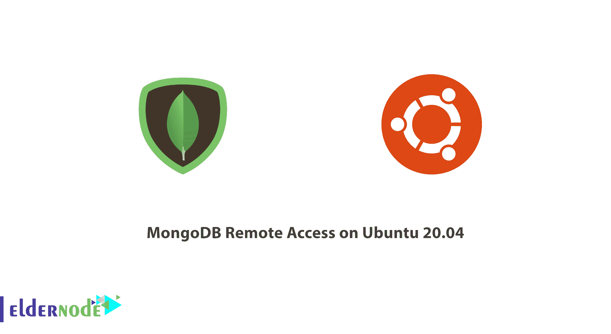

# 教程在 Ubuntu 20.04 上配置 MongoDB 远程访问- Eldernode

> 原文：<https://blog.eldernode.com/mongodb-remote-ubuntu-20/>



**MongoDB** 是现代 web 应用中使用的开源文档[数据库](https://en.wikipedia.org/wiki/Database)。允许来自安装它的同一台服务器的连接。当您决定远程管理 MongoDB 或将其连接到单独的应用服务器时，您可能会发现需要对默认配置进行一些更改。作为 [VPS](https://eldernode.com/vps/) 提供商联系 Eldernode 团队，拥有自己的 [Linux 虚拟服务器](https://eldernode.com/linux-vps/)。

为了让本教程更好地发挥作用，请考虑以下**先决条件**:

当 **MongoDB** 安装在您的服务器上时，我们认为您已经安装了 MongoDB 4.4 或更新版本。你可以按照我们的教程[如何](https://eldernode.com/install-mongodb-ubuntu-20/) [在 Ubuntu 20.04](https://eldernode.com/install-mongodb-ubuntu-20/) 上安装 MongoDB 来安装这个版本。

**此外**，我们**强烈**建议您通过为数据库创建一个管理用户帐户并启用认证来保护您的 **MongoDB** 安装。为此，请遵循我们的教程[如何在 Ubuntu 20.04](https://eldernode.com/secure-mongodb-ubuntu-20/) 上保护 MongoDB。

## 

.

## **教程 Ubuntu 20.04 上的 MongoDB 远程访问配置**

加入我们的指南来配置一个 **MongoDB** 安装，以安全地允许来自可信的远程计算机的访问。为此，您将更新您的防火墙规则，以提供对 MongoDB 监听连接的端口的远程机器访问，然后更新其配置文件以更改其 IP 绑定设置。然后，作为最后一步，您将测试您的远程机器是否能够成功地连接到您的数据库。

### 第一步:调整防火墙

如果您对我们关于**先决条件**和[在您的服务器](https://eldernode.com/initial-server-set-up-on-ubuntu-20-04-lts/)上启用了 UFW 防火墙的请求持肯定态度，您的 **MongoDB** 安装将无法从互联网上访问。如果您只需要在本地将 MongoDB 与运行在同一服务器上的应用程序一起使用，请使用这个安全设置。它还可以帮助您从远程位置连接到 MongoDB 服务器。您可以通过添加一个新的 UFW 规则来允许传入连接到数据库正在侦听的端口，以便能够从远程位置连接到 MongoDB 服务器。然而，第一步是用 lsof 命令检查哪个端口正在监听。您将使用它返回系统中所有打开文件的列表。一旦它与 **-i** 选项结合，它只列出网络相关的文件或数据流。

要将 lsof -i 生成的输出重定向到搜索名为 mongo 的字符串的 grep 命令，请运行以下命令:

以下命令将

```
sudo lsof -i | grep mongo
```

这个示例输出显示 MongoDB 正在监听其默认端口 27017 上的连接:

输出

```
mongod    82221         mongodb   11u  IPv4 913411      0t0  TCP localhost:27017 (LISTEN) 
```

正如您所猜测的，我们只能从某些可信的位置访问 MongoDB，类似于托管应用程序的另一个服务器。要对此进行配置，请在 MongoDB 服务器上键入以下命令，这会打开对 MongoDB 默认端口的访问，同时显式地只允许其他受信任服务器的 IP 地址。当您运行以下命令时，请确保将**trusted _ server _ ip**更改为您将用来访问 MongoDB 实例的可信远程机器的 IP 地址:

```
sudo ufw allow from trusted_server_ip to any port 27017
```

**请注意**:如果您看到您安装的 MongoDB 正在监听来自上一个命令输出的非默认端口，您可以使用 端口号来代替这个命令中的 **27017** 。

每当您需要从另一台机器访问 MongoDB 时，再次使用这个命令，用新机器的 IP 地址代替 trusted_server_ip。

您可以使用 ufw 验证防火墙设置的变化:

```
sudo ufw status
```

正如您在输出中看到的，现在允许从远程服务器到端口 **27017** 的流量:

输出

```
Status: active    To                         Action      From  --                         ------      ----  OpenSSH                    ALLOW       Anywhere  27017                      ALLOW       trusted_server_ip  OpenSSH (v6)               ALLOW       Anywhere (v6) 
```

继续和我们一起将 MongoDB 绑定到服务器的公共 IP 地址，向您展示如何从您的远程机器访问它。如果需要查找自己的 IP 地址，可以看 Linux 教程上的[查找 IP 地址。](https://eldernode.com/find-server-public-ip-linux/)

### 步骤 2:如何配置公共 bindIP

请注意，MongoDB 只能接受来自安装它的服务器的连接，因此，MongoDB 当前绑定到 127.0.0.1 ，即使端口是打开的，也是本地环回网络接口。

尝试编辑 MongoDB 配置文件— /etc/mongod.conf —以额外将 MongoDB 绑定到您的服务器的可公开路由的 IP 地址，从而允许远程连接。之后，您的 MongoDB 安装将能够监听从远程机器到 MongoDB 服务器的连接。

在您喜欢的文本编辑器中打开 MongoDB 配置文件。下面的例子使用了 nano :

```
sudo nano /etc/mongod.conf
```

找到网络接口部分，然后找到绑定 Ip 值:

```
. . .  # network interfaces  net:    port: 27017    bindIp: 127.0.0.1    . . . 
```

在这一行后面添加一个逗号，然后是 MongoDB 服务器的公共 IP 地址:

```
. . .  # network interfaces  net:    port: 27017    bindIp: 127.0.0.1,mongodb_server_ip    . . . 
```

现在，您可以保存并关闭文件。如果你用的是 nano ，按下 CTRL + X 、 Y ，然后回车即可。

然后，重新启动 MongoDB 以使这一更改生效:

```
sudo systemctl restart mongod
```

接下来，您的 **MongoDB** 安装将能够接受来自您允许访问端口 27017 的任何机器的远程连接。尝试测试您在步骤 1 中允许通过防火墙的受信任的远程服务器是否可以到达您的服务器上运行的 MongoDB 实例。

### 步骤 3:如何测试远程连接

既然您已经配置了您的 **MongoDB** 安装来监听连接。源自其可公开路由的 IP 地址。并允许你的远程机器通过你服务器的防火墙访问 Mongo 的默认端口。您可以测试远程机器是否能够连接。

**请注意**:如先决条件一节所述，本教程假设你的远程机器是另一台运行 Ubuntu 20.04 的服务器。无论您的远程机器运行什么操作系统，步骤 1 和 2 中概述的启用远程连接的过程都应该有效。但是这一步中描述的测试方法并不能在所有操作系统中通用。 

测试可信远程服务器是否能够连接到 MongoDB 实例的一种方法是使用 **nc** 命令。 **nc** ，netcat 的简称，是一个用来与 TCP 或 UDP 建立网络连接的实用程序。这对于这种情况下的测试很有用。因为它允许您指定 IP 地址和端口号。

首先，使用 SSH 登录到您信任的服务器:

```
ssh noodi@trusted_server_ip
```

然后运行下面的 nc 命令，其中包含了 -z 选项。这限制了 nc 只扫描目标服务器上的监听守护进程，而不向它发送任何数据。回想一下[先决条件安装教程](https://eldernode.com/install-mongodb-ubuntu-20/)，MongoDB 是作为一个服务守护进程运行的，这使得这个选项对于测试连通性非常有用。它还包括 v 选项，该选项增加了命令的冗长性，导致 netcat 返回一些本来不会返回的输出。

从您信任的远程服务器运行下面的 nc 命令**，确保将 mongodb_server_ip 替换为您安装 mongodb 的服务器的 ip 地址:**

```
nc -zv mongodb_server_ip 27017
```

#### 

如果受信任的服务器可以访问 MongoDB 守护进程，其输出将表明连接成功:

输出

```
Connection to mongodb_server_ip 27017 port [tcp/*] succeeded! 
```

假设您在远程服务器上安装了兼容版本的 mongo shell，那么此时您可以直接连接到安装在主机服务器上的 MongoDB 实例。

一种连接方式是使用连接字符串 URI，如下所示:

```
mongo "mongodb://mongo_server_ip:27017"
```

**请注意**:如果你遵循了推荐的[如何在 Ubuntu 20.04 上保护 MongoDB](https://blog.eldernode.com/secure-mongodb-ubuntu-20/)教程，你将会关闭未经认证的用户对你的数据库的访问。在这种情况下，您需要使用指定有效用户名的 URI，如下所示:

```
mongo "mongodb://username@mongo_server_ip:27017"
```

shell 会自动提示您输入用户密码。

至此，您已经确认了您的 MongoDB 服务器可以接受来自可信服务器的连接。

## 结论

在本文中，您学习了“Ubuntu 20.04 上的 MongoDB 远程访问配置”。此时，您可以从受信任的服务器远程管理您的 Mongo 数据库。或者，您可以将应用程序配置为在受信任的服务器上运行，并远程使用数据库。