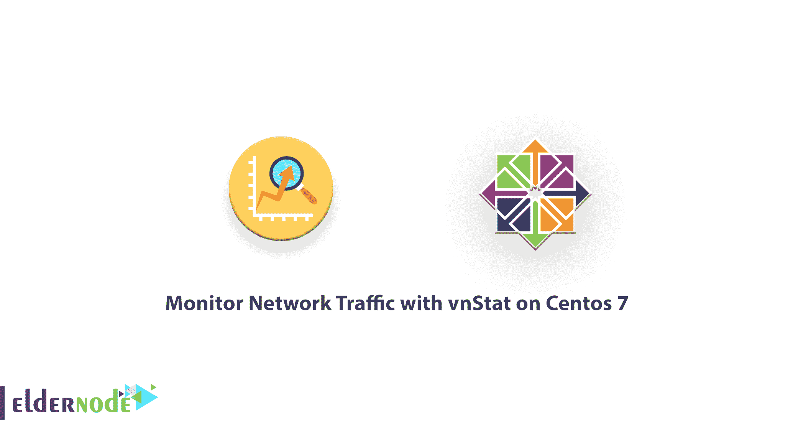
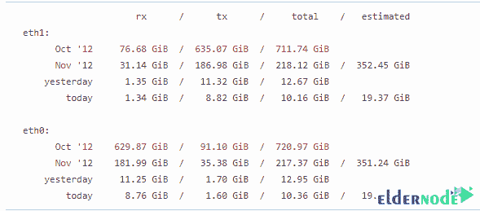
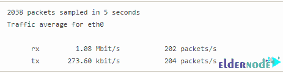

# 在 Centos 7 - Eldernode 博客上使用 vnStat 监控网络流量

> 原文：<https://blog.eldernode.com/monitor-network-traffic-with-vnstat-on-centos/>



许多服务器管理员需要一个工具来监控下载或上传到服务器的总带宽。服务器管理员可以使用 DirectAdmin、cPanel、Plesk、WebSitePanel 或 Kloxo 等控制面板来更好地管理服务器，具体取决于服务器操作系统。在本文中，我们将教您如何在 Centos 7 上使用 vnStat 监控网络流量。需要注意的是，你可以访问 [Eldernode](https://eldernode.com/) 中的套装来购买一台 **[CentOS VPS](https://eldernode.com/centos-vps/)** 服务器。

## **教程在 CentOS 7 上用 vnStat 监控网络流量**

对 [VPS 服务器](https://eldernode.com/vps/)的流量监控是检查服务器性能的重要内容之一。您可以使用 vnStat 工具来完成这项工作。关注本文，教你如何在 [CentOS](https://blog.eldernode.com/tag/centos/) 7 上使用 vnStat 监控网络流量。

### **vnStat 特性:**

在本节中，我们将介绍 14 项 vnStat 功能:

1-统计数据即使在系统重新启动后仍然可用

2-同时监控多个网络接口

3-多种输出选项

4-按小时、天、月、周或前 10 天对数据进行排序

5-生成 png 图形的输出

6-配置“月”,以跟进您可能有的不同计费周期

7-非常轻-消耗很少一部分系统资源

8-无论产生多少流量，CPU 使用率都很低

9-你不必是根用户就可以使用它

10-动态选择单位(KB、MB 等)

11-您可以为生成的输出图像添加图例

12-内容定位和图像背景颜色的可定制选项到 **vnStat.cgi** 。

13-将自动检测接口带宽。

14-使用 JSON 进行输出

## **如何在 CentOS 7 | Centos 8** 上安装 vnStat

一旦您熟悉了 vnStat 的功能，在这一步中，我们将教您如何在 CentOS 7 上安装 vnStat。安装 vnStat 后，在下一步中，我们将教您如何使用该工具监控网络流量。请加入我们。安装 vnStat 的第一步是启用 EPEL 存储库包。然后，您需要依次执行以下命令:

```
yum -y install vnstat
```

```
systemctl start vnstat
```

```
systemctl enable vnstat
```

```
chkconfig vnstat on
```

```
service vnstat status
```

重要的一点是，如果在安装程序后，您注意到程序没有更新或没有显示任何输出，您应该按如下方式设置权限:

```
chown -R vnstat:vnstat /var/lib/vnstat
```

### **如何在 CentOS 7 上配置 vnStat**

在本节中，我们将配置 vnStat，然后介绍如何创建数据库。请加入我们。第一步是编辑 **/etc/vnstat.conf** 配置文件:

```
vi /etc/sysconfig/vnstat
```

示例输出如下所示:

```
VNSTAT_OPTIONS="-u -i eth0"
```

现在您需要输入以下命令来编辑 **/etc/vnstat.conf** :

```
vi /etc/vnstat.conf
```

将默认接口设置为 **eth1** ，如以下命令所示:

```
Interface "eth1"
```

现在**保存**配置文件并退出。

要创建一个数据库，首先必须使用 chsh 命令将 vnStat shell 设置为 **/bin/bash** 。然后使用以下命令创建一个数据库:

```
chsh -s /bin/bash vnstat
```

```
grep --color vnstat /etc/passwd
```

```
id vnstat
```

请注意，这通常是新安装后使用的第一个命令。您可以使用 runuser 命令为 **eth0** 接口创建一个数据库:

```
runuser -l vnstat -g vnstat -c '/usr/bin/vnstat -u -i eth0'
```

您也可以运行以下命令为 **eth1** 接口创建一个数据库:

```
runuser -l vnstat -g vnstat -c '/usr/bin/vnstat -u -i eth1'
```

使用以下命令确保 vnStat 用户无法登录:

```
chsh -s /sbin/nologin vnstat
```

```
grep --color vnstat /etc/passwd
```

```
id vnstat
```

### **如何在 CentOS Linux 上用 vnStat 监控网络流量**

要在引导时启动 vnStat 服务，请键入以下命令:

```
chkconfig vnstat on
```

您还可以运行以下命令来分别**启动** / **停止** / **重启**和**控制**VN start 服务:

```
sudo systemctl start vnstat
```

```
sudo systemctl stop vnstat
```

```
sudo systemctl restart vnstat
```

```
sudo systemctl status vnstat
```

如何查看统计数据将如下。语法是:

```
vnstat
```

您可以在下图中看到示例输出:



您可以输入以下命令来查看 **eth0 统计数据**:

```
vnstat -i eth0
```

注意，要查看 **eth0** 的**每日统计数据**，可以输入以下命令:

```
vnstat -i eth0 -d
```

您也可以输入以下命令来查看**每小时统计数据**:

```
vnstat -i eth0 -h
```

要查看**月统计数据**，运行以下命令:

```
vnstat -i eth0 -m
```

最后，要查看**周统计数据**，运行以下命令:

```
vnstat -i eth0 -w
```

请注意，您可以使用以下命令来计算流量:

```
vnstat -i eth0 -tr
```

上述命令的输出如下所示:



## 结论

vnStat 的一个优点是它很轻便，不会给服务器带来特殊的负载。该软件声称可以计算服务网络上传输的所有流量，无论是 web 服务器流量还是 ICMP 数据包的数量。消费者流量也将在每小时、每天和每月的基础上可见。在本文中，我们试图教您如何在 CentOS 7 上安装 vnStat 并监控网络流量。