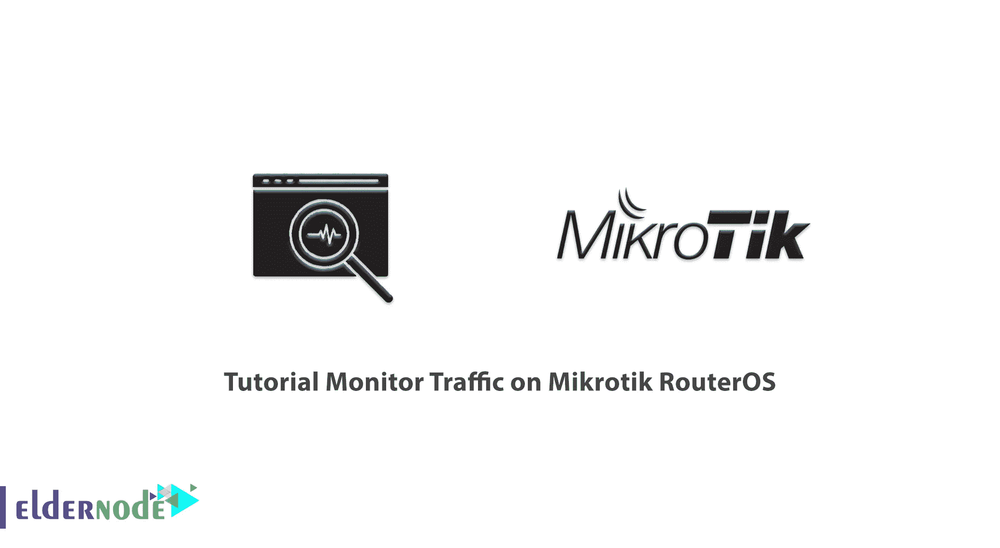
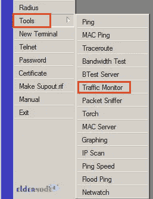
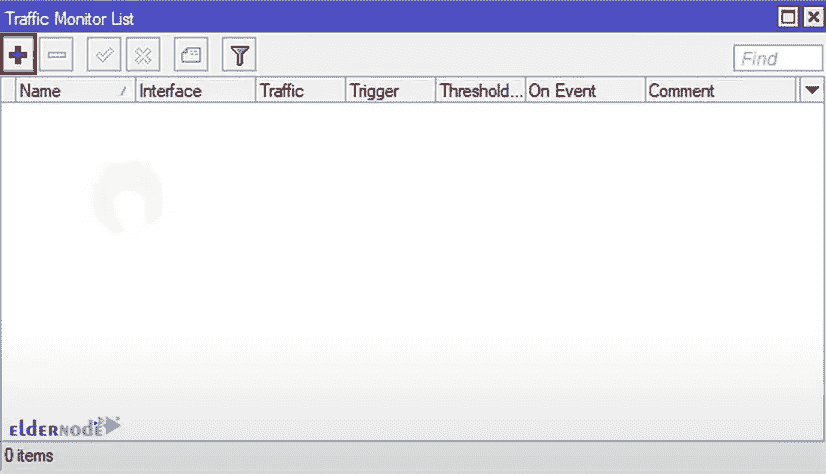
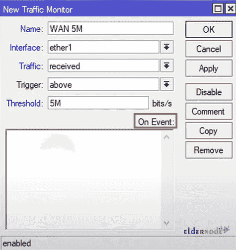
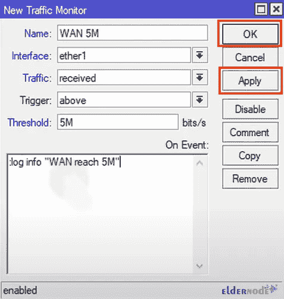
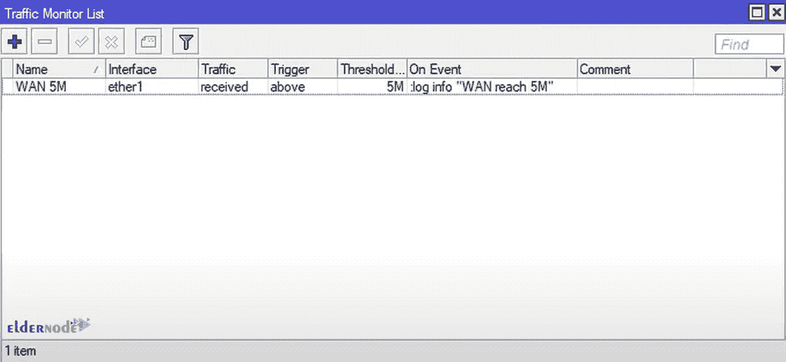

# 教程监控 Mikrotik RouterOS [1 快速路]的交通

> 原文：<https://blog.eldernode.com/monitor-traffic-on-mikrotik-routeros/>

计算机网络需要路由器、交换机、无线设备等设备进行内部和外部通信。大型品牌和公司生产和销售这种硬件。Mikrotik 是这些公司和硬件产品制造商之一。在这篇文章中，我们将教你如何在 Mikrotik RouterOS 上监控流量。如果你想购买一台 [**Mikrotik VPS**](https://eldernode.com/mikrotik-vps-server/) 服务器，你可以访问 [Eldernode](https://eldernode.com/) 网站上的软件包。

## **如何在 Mikrotik VPS 上监控带宽**

### **什么是 Mikrotik RouterOS？**

[Mikrotik](https://blog.eldernode.com/tag/mikrotik/) 是一款基于 Linux 内核的服务器，可以在电脑上以完全稳定的方式安装和维护。Mikrotik 是拉脱维亚的一家制造计算机网络和无线电信设备的公司。这家公司最重要的产品是 Mikrotik RouterOS 操作系统。

Mikrotik RouterOS 是一个独立的基于 Linux 的操作系统，支持 Mikrotik RouterBoard 硬件。需要注意的是，Mikrotik 是一个使用 Linux 内核构建的路由操作系统。它是由美国麻省理工学院的两名学生于 1996 年使用一个版本的 Linux 操作系统创建的。请注意，Mikrotik 为世界上大多数国家提供连接互联网的硬件和软件。

### **米克罗提克特征**

->高稳定性

->开机高速

->自动操作，无需登录任何服务

->高安装速度

->图形操作系统带来的高配置速度

->进出口能力

->与类似硬件相比的成本效益示例

## **监控 Mikrotik RouterOS** 上的流量

首先打开 **Winbox** 点击**工具**然后选择**交通监控**:

现在点击 **"+"** 来创建一个**新规则**:

你想怎么叫都行。我们称之为**万 5M** 。每当你的一个连接达到每秒 5 兆比特，以太网 1 就会触发。

**流量**部分与上传或下载有关。发送实际上是上传，接收是下载。

现在你可以设置**触发**部分，当它高于、总是或低于。

**阈值**部分是您想要设置的实际值。如果您打算将您的一个连接设置为 5 兆位，您应该只键入 5M。

每当你在接口以太网上接收到超过每秒 5 兆比特的流量时，做**事件**。在**事件**部分，您可以编写一个脚本或者调用之前编写的另一个脚本:

在**事件**部分，我们将把**日志信息“万达到 5M”**。当 5 兆位通过以太网 1 时，它将激活 arm 脚本。最后，点击**应用**，然后点击**确定**:

您可以在**流量监控列表**中看到您的脚本:

如果接口每次达到 5mb，它将在事件发生时激活。交通监视器上的典型字母起作用。

就是这样！你可以写一个脚本来切换到另一个界面或无休止地重新创建道路的可能性。

## 结论

流量监控工具监控流经接口的营养不良，并在流量达到基于您设置的阈值时触发它。在本文中，我们教你如何监控 Mikrotik RouterOS 上的流量。我希望这篇文章对你有用。如果你有任何问题，可以在评论中联系我们。