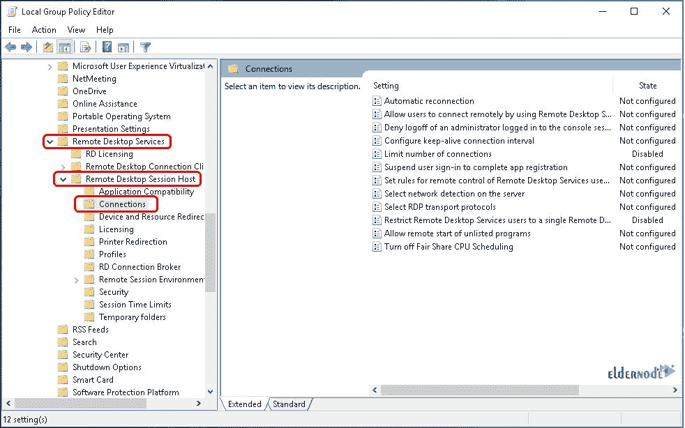
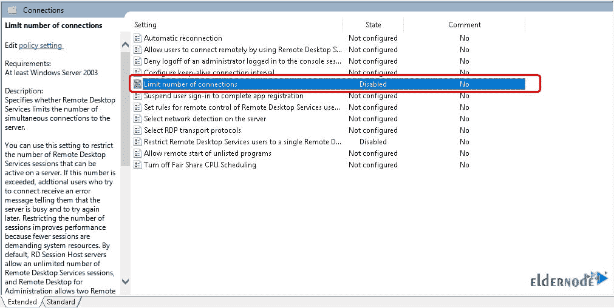

# 在 Admin RDP 2016 - Eldernode 上连接多个用户的秘密

> 原文：<https://blog.eldernode.com/more-than-1-user-on-admin-rdp/>

介绍秘密连接超过 1 个用户的管理 RDP 2016 窗口。 [Windows](https://blog.eldernode.com/tag/windows/) Server 2016，微软开发的 Windows server 操作系统的第 17 个^(版本)。您可以购买自己的即时 [Windows VPS](https://eldernode.com/windows-vps/) 来更好地体验本指南。

微软通常为操作系统提供十年的支持，Windows server 2016 的主流支持端是 2022 年 1 月 11 日，其扩展支持端是 2027 年 1 月 12 日。

## **如何在 Admin RDP 2016 上连接**1 个以上用户****

**可以在管理远程桌面上连接多个用户吗？换句话说，如何在 Windows 虚拟服务器中允许多个会话？然而，它是许可证主题，例如直接从微软购买 [RDS CAL 许可证](https://docs.microsoft.com/en-us/windows-server/remote/remote-desktop-services/rds-client-access-license)，以允许更多的用户。另外，请注意，2 个双核 CPU 的性能优于单个四核处理器，因为每台服务器的建议并发会话数在 30-40 之间。**

****注意**:一旦你决定每台机器使用 3 个以上用户，尽量购买 [VPS](https://eldernode.com/windows-vps/) 或[专用服务器](https://eldernode.com/dedicated-server/)以防止每用户 VPS 整体性能下降。**

### **启用多个远程桌面(RDP)会话**

****首先**，通过 [RDP](https://eldernode.com/buy-rdp/) 连接到 Windows 服务器会话。对于 Windows 2016，需要点击开始菜单旁边的搜索按钮。**

****

**然后，进入 **gpedit.msc** ，如下图所示。**

****

**接下来，当组策略编辑器加载后，导航到 **C** 计算机 **C** 配置。然后转到 **A** 管理 **T** 模板，然后**W**windows**C**组件，然后 **R** 表情 **D** esktop **S** 服务，然后 **R** 表情 **D** esktop **S** 会话主机。**

****

****

**现在，你看到一个标记为**连接**的文件夹，点击它。之后，右键点击 **L** 极限 **N** 数量 **C** 连接并点击编辑。**

****

**从那里，你可以设置你想要的数量限制，或者关闭它。**

****

**在这一步中，您必须单击“下一步设置”直到您到达“远程”**远程,**远程,**远程,**远程服务,**远程服务,**远程服务,**远程服务,**远程服务,远程服务,远程服务,**远程服务,**远程服务,**远程服务,**远程服务屏幕，这样您就可以编辑此设置。**

****

**毕竟，要关闭用户限制，请在此窗口中单击 Disabled。最后，您应该从云控制概述页面重新启动服务器，组策略更改应该会自动应用。**

### **如何逆转变化**

**您可以轻松地撤销这些更改。您只需遵循上述相同的步骤，将所需的组策略设置为未配置，然后选择启用或禁用。**

**有关更多说明，请遵循以下路径禁用多个 RDP 会话:**

****1-** 使用远程桌面登录服务器。**

****2-** 打开开始菜单，输入‘gpedit . MSC’并打开**

****3-** 转到计算机配置>管理模板> Windows 组件>远程桌面服务>远程桌面会话主机>连接。**

****4-** 将“限制远程桌面服务用户使用单个远程桌面服务会话”设置为“已启用”。**

### **多少用户可以同时在同一台电脑上工作**

**如果您有一台未使用的计算机，只需将其连接到现有的计算机上，就可以轻松地将其显示器转换为合适的 PC，无需额外的硬件。当您准备两台连接到同一 CPU 的显示器时，(两台独立的计算机)，两个用户可以使用他们自己的键盘和鼠标在每台显示器上同时执行不同的任务。**

**然而，通过使用 Userful 的免费软件，你可以将两台显示器连接到一台计算机上，将光盘放入其中，然后启动。**

### **这两个用户有什么权限？**

**他们可以分别浏览不同的网站，同时在个人屏幕上查看自己的电子邮件。他们还可以编写文档，使用连接到主计算机的打印机和扫描仪等常用设备。当人们有基本的计算需求或没有预算购买额外的计算机时，通常会使用这种解决方案。**

#### **结论**

**在本文中，您学习了如何在 Admin RDP 2016 上连接多个用户。从现在开始，您知道如何配置您的远程桌面服务以允许多个会话。如果你没有许可证，你可以同时有两个用户，但是如果你提供一个特定的许可证，你可以自由地拥有无限数量的用户。此外，你可以阅读更多关于如何连接到 DirectAdmin 的信息。**