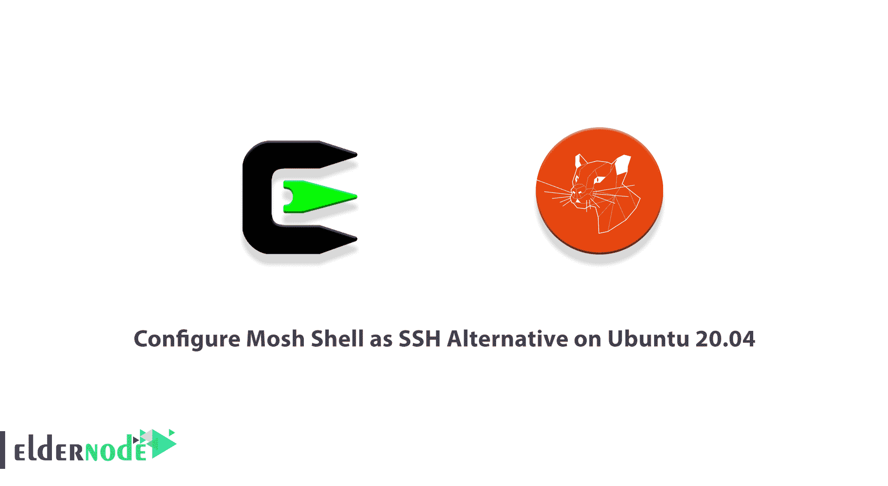
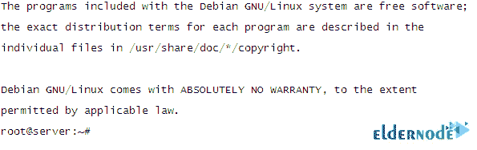

# 在 Ubuntu 20.04 - Eldernode 上将 Mosh Shell 配置为 SSH 替代

> 原文：<https://blog.eldernode.com/mosh-shell-as-ssh-alternative-on-ubuntu/>



手机壳是一款免费快速的远程终端应用。它允许漫游，支持间歇性连接，并提供智能本地回声和用户按键的线路编辑。你已经学习了 SSH。Mosh 旨在支持 SSH 的典型交互使用。由于 Mosh 更健壮、响应更快，尤其是在 Wi-Fi、蜂窝和长距离链接上，它被认为是交互式 SSH 终端的良好替代品。几乎所有的 GNU/Linux、FreeBSD、Solaris、Mac OS X 和 Android 都可以使用 Mosh。本文介绍**在 Ubuntu 20.04** 上将 Mosh Shell 配置为 SSH 替代方案。不要错过各种帮助您订购自己的 **[Ubuntu VPS](https://eldernode.com/ubuntu-vps/)** 的软件包。你可以在 [Eldernode](https://eldernode.com/) 上找到你需要的东西。

## **教程在 Ubuntu 20.04 上配置 Mosh Shell 为 SSH 替代**

Mosh 是一种基于 UDP 的传输系统，专为慢速连接的移动设备或笔记本电脑设计。它被认为是 SSH 的替代品。即使您更换 WiFi 网络或遇到手机信号波动，Mosh 也会保持您的连接畅通。接下来，你会更加熟悉 Mosh，并学习如何在 [Ubuntu](https://blog.eldernode.com/tag/ubuntu/) 20.04 LTS 上配置它。

### **什么是 Mosh，它是如何工作的？**

Mosh 是免费的命令行软件，用于通过互联网从客户端计算机连接到服务器，以运行远程终端。它适用于 GNU/ [Linux](https://blog.eldernode.com/tag/linux/) 、BSD、macOS、Solaris、Android、Chrome 和 iOS。Mosh 类似于 SSH，具有旨在提高移动用户可用性的附加功能。Mosh 比 SSH 聪明。SSH 客户机在显示您的输入之前等待来自服务器的 TCP 响应，而 Mosh 将实时显示您的输入，甚至给出带下划线的输入预测。mosh 程序将 SSH 与 ***[【邮件保护】](/cdn-cgi/l/email-protection)*** 建立连接。如您所知，SSH 可能会提示用户输入密码或使用公钥认证来登录。但是 mosh 在服务器机器上运行 mosh-server 进程(作为用户)。这样，与众所周知的 [SSH](https://blog.eldernode.com/tutorial-connect-to-ssh-on-linux/) 连接相比，Mosh 带来了一些明显的优势。

在长延迟或不可靠的链路上，Mosh 速度更快，响应更快。所以，不难说 Mosh 是 SSH 的替代品。当连接丢失时，Mosh 会尝试自动重新连接到您的 pi，即使您没有注意到。

*让我们在下面回顾一下**使用 Mosh 而不是 SSH** 的最重要原因:*

1- Mosh 将保持连接，即使您的 IP 发生变化。

2-当您的网络在失去互联网连接后恢复时，或者当您将系统置于睡眠模式时，Mosh 将恢复与您的网络机器的连接。

3-你不需要成为超级用户来安装或运行 Mosh。

4- Mosh 客户端通过 SSH 登录到服务器，用户提供与以前相同的凭证。

5- Mosh 将在您的终端中运行，如 xterm、gnome-terminal、urxvt、Terminal.app、iTerm、emacs、screen 或 tmux。

6-与 SSH 不同，Mosh 不会填满网络缓冲区，所以 Control-C 总是能够中止失控的进程。假设您请求了一个 200MB 而不是 100MB 的文件，您可以通过按下 **CTRL+C** 来立即停止它。

### **摩西外壳优点**

现在你对 Mosh Shell 有了更多的了解，如果你不确定要用 SSH 来代替它，看看下面的列表:

1- Mosh 效率高。

2- Mosh 适用于低带宽或间歇性连接。

3-与 ET 相同，连接持续跨越 WiFi 网络和中断。

4- Mosh 允许您在 SSH 和 ET 仍在等待命令完成或连接重新建立的时候输入。

5-处理数据包丢失的机制。

6- Mosh 能够使用与 SSH 相同的旧方法登录。

### **在 Ubuntu 20.04 上安装 Mosh Shell 的先决条件| Ubuntu 18.04**

为了让本教程更好地工作，请考虑以下先决条件:

_ 拥有 Sudo 权限的非 root 用户。

_ 要进行设置，请遵循我们在 Ubuntu 20.04 上的[初始服务器设置。](https://blog.eldernode.com/initial-server-setup-on-ubuntu-20/)

## **如何在 Ubuntu 20.04 上安装 Mosh Shell**

要在你的 Ubuntu 20.04 系统上安装 Mosh 包，你只需要运行以下命令:

```
apt-get update -y
```

```
apt-get install mosh -y
```

***注意* :** 如果你运行的是 iptables 之类的[防火墙](https://blog.eldernode.com/setup-firewall-ufw-ubuntu-20/)，使用下面的命令手动打开这些端口:

```
sudo iptables -I INPUT 1 -p udp --dport 60000:61000 -j ACCEPT
```

### **在 Ubuntu Linux 上配置 Mosh Shell 作为 SSH 替代**

一旦安装了 Mosh shell，你就可以**开始**使用它了。因此，运行下面的命令来连接到您的远程系统:

```
mosh [[email protected]](/cdn-cgi/l/email-protection)_IP_Address
```

应该会显示如下输出:



然后，您应该能够连接到您的远程系统。此外，您可以通过运行以下命令来检查已安装的 Mosh 的**版本**:

```
mosh --version
```

Mosh 支持许多选项，要查看所有选项，请键入:

```
mosh --help
```

## 结论

在本文中，您了解了如何在 Ubuntu 20.04 上将 Mosh Shell 配置为 SSH 替代方案。Mosh 是一个支持漫游的远程终端应用程序。它可以在大多数 Linux 发行版的存储库中下载。作为一个 Linux-尤尔建议尝试使用这个应用程序。如果您有任何经验，请将您的反馈发送给 [Eldernode 社区](https://community.eldernode.com/)上的朋友。