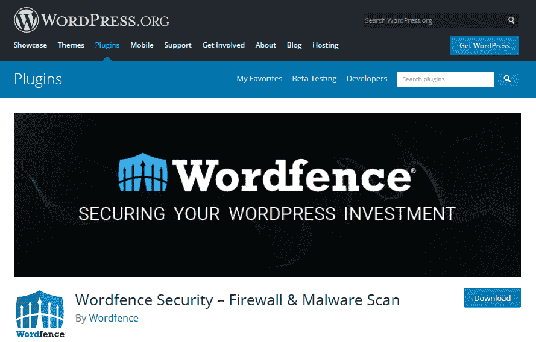

# 最重要的 WordPress 插件| Eldernode 是什么

> 原文：<https://blog.eldernode.com/most-important-wordpress-plugins/>

在本文中，我们将介绍最重要的 WordPress [插件](https://eldernode.com/category/wordpress/plugins/)。

网站应该拥有的最好的 WordPress 插件

**1) [珠峰形态(免费)](https://wordpress.org/plugins/everest-forms/)**

无论你的网站是大是小，或者是什么样的网站，你都需要一个联系人页面，让你的联系人可以和你联系。联系任何事情的目的可以是:从你的工作中获得反馈，让你达成商业交易或提供一般的报价，所以应该考虑为你设计一个漂亮的商业联系页面。

它允许您快速、轻松地创建漂亮的联系人表单。这个插件有普通的字段和更高级的字段，这些字段使得拖拽创建表单成为可能。

**2)[Yoast SEO](https://wordpress.org/plugins/wordpress-seo/)**

每个网站都需要做一些搜索引擎优化，以便更好地在搜索引擎中看到它。多年来，最好的 SEO WordPress 扩展一直是 Yoast SEO 插件。有了这个动作，你就可以优化生成的内容，通过在谷歌中聚焦关键词获得好的排名。它有一个非常定期的更新，过去的许多功能已经被添加到帮助您优化您的网站。

[巴基斯坦反垃圾邮件](https://wordpress.org/plugins/akismet/)

垃圾邮件发送者总是潜伏在我们的网站上，我们需要知道适当的解决方案来对付他们。Akismet 插件也是最好的 WordPress 插件之一，有很长的接受历史。WordPress 用户花了一段时间来做这件事，因为它的连接和高级模式有问题，但我们也教你一个解决方案，在 WordPress 上使用免费版本的 Oxymet，这样你就可以继续使用这个强大的插件并击败垃圾邮件发送者。

**4)[Google XML sitemap](https://wordpress.org/plugins/google-sitemap-generator/)**

这个插件对于 SEO WordPress 也是一个有用的工具。允许浏览器更容易地阅读您网站的内容，并更好地对其进行索引。事实上，谷歌不习惯我们阅读的语言和我们看到的可见性，所以在这个插件的帮助下，我们已经将我们所有的链接和内容转换成 XML，这样谷歌就可以轻松地查看和索引我们所有的内容。启用此扩展后，将立即为您创建站点地图。

**5)[【woo commerce】](https://wordpress.org/plugins/woocommerce/)**

我们都很熟悉 Woocommrce 插件，但它是如此广泛，以至于我们有时会记得它是一个插件。它当然是最好的 WordPress 扩展之一，有建立各种在线商店和大量更新的任务。它在支持方面也非常有效。

**6) [喷气背包](https://wordpress.org/plugins/jetpack/)**

一个非常强大的 JetPack 插件是任何 WordPress 网站的必备。这个插件包的一个特点是，它允许你飞行并带来你的成功。此插件具有强大的分发功能，可自动与第三方个人服务(如搜索引擎)共享您发布的内容，并帮助您增加流量。此外，这个插件可以创建网站地图，这样搜索引擎可以很容易地索引你的网站。
该插件通过防止暴力攻击来保护您网站的安全，并每五分钟监控您网站的损坏情况，如果出现问题，会迅速通知您。

**7) [Elementor 页面生成器](https://wordpress.org/plugins/elementor/)**

有时我们需要用特殊的设计创建不同的页面。为此我们可以使用 Elementor 的专业布局。在 Elementor 的帮助下，我们可以设计所有不同的登录页面和页面，因为它有不同而美丽的元素。这是一个新的扩展，但它已经收到了很多评论，因为它出来了。

**8) [UpdraftPlus WordPress 备份插件](https://wordpress.org/plugins/updraftplus/)**

你的网站总是需要一个备份和备份插件。这方面最好的 WordPress 插件之一是 UpdraftPlus WordPress 备份插件。它不仅执行备份操作，还执行恢复操作。如果你想了解更多关于这些插件的信息。

**9) [文字围栏安全](https://wordpress.org/plugins/wordfence/)**

如果你拥有一个网站，你应该知道你的网站的安全是第一位的，你必须注意。如果你忽视它，迟早你会失去你的网站。最好的 WordPress 安全插件之一是 Wordfence security。

**10) [BJ 懒载](https://wordpress.org/plugins/bj-lazy-load/)**

Lizzie 加载是一个重复的过程，它可以加速你的站点加载你页面上的许多图片。你可以使用一个插件，比如 BJ 懒加载，来添加一个 Lizzie Lodink 功能到 WordPress 站点。这个插件用一个侧边栏替换了所有的文章图片、文章模板、gravatar 图片和内容格式，如果你想进入浏览器页面，就加载内容。这个插件只在用户滚动页面时显示内容(图片)。所以你的网站加载速度更快，节省带宽。

注意:如果需要的话，也可以查看 [WordPress VPS](https://eldernode.com/wordpress-vps/) 服务来订购和使用你的网站。

如有疑问或问题，可向[提问系统](https://eldernode.com/ask/)咨询，提供指导。