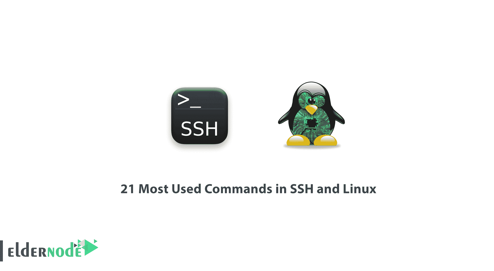

# SSH 和 Linux 中最常用的 21 个命令——教程 Linux | Eldernode

> 原文：<https://blog.eldernode.com/most-used-commands-in-ssh-and-linux/>

在这一节中，我们将看看 SSH 和 Linux 中最常用的 21 个命令。

## 在 [SSH](https://en.wikipedia.org/wiki/Secure_Shell) 和 [Linux](https://blog.eldernode.com/tag/linux/) 中最常用的命令

下面是 ssh 中一些简单但常用的命令:

1) cd 文件夹:转到目的文件夹

2) cd~ :转到主目录

3) cd..:导航到更高级别的文件夹

4) pwd :显示当前文件夹的完整路径

5) ls :列出一个文件夹中的所有文件夹和文件

6) cp 文件 newfile :复制并重命名文件

7) cp 文件目录/文件:将文件复制到另一个文件夹

8) mv 文件目录/文件:将一个文件完全移动到另一个文件夹

9) mv 目录 1/all 目录:将一个文件夹移动到另一个文件夹

10) /mv 目录..:将文件夹移动到更高一级

11) rm file1 :删除一个文件

12) rm* :删除一个文件夹内的所有文件

13) 分机 rm。* :删除所有带有特殊扩展名的文件

14) mkdir directoryname :建立一个目录

15) chmod 权限文件名称 e:更改文件的访问级别

例如:config.php chmod 777

16) chown 所有者:所有者文件名:改变文件的所有者

示例:chown admin:admin config.php

17) wget filename : Download URL

18) w :一会儿看服务器负载

19) top :连续查看服务器负载

20) 退出:退出应用环境

21) grep [text] [filename] :在特定文件中搜索文本

祝你好运。