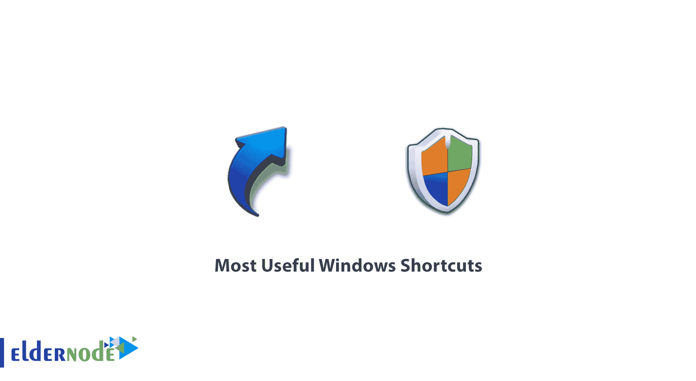

# 最有用的 Windows 快捷方式- Eldernode

> 原文：<https://blog.eldernode.com/most-useful-windows-shortcuts/>

快捷键是在应用程序或操作系统中调用命令的一组一个或多个键。Windows 中的快捷方式提高了在操作系统中做事的速度和便利性。有了这些快捷方式，用户可以通过按组合键而不是移动鼠标来轻松地执行他的一些需求。许多人都熟悉一些有用的快捷方式，但在本文中，我们将向您介绍您不太熟悉的最有用的 Windows 快捷方式。

## 最有用的 Windows 快捷键

在继续之前，如果你是 Windows 的新手用户，你应该知道 Windows 键指的是键盘左侧的按钮，位于 Alt 和 Ctrl 键之间，通常会在上面画出 Windows 的 logo。下面的列表是 20 个最重要的 Windows 快捷方式，对你的日常工作有帮助。

### Windows +空格键

如果您想查看 windows 桌面一会儿，然后立即返回到以前的状态(查看活动窗口)，请使用 Windows 组合键和空格键。只要你按住这两个键，手铐屏幕就会显示出来，放开这两个键之后马上回到窗口或者运行程序。

### Windows + T

通过使用此快捷方式，您可以看到在任务栏中打开的窗口的小预览。重复按下 **Windows + T** 会看到第一组到最后一组运行程序的预览。您可以通过将鼠标指针悬停在任务栏中的任何图标上来完成同样的操作。

### 视窗+ 1，2，3，…

在 Windows 7 及以后的版本中，任务栏中增加了一种新的添加有用软件的方式，用户可以右击窗口中的任意图标，选择“**将此程序固定到任务栏**”。将所需的程序或窗口添加到工具栏中。锁定所需软件后，用户可以通过点击相关图标快速运行所需软件。现在，除了使用鼠标，您还可以通过按组合键 Window + 1 或 2 或 3 等从左到右访问工具栏中的固定软件。

### Windows+/–

如果您想在阅读文本或查看图像时放大屏幕，您可以通过按下 **Windows 键和+** 或 Windows 组合键运行 Windows 放大镜软件，并放大或缩小 Windows 屏幕。这些快捷方式可以在 Windows 上运行的所有软件中使用。

### Windows + Shift +向左或向右

左右键是指键盘右侧的上下箭头旁边带有左右箭头的键。如果您使用两台监视器来充分利用桌面空间，您可能希望将其中一台监视器用作主屏幕，而将另一台监视器用于显示活动的和正在运行的程序。您可以使用鼠标和拖放窗口将它们从一个监视器屏幕移动到另一个，或者使用 Windows + Shift +向右键或向左键组合。

### Windows + M 或 Windows + D

您可以通过按 Windows + M 组合键来最小化屏幕上的所有窗口和应用程序。也就是按下 **Windows + Shift + M** 组合键，将它们全部从屏幕移动到任务栏，返回运行软件。Windows + D 组合键的工作原理几乎与 **Windows + M** 相同。 **Windows + D** 最小化显示的所有软件。尝试两种组合键，看看两者之间的细微差别。

### Shift + Ctrl + N

在 Windows 中创建新文件夹非常容易。您始终可以通过右键单击并选择“创建新文件夹”在资源管理器中创建新文件夹。但是更简单的解决方案是使用 **Shift + Ctrl + N** 组合键。按下这些组合键可以快速创建一个新文件夹，您可以在重命名文件夹并按下 Enter 键后创建一个新文件夹。

### Windows + X

您可以使用 **Windows + X** 组合键访问 Windows 移动中心设置。这些设置包括显示器亮度、电池寿命显示和更改耗电条件的可能性、打开和关闭无线网络、增加或减少输出声音和演示模式，以及使用投影仪。此快捷方式仅适用于笔记本等移动设备。

### Shift + Delete

默认情况下，通过按删除按钮删除的任何文件实际上都被转移到回收站。事实上，它们并没有被删除，所以如果不正确地删除，用户可以通过回收站恢复所需的文件。现在如果你不希望被删除的文件被转移到回收站并直接删除，你可以使用 **Shift + Del** 组合键。

### Windows + L

您可以通过按下 **Windows + L** 组合键来锁定窗户。例如，如果您计划离开办公桌工作几分钟，您可以锁定窗口以确保当您离开时没有其他人可以访问您的计算机。当然，这需要您的活动用户名的密码。

### Ctlr + Z

Ctlr + Z 是救世主，无论你做什么，在哪里。这些组合键有后退的作用。您使用的每个程序都支持此快捷键。所以不要担心你的错误。

### Ctlr + A

还是那句话，不管你用什么程序，这个快捷键都可以选择你正在用的程序的所有文本、文档或者元素。不用拖鼠标，Ctrl + A 比你想象的有用。

### Ctrl + C

选择部分文本后，您可以使用这些组合键来复制该文本。这是当时最重要的 Windows 快捷键之一。想复制什么就复制什么，想什么时候粘贴就什么时候粘贴。

### Ctrl + V

用这个快捷方式粘贴您复制的所有内容。它可以是文本、文件、照片或文件夹。如果要粘贴不带格式的纯文本，还必须向该快捷方式添加 Shift:Ctrl+Shift+V

### Ctrl + X

如果您不希望文本/表格/图像/文件保留在当前位置，只需选择它并使用 Ctrl + X 将其完全删除。这个快捷方式实质上是删除和复制主题。然后贴在你想贴的地方。

### Alt + Tab

这是一个有点有限的，并已改善了固件升级。只需按 Alt 键，然后点击 Tab 键即可在所需页面/选项卡之间移动。您也可以在按住 Alt 键和 Tab 键的同时在页面之间切换。我们谈论的是多任务处理。

### Ctrl + Alt + Del

当一个正在运行的应用程序延迟或没有响应，而你的窗口保持原样时，你必须使用这些按键。您可以通过按 Ctlr + Alt + Del 来完成此操作。当你同时按下这些键时，会出现一个叫做任务管理器的神奇盒子。然后你就可以这样关闭相关的应用程序/程序，给你的电脑赋予新的生命。

### Alt + F4

只需按下 Alt 键和 **F4** 操作键，你会看到应用程序关闭。你所要做的就是进入应用程序。这个快捷键足够智能，在关闭之前会要求你保存你的工作。

### Ctrl + F

Ctrl + F 是一个很棒的快捷键，可以让你运行快捷栏来键入你想要的东西。你可以根据你想要的关键词看到所有的结果。

### Ctrl + H

这个快捷方式负责查找和替换。只要按下相应的键就可以打开一个盒子。只需输入可跟踪和可替换的条目，就可以做到这一点。这种快捷方式适用于大多数文档。

## 结论

Windows 的魅力之一是，对于大多数活动，都定义了一个快捷键，您只需按下 Windows 快捷键，就可以在很短的时间内执行所需的操作。这将加快速度。比如运行一些程序，小改动，开关窗口等。都有定义快捷键。在本教程中，我们试图向您介绍最有用的 Windows 快捷方式。