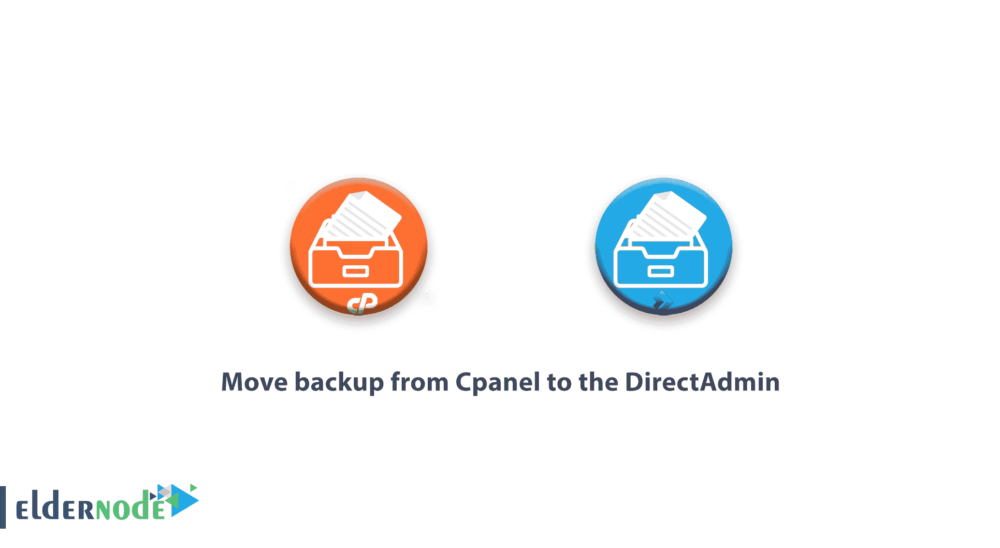

# 将备份从 Cpanel 移动到 DirectAdmin - Directadmin 服务器

> 原文：<https://blog.eldernode.com/move-backup-from-cpanel-to-the-directadmin/>

将备份从 Cpanel 移动到 DirectAdmin 由于 Cpanel 在[许可](http://eldernode.com/vps-hosting/)方面的变化，如今许多站长正计划将他们的网站从 Cpanel 转移到 [DirectAdmin](https://blog.eldernode.com/tag/direct-admin/) 。如果你已经决定移动到 DirectAdmin，请阅读本教程到最后，这样你就可以轻松地移动所有的文件，没有任何问题。

#### **将备份从 Cpanel 传输到 DirectAdmin 之前需要了解的事项:**

*   您在 **CPanel** 中创建的备份文件的格式必须是“【cpmove-user.tar.gz】T2 的格式
*   您的 DirectAdmin 版本应该高于 1/57/4
*   检查您的服务器上是否安装了最新版本的 Roundcube

请注意， **CPanel** 中邮件列表部分的内容不会传输到 DirectAdmin。

DirectAdmin 使用的数据库名称和数据库用户名的格式始终是:“**用户名 _ 数据库**和“**用户名 _ 用户**”。 **CPanel** 也使用相同的格式，但是通常由于数据库名称和数据库用户之间存在的限制， **CPanel** 通常会缩短用户名字段。

但是，DirectAdmin 总是将用户名部分完全放在字符串的开头。在将 **CPanel** 备份转换为 DirectAdmin 时也是如此，因此在移动之后，您需要更改“【wp-config.php】”文件和存储在其他数据库脚本中的类似文件。

如果您的 **CPanel** 备份是由“ **Jetbackup** ”插件提供的，请注意该插件的输出文件不是“ **cpmove-user** ”，需要转换。下面是怎么做的。

#### 注:

我们建议您在将备份转移和恢复到服务器上的 DirectAdmin 后，保留名为“【cpmove-user.tar.gz】”的 **CPanel** 核心备份文件，以防仍然由您处理的站点备份文件出现问题或错误。

[DirectAdmin](https://www.directadmin.com/) 拥有 CPanel 所没有的特性，比如直接支持**nginx**/**openlitespeed**、 **mysql8** 、 **rspamd** 等。还有 DirectAdmin 中不支持的东西，比如 **rubby** 和 **postgresql** 。

因此，如果你有一个网站使用这两个你需要手动转移。

DirectAdmin 中的系统用户名字符串的最大长度是 10 个字符，MySQL 中的最大长度是 16 个字符，您可以通过下面描述的方法增加该长度。

如果您有许多 CPanel 备份，其格式被称为**user.tar.gz**，您通常可以在尝试恢复备份之前将它们转换为正确的 **cpmove-user** 格式。

如果您有许多格式为 **backup 的 CPanel 备份-…_user.tar.gz** ，在尝试恢复备份之前，您通常可以将它们转换回正确的 **cpmove-user** 格式。

转移后，您可能看不到“**在经销商**之间移动用户”部分中的部分已转移用户列表，修复此问题的方法将在下面讨论。

### **Jetpack 备份转换器:**

由于 Jetpack 插件不生成 **cpmove-user** 格式的备份，您需要将该插件的备份转换到 DirectAdmin 来恢复它。为此，在将文件传输到 ssh 上的 DirectAdmin 服务器后，运行以下命令。

| jetbackup=yes /usr/local/directadmin/scripts/cpanel_to_da/cpanel_to_da.sh /home/admin/user_backups/cpmove-USERNAME.tar.gz /home/admin/converted_user_backupchown -R 管理。/home/admin/converted _ user _ backup |

**增加 DirectAdmin:** 中系统和 MySQL 用户名的字符串长度

DirectAdmin 在命名系统用户时最多支持 10 个字符，在命名数据库和数据库用户时最多支持 16 个字符。您可以通过在 ssh DirectAdmin 服务器上执行以下命令来最大化这个数字。

| /usr/local/direct admin/direct admin set max _ 用户名 _ 长度 16 重新启动 |

### **将 Cpanel 备份转换为正确的格式，以便传输到 DirectAdmin:**

如果您的 CPanel 中有形式为**user.tar.gz**或**备份-… -user.tar.gz** 的备份，您必须在尝试将它们恢复到 DirectAdmin 之前将它们转换为**cpmove.tar.gz**。您可以按照下面的说明简单地执行这种转换。如果您的备份是以**user.tar.gz**的形式，运行以下命令:

| 对于 I in ` ls * . tar . gz &#124; grep '^[a-za-z0-9]*.tar.gz'`；do { mv-VF $ { I } CP move-$ { I }；};完成的 |

如果您的备份是以 **backup-… -user.tar.gz** 的形式，请运行以下命令:

| for i in `ls backup-[0-9]*。* . tar . gz `；do { USERNAME = ` echo $ I &#124; cut-d _-F3 &#124; cut-d ' . '-f1 `；mv-v $ I CP move-$ { USERNAME } . tar . gz；};完成的 |

请注意，要在备份所在的目录中运行上述命令。

### **修复了 DirectAdmin** **:** 的“在经销商之间移动用户”部分不显示用户的问题

如果在 DirectAdmin 中恢复备份后没有看到所有用户或某些用户，并参考 DirectAdmin 的“在经销商之间移动用户”部分，请在 ssh DirectAdmin 服务器上运行以下命令。

| #!/bin/shCD/usr/local/direct admin/data/users对于' ls */reseller.conf &#124; cut -d/ -f1 '中的 r；做{echo“修复经销商$ r…”；echo -n " > $r/users.listfor u in ` grep " ^creator=$r$ " */user . conf &#124; cut-d/-f1 `；做{ISUSER=`grep -c usertype=user $u/user.conf`if[" $ I user " = " 1 "]；然后echo $u >> $r/users.list船方不负担装货费用};搞定；};搞定； |

### **修复正确代表子集中没有用户的问题:**

如果在备份 DirectAdmin 时没有首先返回委托，用户将被创建为管理员子集。要解决此问题，请在备份所在的目录中运行以下命令。

| for i in `ls user*.tar.gz`; do { RESELLER=`echo $i &#124; cut -d. -f2`; USER=`echo $i &#124; cut -d’.’ -f3`; /usr/local/directadmin/scripts/move_user_to_reseller.sh $USER admin $RESELLER; }; doneecho " action = cache & value = showall users " > >/usr/local/direct admin/data/task . queue/usr/local/direct admin/dataskq d |

### **开始将备份从 CPanel 转移到 Directadmin 的过程:**

”将备份从 Cpanel 移动到 DirectAdmin”:

要开始传输，首先，在 CPanel 服务器中登录到您的 ssh，并仔细执行以下两个步骤。

**1。**首先，通过执行以下命令创建所有 CPanel 帐户的备份。

| mkdir -p /home/all_backups对于“ls /var/cpanel/users/”中的用户；do {/scripts/pkgacct $ { user }/home/all _ backups；};完成的 |

**2。**在服务器上完成备份过程后，使用以下命令将创建的备份文件传输到 DirectAdmin:

| rsync-avt–delete/home/all _ backups/[【电子邮件保护】](/cdn-cgi/l/email-protection)_ direct admin _ server . com:/home/admin/all _ backups/ |

将备份文件传输到新服务器后，连接到 DirectAdmin 服务器的 ssh 服务器，并执行以下命令:

| cd /usr/local/directadmin/custombuild。/build 更新。/build cpanel_to_dachown -R 管理。/home/admin/all_backups |

完成以上步骤后，进入 DirectAdmin，进入**备份&恢复**部分，即可轻松恢复 **/home/admin/all_backups** 中的备份。

将备份从 Cpanel 移动到 DirectAdmin。

祝您好运