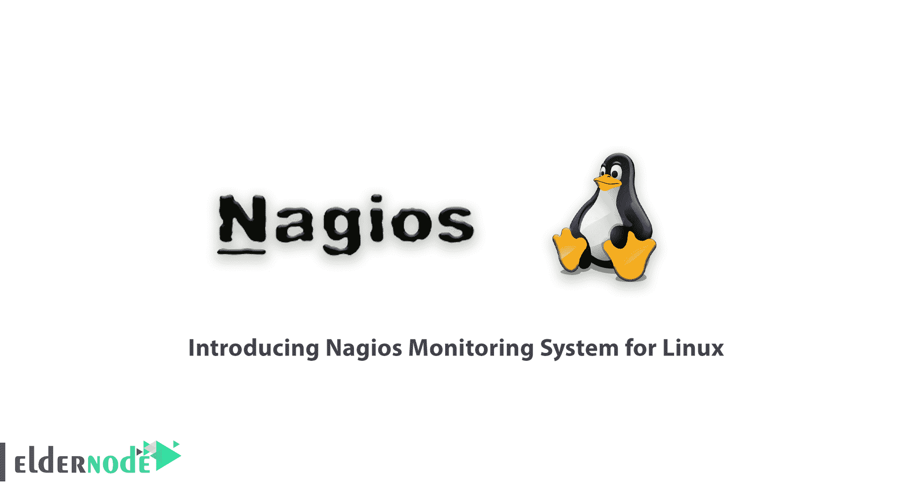
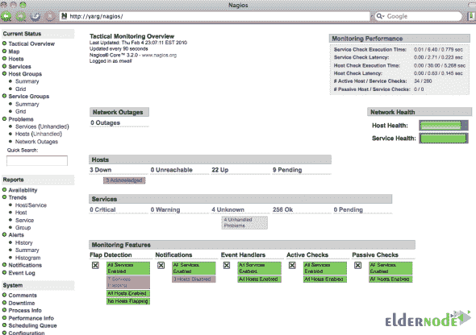
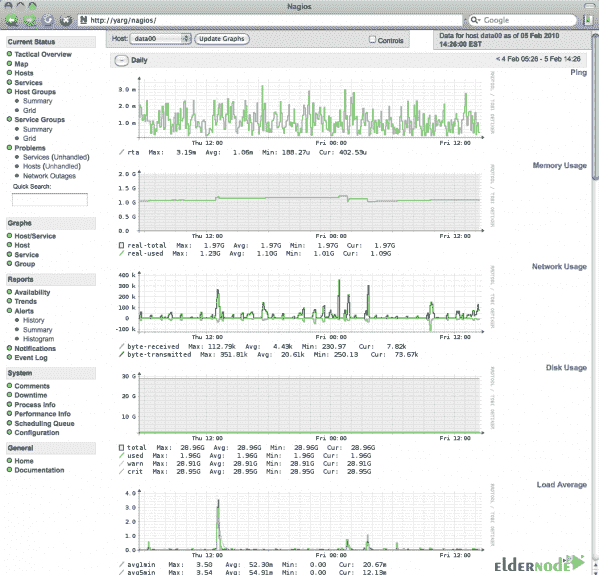
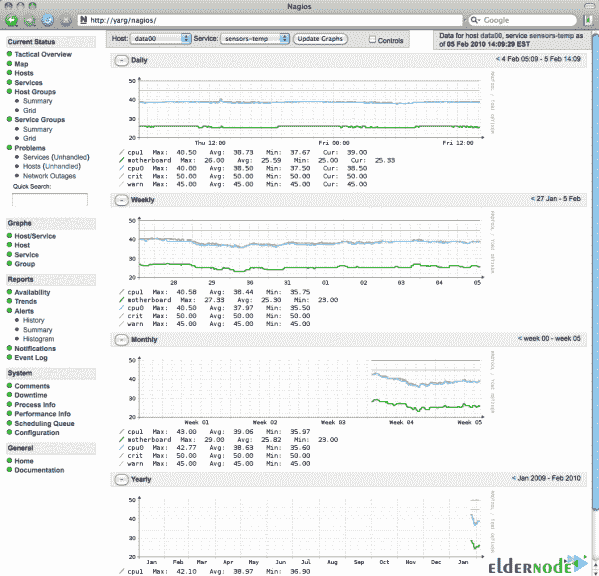
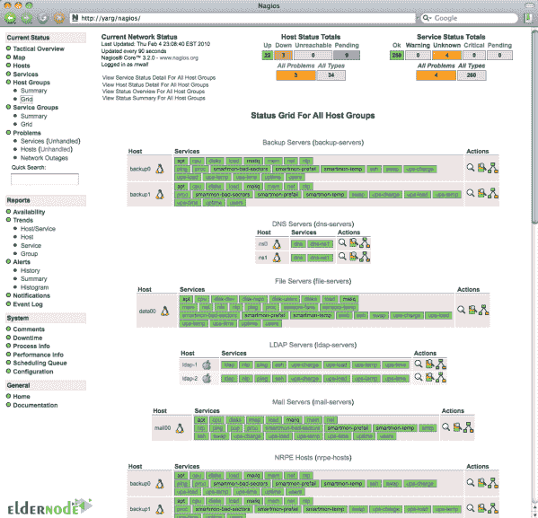
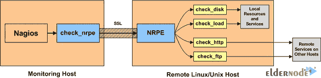
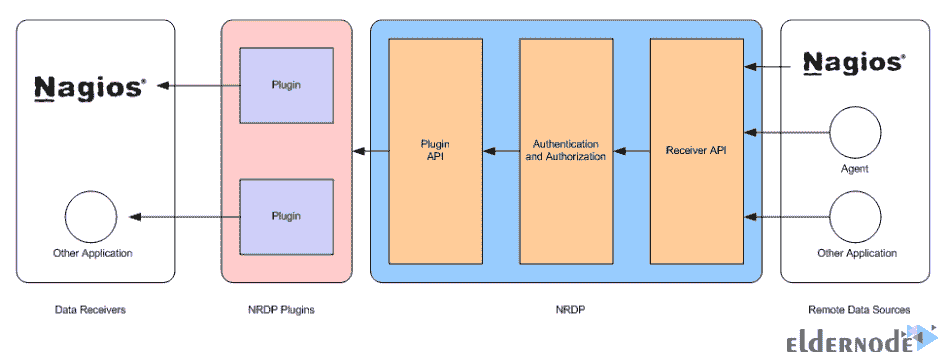
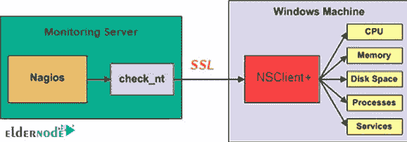
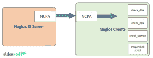

# 介绍用于 Linux 的 Nagios 监控系统- Eldernode 博客

> 原文：<https://blog.eldernode.com/nagios-monitoring-system-for-linux/>

Nagios 是一个免费的开源软件，用于监控系统、网络和基础设施。Nagios 为服务器、交换机、应用程序和服务提供监控和警告服务，并在出现问题时提醒用户。在这篇文章中，我们试图向您介绍用于 Linux 的 Nagios 监控系统。你可以访问 [Eldernode](https://eldernode.com/) 提供的包来购买 [Linux VPS](https://eldernode.com/linux-vps/) 服务器。

## Nagios 监控系统简介

Ethan Galstad 和一群开发人员最初像 NetSaint 一样编写 Nagios。从 2015 年开始，他们积极维护正式和非正式插件。Nagios 代表 Nagios 不会坚持 Sainthood，这是指 NetSaint 的原始名称，该名称因类似品牌所有者的法律挑战而被更改。Agios 或 hagios 也是一个希腊词，意思是圣人。Nagios 最初是为运行基于 Linux 的系统而设计的，但现在也能在 Unix 版本上很好地工作。根据自由软件基金会发布的 [GNU](https://www.gnu.org/home.en.html) 通用公共许可证版本 2 的条款，该软件是免费的。

## 【Linux 的 Nagios 监控系统

### Nagios 软件有什么特点？

Nagios 是在 GNU GPL V2 许可下的开源软件。

**1-** 监控网络服务(SMTP、POP3、HTTP、NNTP、ICMP、SNMP、FTP 和 SSH)

**2-** 使用[监控](https://blog.eldernode.com/website-and-server-monitoring-tools/)代理监控包括微软 [Windows](https://blog.eldernode.com/tag/windows/) 在内的大多数网络操作系统中的主机资源，包括负载处理器、磁盘消耗、系统日志

**3-** 监控任何硬件，如温度探测器、警报等。它们能够将通过网络收集的数据发送到特定的编写插件。

**4-** 通过 Nagios 远程插件执行器远程运行脚本进行监控

**5-** 支持通过 SSH 或 [SSL](https://blog.eldernode.com/how-to-install-and-activate-the-ssl-certificate/) 加密隧道进行远程监控。

**6-** 简单的插件设计，允许你使用你想要的工具，如 shell 脚本、C++、Perl、Ruby、Python、PHP、C#等，轻松开发你的服务评论。

**7-** 数据图表插件可用。

**8-** 并行服务评审

**9-** 集成了许多配置编辑器的纯文本格式配置文件。

**10-** 使用父主机定义网络主机的能力

**11-** 区分低级主机和不可访问主机的能力

**12-** 能够定义在服务或托管期间运行的事件处理，以解决主动问题

**13-** 自动旋转日志文件

**14-** 支持托管性能监控

**15-** 支持执行数据性能图表

**16-** 支持数据库后端，如 NDOUtils

**17-** 推送通知

**18-** 查看当前网络状态、通知、问题历史、日志文件等的 web 界面。

### 什么是 Nagios 代理？

Nagios 代理包括以下内容:

**1 .NRPE 代理商〔t1〕**

NRPE，或 Nagios 远程插件执行器，是一个 Nagios 代理，支持使用远程系统上的脚本进行远程系统监控。这允许您监视资源，如磁盘使用、系统负载或登录的用户数量。NRPE 允许您在其他 Linux 或 Unix 设备上远程运行 Nagios 扩展。这允许您远程控制设备指标，如磁盘使用、CPU 负载等。NRPE 还可以与一些 Windows 操作扩展交互，因此您可以运行脚本并检查远程 Windows 设备的标准。

**2。NRDP 代理**

NRDP 或 Nagios 远程数据处理器是一个 Nagios 代理，具有灵活的数据传输机制和处理器。该代理的设计架构使其易于部署和配置。NRDP 使用标准端口和协议，如 HTTP 和 XML，可以作为 Nagios 服务检查接受者或 NSCA 的替代方案。

**3。NSClient++代理**

这个程序主要用于监控 Windows 设备。NSClient++正在侦听 TCP 端口 12489 的远程系统上安装。用来从这个插件收集信息的 Nagios 插件叫做 **check_nt** 。

**4。NCPA 代理**

Nagios 跨平台代理是 Nagios Enterprises 运行的一个开源项目。NCPA 正在 Windows、Linux 和 macOS X 上安装。NCPA 允许多种控制，如内存使用、CPU 使用、磁盘使用、进程、服务和网络使用。主动检查通过 NCPAListener 服务 API 发送，而非主动检查通过 NCPA 被动服务发送。

### Nagios 软件的优势

**A-** 监控 SMTP、POP3、HTTP、NNTP、ICMP、SNMP、FTP、SSH 等网络服务

**B-** 监控任何硬件，如温度探测器、警报等。它们能够将通过网络收集的数据发送到特定的编写插件。

**C-** 使用监控代理监控大多数网络操作系统中的主机资源，包括负载处理器、磁盘消耗、系统日志

**D-** 支持通过 SSH 或 SSL 加密隧道进行远程监控。

与许多配置编辑器集成的纯文本格式的配置文件。

**F-** 使用父主机定义网络主机的能力，区分低级主机和不可访问主机的能力

**G-** 能够定义在服务或托管期间运行的事件处理，以解决主动问题

**H-** 自动旋转日志文件

**I-** 查看当前网络状态、通知、问题历史、日志文件等的 web 界面。在纳吉奥斯

**J-** 支持托管性能监控

**K-** 支持数据库后端，如 NDOUtils

**L-** 推送通知

**M-** 支持执行数据性能图表

## 结论

Nagios 是一个用于监控网络、基础设施和软件的开源监控系统。在本文中，我们试图让您全面了解用于 Linux 的 Nagios 监控系统。