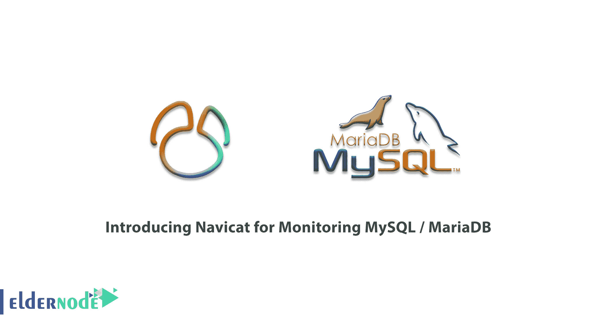
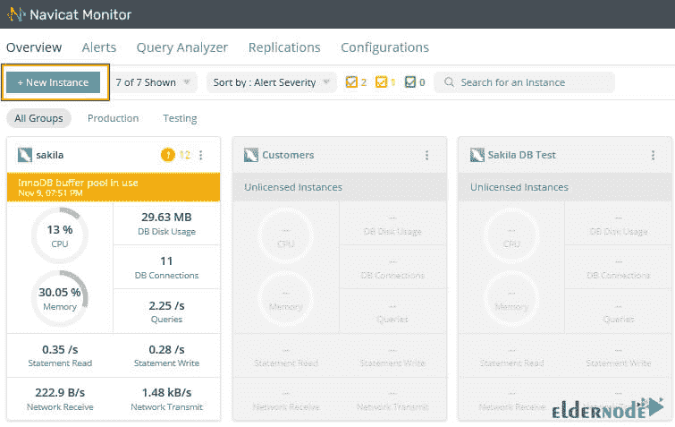
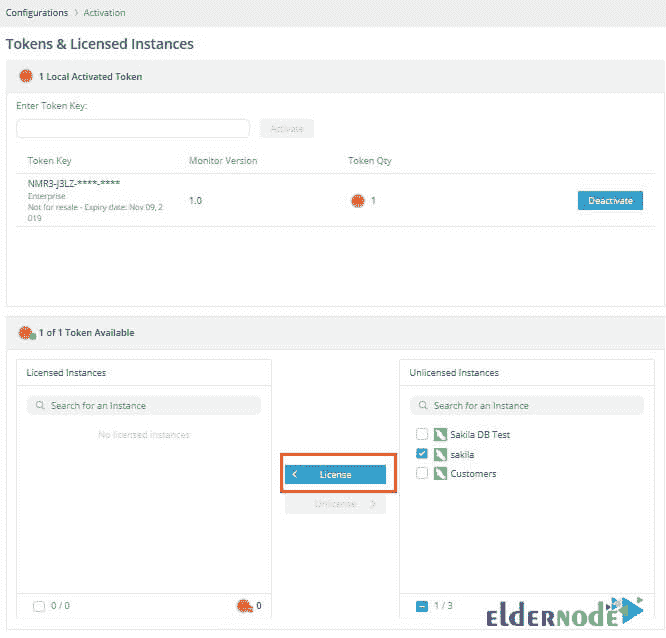

# 介绍用于监控 MySQL / MariaDB - Eldernode 博客的 Navicat

> 原文：<https://blog.eldernode.com/navicat-for-monitoring-mysql-mariadb/>

Navicat 是一个功能强大的软件，具有图形用户界面，用于管理和使用此类数据库。Navicat 允许您组织和交换数据库中的数据，并确保这些过程是安全的。使用 Navicat，您可以连接到本地服务器或远程。该软件还支持从 ODBC 导入数据、调度任务(意味着为数据传输和存储查询创建时间线)以及打印结构表。需要注意的是，该软件包括图形化管理来设置用户和访问权限。在本文中，我们将全面讨论**引入 Navicat 来监控 MySQL / MariaDB** 。请注意，如果您决定购买 [VPS 服务器](https://eldernode.com/vps/)，您可以在 [Eldernode](https://eldernode.com/) 中看到可用的软件包。

## **介绍 Navicat 监控 MySQL / MariaDB**

Navicat Monitor for MySQL / MariaDB 是一款无需代理即可进行远程服务器监控的工具。该工具具有尽可能高效、轻松地监控数据库(DB)项目的特性。此外，它基于服务器的体系结构使它可以从任何地方通过网络浏览器访问。因此，它提供了无障碍的访问，以便在白天或夜晚的任何时间从世界任何地方轻松、无缝地跟踪服务器。

### **Navicat 软件的优势**

在本节中，我们将介绍 Navicat 软件最重要的功能:

–支持最新版本的 [MySQL](https://blog.eldernode.com/install-mysql-on-windows-server/) 、 [PostgreSQL](https://blog.eldernode.com/postgresql-installation-tutorial/) 和 Oracle。

–在程序设计中使用 SQL 命令台。

–能够同时建立多个连接。

–备份数据库并检索它们。

–数据输入和输出支持 XLS、CSV、TXT、DBF 和 XML 格式。

–高级图形设计。

### **Navicat 软件的特点**

**1-迁移**

Navicat 的功能之一是迁移能力。如果要将应用程序服务器从一台计算机移动到另一台新计算机，可以导出监视器设置。该脚本的输出将是一个备份 zip 文件，其中包含重建所需的所有配置文件和设置。

**2-角色经理**

您可以通过向用户分配角色来设置用户权利和限制。请注意，可以为任何用户绘制角色，例如外部 LDAP/AD 用户或在 Navicat Monitor 中创建的本地用户。您还可以自定义预定义的角色以满足您的需求，或使用自定义权限设置创建新角色，以限制对 Navicat Monitor 中选定页面的访问。

**3-黑暗模式**

有了这个功能，你可以设置一个深色主题，保护你的眼睛不受电脑屏幕白色的影响。

**4-定制警告**

设置自定义警报阈值以监控您的基础架构。这样，当您达到设置的规则阈值时，您可以收到警报。

**5- LDAP / AD 认证**

通过将 Navicat Monitor 配置为使用 LDAP 或 Active Directory 服务器进行身份验证，您可以节省设置新的不同安全方法的时间。

**6-通知**

每当您的基础架构中出现警报或紧急情况时，您都会通过电子邮件、SMS、SNMP 或 Slack 收到通知。

## **Navicat 用于监控 MySQL /** **MariaDB**

在描述了 Navicat 及其优点和特性之后，在本节中，我们将在 Navicat Monitor for MySQL/[Maria db](https://blog.eldernode.com/mariadb-installation-on-ubuntu/)中配置一个实例。重要的是，您可以创建多达 1000 个实例。

在**仪表板**上，您可以看到由 Navicat Monitor 控制的所有内容的概览。这些信息总结了系统的状态，并确定了需要特别注意的问题。示例卡中还提供了实例信息，这允许您确定服务器的状态以及所使用的系统资源数量。

要创建一个新实例来监视您的服务器，请单击“**新实例**，并从下拉列表中选择**服务器类型**:

在下一步中，您必须在**新实例**窗口中输入适当的信息。要在新实例窗口中这样做，请为**实例名**输入一个自定义名称。然后，您必须为您的样本选择组。请注意，如果您想添加一个新组，您可以点击“**新组**”。

***注:*** Navicat Monitor 可以通过安全的 [SSH](https://blog.eldernode.com/ssh-connection-softwares/) 隧道连接到数据库服务器，以发送和接收监控数据，即使连接被防火墙禁用或阻止。

对于在 **MySQL 服务器**或 **MariaDB 服务器**部分的更多信息，我们提供以下解释。您必须输入以下信息:

***–主机名:*** 数据库服务器的主机名或 IP 地址。

***–端口:*** 连接数据库服务器的 TCP/IP 端口号。

***–用户名:*** 监控数据库服务器连接的用户。

***–密码:*** 监控用户的登录密码。

***–服务器类型:***Unix 或 Windows 等服务器类型。

***注:*** 我们建议为监控用户创建一个单独的账户。您还需要在所有数据库对象中将复制客户机、超级、进程和选择权限授予监视用户。

完成最后提到的更改后，点击“ **New** 创建一个新样本。

### **如何在 Navicat** 高级版中激活令牌

使用本软件的试用期结束后，您需要获得 Navicat Monitor 的许可证。您可以从 [Navicat 网站](https://www.navicat.com/en/)购买代币。要管理令牌，进入**配置>** > **激活**，如下图所示。注意，要激活一个实例，必须将其放入**未授权实例**列表中。然后选中它旁边的框，并单击“**许可证**”按钮。

## 结论

Navicat 软件是管理 MariaDB、Mysql、PostgreSQL 和 Oracle 数据库的极其强大的应用程序。完整的 Unicode 支持，能够使用 MS Access、MS Excel、XML、PDF 和 TXT 扩展名导入和导出信息，能够在程序中编辑和构建数据库，这些都是 Navicat 的特性。此外，创建所需的查询并保存它们，同时查看查询输出，从数据库创建报告和其他独特的可能性是该软件的特点。在本文中，我们试图向您全面介绍用于监控 MySQL/MariaDB 的 Navicat。