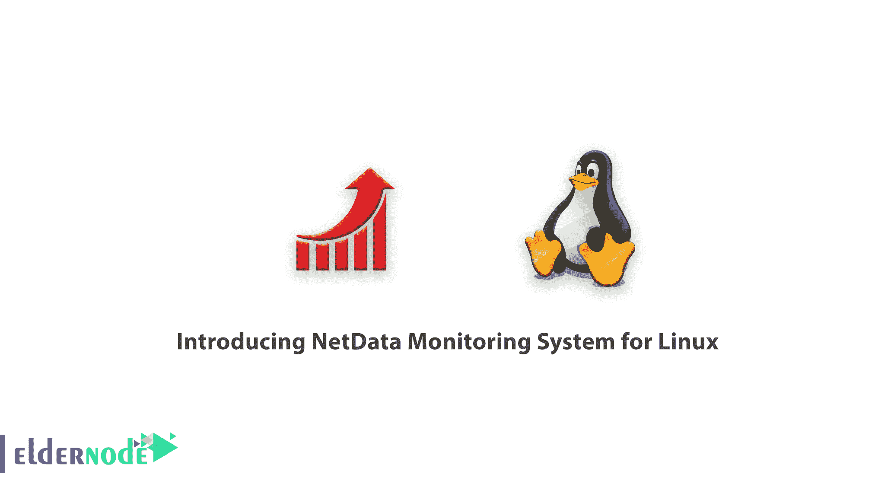
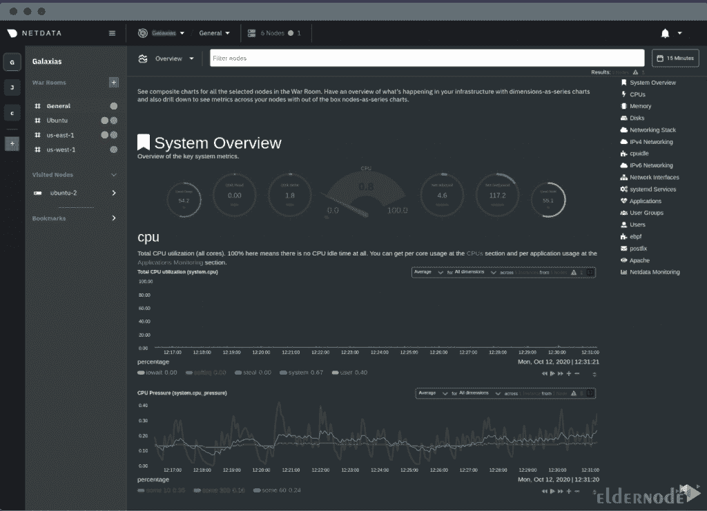
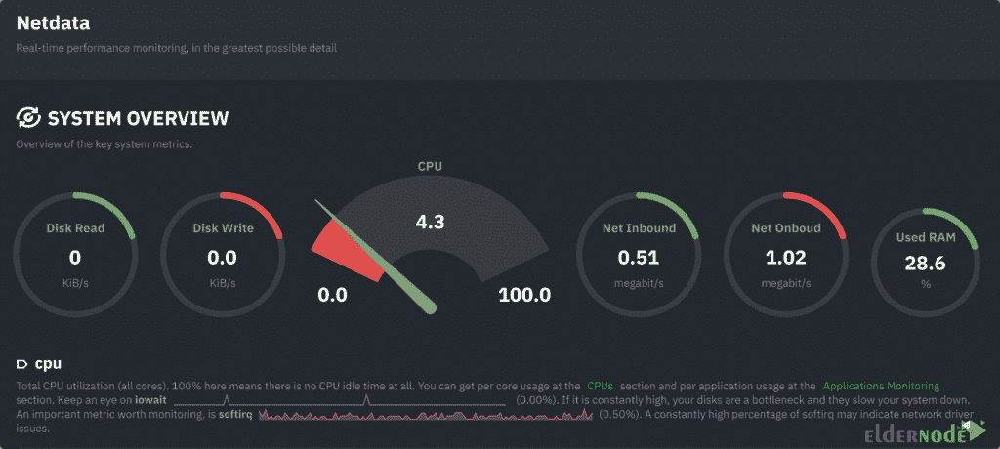

# 介绍用于 Linux 的 NetData 监控系统- Eldernode 博客

> 原文：<https://blog.eldernode.com/netdata-monitoring-system-for-linux/>

Netdata 是一个服务器监控工具。该工具显示了服务器资源的瞬时使用情况，例如 RAM、硬盘和 CPU。服务器管理员需要这些信息来进行管理并做出必要的决策。有用于服务器管理的控制面板，每个面板专用于特定的操作系统，并根据个人需求使用。这些面板都不能即时监控服务器，也不能显示准确的信息。安装这个工具很简单。它也不会增加服务器的负载，并且具有用户友好的外观和界面。Netdata 软件还监控服务器上的一切。在本文中，我们试图向您介绍用于 Linux 的 net data 监控系统。您可以访问 **[Eldernode](https://eldernode.com/)** 中的套装，购买一台[专用服务器](https://eldernode.com/dedicated-server/)。

## **net data Linux 监控系统**

许多服务器管理员需要工具来监控带宽、RAM 和 CPU 的使用情况，并且通常根据服务器上的硬件来监控服务器。服务器管理员可以使用控制面板，如 [Directadmin](https://blog.eldernode.com/tag/direct-admin/) 、 [cPanel](https://blog.eldernode.com/tag/cpanel/) 、 [Plesk](https://blog.eldernode.com/tag/plesk/) 、WebSitePanel 或 Kloxo 来更好地管理服务器，这取决于服务器操作系统。。但是这些面板都没有即时监控服务器所需的功能。这些面板可以大致显示一个帐户在过去 24 小时内消耗的流量。

[Netdata](https://www.netdata.cloud/) 是一个分布式实时性能故障排除和健康监控平台，适用于任何规模的基础设施。Netdata [监控](https://blog.eldernode.com/website-and-server-monitoring-tools/)系统是计时测量系统中的后起之秀。与其他类似工具相比，Netdata:

**–**运行在大多数 Linux 发行版上。

**–**针对最小的 CPU、内存和磁盘使用量进行了优化。

下面，我们将介绍 NetData [监控](https://blog.eldernode.com/linux-server-monitoring-commands/)系统的一些特性。

### net data 有什么特点？

**1。优化:**这个工具很轻，不会给服务器增加负载。

**2。快:**这个工具速度快，瞬间显示信息。

**3。安装在所有系统上:**可以安装在所有物理和虚拟系统上。

**4。开源:** Netdata 是一款开源软件。

**5。免费:**使用本软件完全免费。

**6。通知系统:**这款软件有一个警告系统，一旦出现问题会通知服务器管理员。

**7。**无需特殊设置即可开始使用。

### NetData 监控什么？

**–**中断、软件和 CPU 内核的总体和单独使用情况。

**–**使用内核、总内存、RAM、交换空间。

**–**每个磁盘的 I/O 以及详细信息，如积压、操作、带宽等。

**–**监控网络接口，如带宽、数据包、错误、丢弃。

**–**监控 SNMP 设备

**–**Mysql 数据库的问题和操作。

**–**通过 mod_status 显示 Apache 和 Nginx 的性能状态。

**–**流程如何工作

**–**监控和检查电压、温度等硬件传感器。

### net data 监控系统的优势

**A .实时监控能力。**

NetData 是一个实时监控系统。换句话说，信息不是集中显示，而是实时显示在每台设备上。因此，要查看每个设备的状态，您必须连接到它。

有一个吸引人的用户界面。

一个好的用户界面使得使用 NetData 更加容易和更有吸引力。使用正确的用户界面，您可以浏览图表并采取行动。

**C .可扩展，可伸缩。**

NetData 监测系统插件 API 允许分析一切你可以得到的数字。此外，它使您的浏览器成为连接所有服务器的中心点。它可以以较低的速率将其指标归档到 graphite，以避免这些服务器因收集的数据而过载。

**D .可以安装在所有被监控的设备上。**

NetData 监控系统可以安装在所有被监控的服务器上。该工具已经在 Debian、 [Ubuntu](https://blog.eldernode.com/tag/ubuntu/) 、 [CentOS](https://blog.eldernode.com/tag/centos/) 、RedHat、ArchLinux、Fedora 和 Gentoo 上成功测试并安装。

**E .它有一个复杂的警告功能**

通过设置通知，您可以随时访问有关服务器的信息。

## 结论

服务器监控是服务器管理员应该认真对待的事情之一。为了维护服务器的安全并防止破坏服务器的攻击，您应该定期检查服务器资源的使用情况。例如，您可以非常快速地检测到 [DDOS 攻击](https://blog.eldernode.com/prevent-ddos-attacks-on-wordpress/)，并阻止它们继续进行。引入了各种工具并用于监控服务器和主机，其中之一是 Netdata。这就是为什么我们试图在本文中向您介绍 net data Monitoring System for Linux。