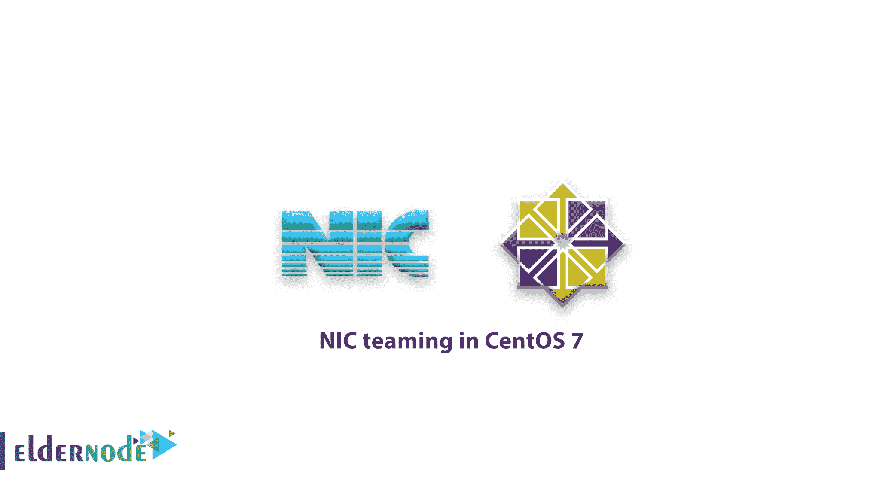

# centos 7 中的网卡绑定-在 CentOS 7 上绑定网卡

> 原文：<https://blog.eldernode.com/nic-teaming-centos-7/>



在下面的 [Linux](https://eldernode.com/tag/learning-linux/) 教程中，在这篇文章中，你将了解到 CentOS 7 中的**网卡绑定。但是首先，什么是 NIC？网络接口卡也称为**网络绑定**，可以定义为将多个 NIC 聚合或组合成一个绑定接口。网卡的主要目的是提供高可用性和冗余。**

#### 先决条件:

您的绑定模块必须加载到您的 Linux 机器上。如果不是，请使用下面的命令。

```
[[[email protected]](/cdn-cgi/l/email-protection) ~]# modprobe bonding
```

## NIC 组队在 CentOS 7

遵循本指南，了解如何在 CentOS 7 和 RHEL 7 中配置网卡或网络绑定。我们从两个 [接口卡](https://en.wikipedia.org/wiki/Network_interface_controller) (enp0s3 & enp0s8)开始，将形成一个 bond 接口(bond0)。

列出焊接模块信息:

```
[[[email protected]](/cdn-cgi/l/email-protection) ~]# modinfo bonding
```

1-创建债券接口文件

### 首先，在文件夹“**/etc/sys config/network-scripts/**”下创建一个绑定接口文件( **ifcfg-bond0** )

您现在可以保存并关闭文件。

```
[[[email protected]](/cdn-cgi/l/email-protection) network-scripts]# vi ifcfg-bond0  DEVICE=bond0  TYPE=Bond  NAME=bond0  BONDING_MASTER=yes  BOOTPROTO=none  ONBOOT=yes  IPADDR=192.168.10.70  NETMASK=255.255.255.0  GATEWAY=192.168.10.1  BONDING_OPTS="mode=5 miimon=100"
```

接下来，指定 IP 地址、网络掩码和绑定模式。这里我们选择'**mode = 5 '**，它用于提供容错和负载平衡。

2-编辑网卡接口文件

### **为 ifcfg-eno1**

**为 ifcfg-eno2**

```
[[[email protected]](/cdn-cgi/l/email-protection) ~]# vi /etc/sysconfig/network-scripts/ifcfg-eno1  TYPE=Ethernet  BOOTPROTO=none  DEVICE=eno1  ONBOOT=yes  HWADDR="08:00:26:79:60:b9"  MASTER=bond0  SLAVE=yes 
```

```
[[[email protected]](/cdn-cgi/l/email-protection) ~]# cat /etc/sysconfig/network-scripts/ifcfg-eno2  TYPE=Ethernet  BOOTPROTO=none  DEVICE=eno2  ONBOOT=yes  HWADDR="08:00:26:ed:71:2d"  MASTER=bond0  SLAVE=yes
```

[购买 Linux 虚拟主机](https://eldernode.com/linux-hosting/)

3-重启网络服务

### 通过以下命令，您可以重新启动网络服务并使上述更改生效。

```
[[[email protected]](/cdn-cgi/l/email-protection) ~]# systemctl restart network.service
```

4-验证键接口

### 要检查绑定接口及其从属接口，请使用'**ifconfig**'&'**IP add**命令。

要查看焊接接口设置，如焊接模式和从属接口:

To view bond interface settings like bonding mode and slave interface:

```
[[[email protected]](/cdn-cgi/l/email-protection) ~]# cat /proc/net/bonding/bond0
```

### 5-容错测试

### 您可以关闭一个接口，检查您是否仍然能够访问服务器，以测试容错能力

[[[电子邮件保护]](/cdn-cgi/l/email-protection) ~]# ifdown eno1 设备' eno1 '已成功断开连接。[ [【邮件保护】](/cdn-cgi/l/email-protection) ~]#

干得好！你在 CentOS 7 / RHEL 7 中学会了如何 c 配置 NIC( **网卡**)绑定。

亲爱的用户，我们希望你能喜欢 CentOS 7 中的 **NIC teaming 这个教程，你可以在评论区提出关于这个培训的问题，或者要解决 [Eldernode](https://eldernode.com/) 培训领域的其他问题，请参考 [提问页面](https://eldernode.com/ask) 部分并在其中提出你的问题。**

Dear user, we hope you would enjoy this tutorial **NIC teaming in CentOS 7**, you can ask questions about this training in the comments section, or to solve other problems in the field of [Eldernode](https://eldernode.com/) training, refer to the [Ask page](https://eldernode.com/ask) section and raise your problems in it.