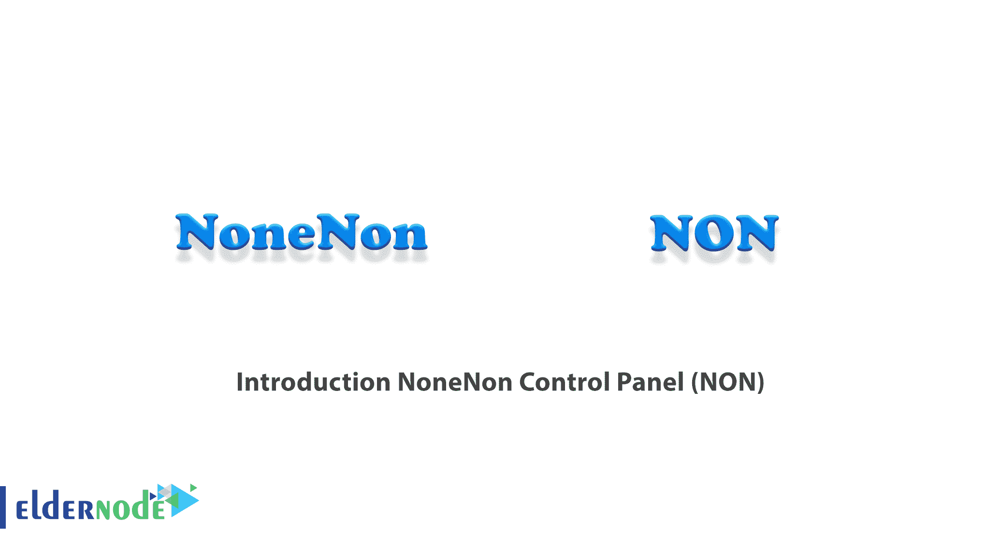
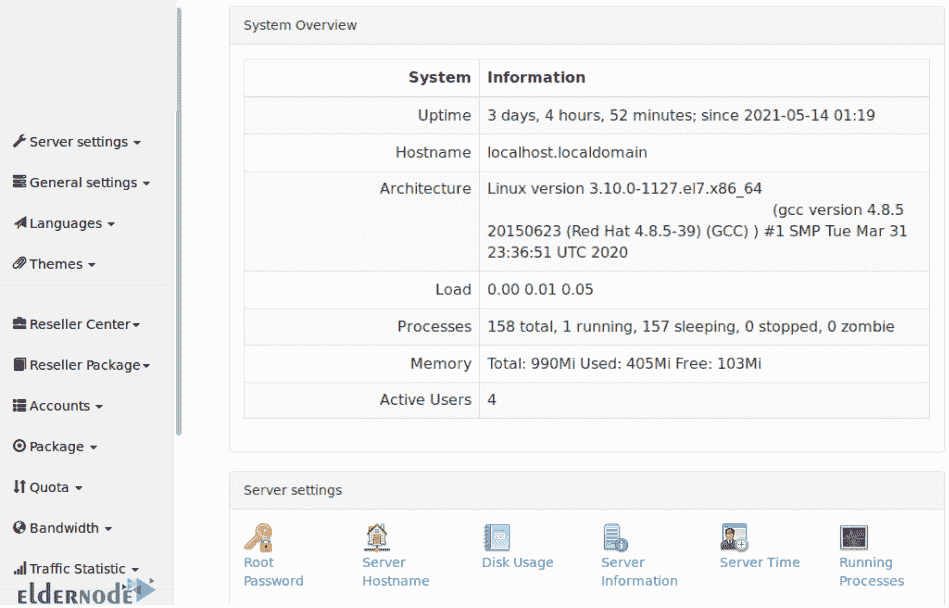
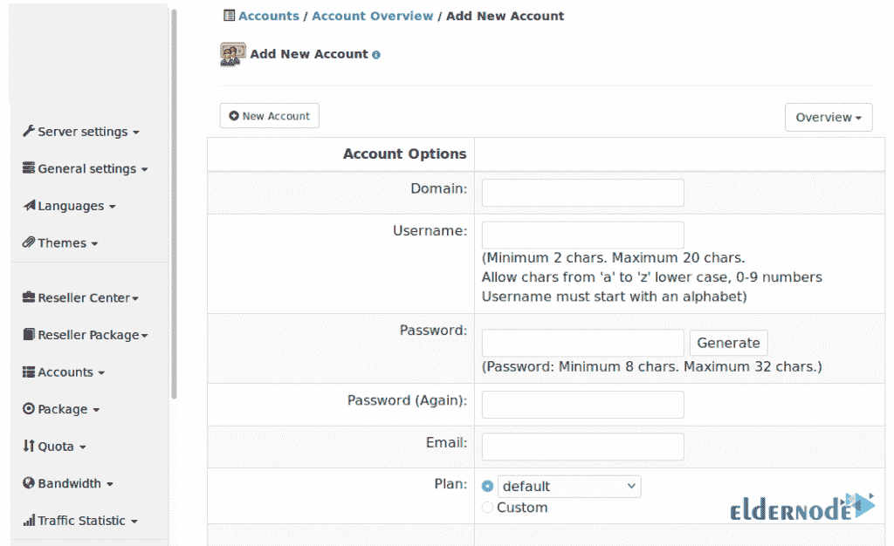
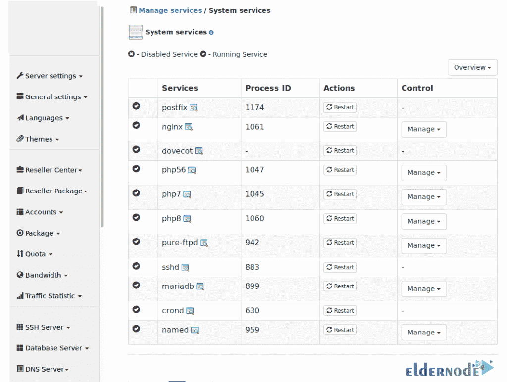
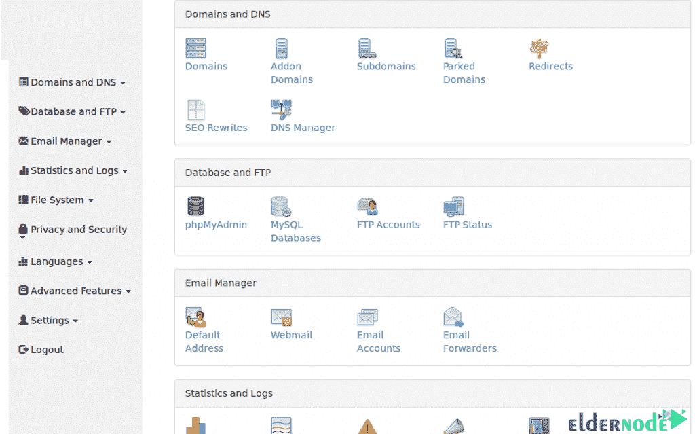

# 介绍 NoneNon 控制面板(非)- Eldernode 博客

> 原文：<https://blog.eldernode.com/nonenon-control-panel/>



NoneNon 是建立在下一代平台上的托管自动化软件，提供自动化的站点准备、管理和行政。此外，NoneNon 建立在可扩展的安全框架上，使用户能够轻松添加高需求的第三方解决方案，并构建具有全面数据安全性的自定义应用程序和网站。在本文中，我们将**介绍 NoneNon 控制面板**。如果您想购买 [**VPS**](https://eldernode.com/vps/) 服务器，可以访问 [Eldernode](https://eldernode.com/) 中的软件包。

## **什么是 NoneNon 控制面板？**

NoneNon 是一个控制面板，包括互联网电子邮件、数据库、FTPS、文件管理器、DNS、开发(PHP、Perl、CGI、Django、RubyonRail 等等)。使用此控制面板简化了服务器设置。



您还可以使用 NoneNon 轻松设置多个云帐户和经销商。使用电子邮件、ftps、DNS 和数据库在几分钟内创建云帐户和经销商。



使用 NoneNon 控制面板，用户可以轻松配置和管理多项服务。您还可以配置实时系统服务，如电子邮件、HTTP、DNS、数据库、SSHD。启动、停止、重新启动服务。浏览服务器和服务报告。



NoneNon 的其他特性包括每个人对系统所有方面的更多控制。



### **none**控制面板功能

在这一节中，我们想全面解释 none 控制面板的功能。

**1。支持 CentOS 7、8 和 Debian 10**

_ 支持多种 PHP:PHP 5.6、7、8

_ 支持其他语言，如 Perl、Django、Ruby on Rail (RoR)等等

_ 从一个页面查看、搜索和管理您的整个主机和任何域

_ 使用 fastcgi 增加每日点击率

_ 高级备份和恢复功能

_ 将备份上传到 FTPs 服务器

_ 支持 Nginx、bind 和 pure-ftpd

_ 高级入侵检测管理界面

**2。主要和一般特征**

_ 备份和恢复您的整个主机

_ 命令行 API 到一切可以通过 web 界面完成的事情。

_ 整个集群的磁盘使用情况和警告报告。

_ 能够在经销商之间移动客户/域。您可以更改客户端和域的所有权，并轻松地移动它们。

_ 禁用/启用经销商。

_ 更改销售代理配额

**3。客户端功能**

客户端功能的特性包括:

_ 服务器

_ 邮件服务器

_ DNS 服务器

_ 数据库服务器

_ 启用 SSL 的能力

_ 供应商配额管理

_ 控制客户更改帐户设置的能力

_ 允许客户端为此 ip 地址设置 SSL 证书。

**4。邮件功能**

_ 包罗万象

_ 管理电子邮件帐户

_ 网络邮件

_ 自动应答器

_ 转发

_ 完全控制 DNS

_ 垃圾邮件过滤

**5。统计数据**

_ AWStats

_ 查看最近的访问者

_ 查看带宽使用情况

_ 流量计算包括邮件、Web 和 Ftp 流量。

_ 查看错误日志

_ 下载原始日志文件

**6。网络和服务器功能**

_ 目录保护

_ WebDav

_ SEO 重写

_ 自定义错误页面

_ 重定向

_ 文件管理器

_ Cron 作业管理。

_ 管理 FTP 帐户

_ 管理服务

_ 更改数据库管理员密码

_ 地址管理

_ 查看正在使用特定服务器的所有域。

_ Cron 乔布斯。

_ 日志管理器

_ 流程经理

### **系统要求安装 NoneNon 控制面板**

在本节中，我们将讨论安装 none 控制面板的系统要求。这些要求包括以下内容:

**1。**独立版本

**2。**支持 [CentOS](https://blog.eldernode.com/tag/centos/) 7，8.x， [Debian](https://blog.eldernode.com/tag/debian/) 10 操作系统

**3。硬盘:**最小 10GB 的可用空间

**4。硬盘布局:**默认布局没有 LVM 或 LVM/Raid，因此扩展可用空间(添加硬盘)很容易。

**5。RAM 内存:**最小 512Mb

**6。CPU:** 在旧的 Core2Duo/333Mhz 机器上工作正常

### **Nonenon 函数**

在本节中，我们将向您介绍 none 控制面板的功能。我们将逐一解释:

**1。许可的 Linux**

NoneNon 是 Linux 许可的控制面板。该控制面板由希望提高安全性、稳定性和可伸缩性的提供商使用。

**2。无与伦比的安全性**

NoneNon 是唯一包含虚拟专用文件系统的控制面板，可创建业内最安全的托管环境。应该注意的是，用户可以通过向客户提供安全的远程访问和脚本工具来提高他们的安全性。值得注意的是，NoneNon 降低了管理关键托管活动所需的成本和技术专业知识，例如设置新站点、配置用户和管理电子邮件。您还可以通过自动化显著减少管理时间。

**3。轻松管理界面** 

使用 NoneNon 既直观又快速。另一方面，它大大降低了管理关键托管活动所需的成本和技术专业知识，如建立新网站、用户配置和电子邮件管理。

**4。丰富灵活的功能**

NoneNon 包括服务计划管理工具，可帮助用户向更广泛的客户提供服务。这些工具简化了任意数量的个人和目标服务应用程序中的流行 web 应用程序和服务器资源。

**5。增长的可扩展性，客户满意度的稳定性**

NoneNon 旨在管理任何规模的服务提供商，具有无与伦比的稳定性。当您的声誉符合严格的服务水平协议时，非控制面板保证更高水平的客户满意度。

**6。所有托管任务完全自动化**

NoneNon 降低了管理关键托管活动所需的成本和技术专业知识，例如设置新站点、配置用户和管理电子邮件。通过自动化，您可以显著减少管理时间。

## **如何在 CentOS 和 Debian 上下载安装 none non**

要在 CentOS 和 Debian 上下载并安装 NoneNon 控制面板，您可以按照以下步骤操作:

```
su - root
```

**在百分位上:**

```
yum install -y wget
```

**在 Debian 上:**

```
apt install wget
```

```
cd /root
```

```
wget https://www.nonenon.org/nonenon-installer.sh
```

```
chmod 755 nonenon-installer.sh
```

```
./nonenon-installer.sh
```

成功安装 NoneNon 后，您现在可以连接到**https://YOUR _ SERVER _ IP:8008**。您将看到为您显示的登录页面。您可以使用文件中提供的密码作为“**超级用户**登录。

## 结论

在本文的开始，我们试图向您展示 none 控制面板的完整定义，以及来自这个控制面板的仪表板的图像。然后我们向您解释了非控制面板的功能。在接下来的步骤中，提到了安装 none 控制面板的系统要求。最后，在介绍了 NoneNon 函数之后，介绍了如何在 Debian 和 CentOS 操作系统上下载和安装 NoneNon。