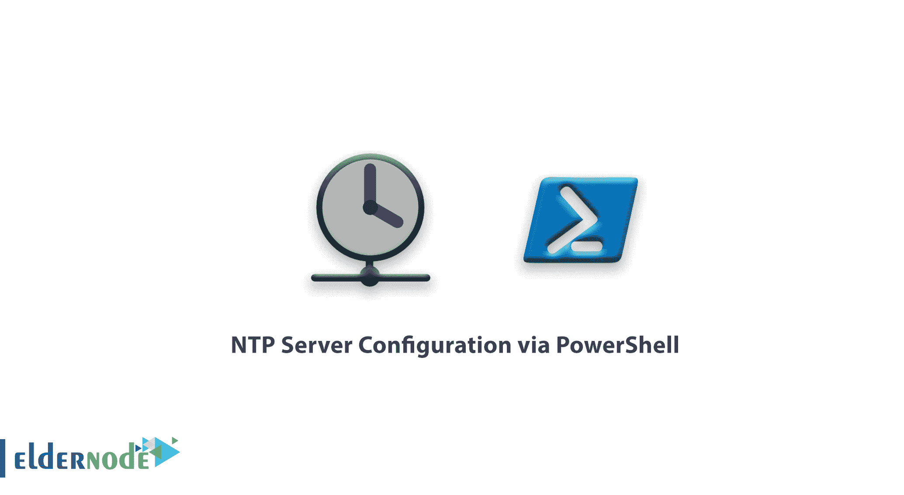

# 教程通过 PowerShell - Eldernode 配置 NTP 服务器

> 原文：<https://blog.eldernode.com/ntp-server-configuration-via-powershell/>



在这篇短文中，我们将向您介绍如何通过 PowerShell 配置 NTP 服务器。在之前的文章中，我们教过你[教程在 Windows Server 2019 中配置 NTP 服务器](https://eldernode.com/configure-ntp-server-in-windows-server/)你可以参考那篇文章。

您可以从 eldernode 选择您最理想的 [Windows VPS Server](https://eldernode.com/windows-vps/) 软件包。

## 使用 PowerShell 在 Windows 2019 上配置 NTP 服务器

通过 PowerShell 执行 NTP 设置更加简单快捷，并且不涉及复杂的步骤。为此，首先以管理员权限(以管理员身份运行)打开 PowerShell，并运行以下命令来激活 **NtpServer** 。

```
Get-ItemProperty -Path "HKLM:\SYSTEM\CurrentControlSet\Services\w32time\TimeProviders\NtpServer" 
```

```
Set-ItemProperty -Path "HKLM:\SYSTEM\CurrentControlSet\Services\w32time\TimeProviders\NtpServer" -Name "Enabled" -Value 1 
```

现在使用下面的命令将 AnnounceFlags 文件的**值数据**设置为**T5 5T7。**

```
Set-ItemProperty -Path "HKLM:\SYSTEM\CurrentControlSet\services\W32Time\Config" -Name "AnnounceFlags" -Value 5 
```

最后，在完成上述设置后，我们将使用下面的命令重启 NtpServer 。

```
Restart-Service w32Time 
```

**注意:** 如果你的 Windows Server 防火墙是开启的，你必须打开防火墙上的 UDP 123 端口。

```
New-NetFirewallRule `  -Name "NTP Server Port" `  -DisplayName "NTP Server Port" `  -Description 'Allow NTP Server Port' `  -Profile Any `  -Direction Inbound `  -Action Allow `  -Protocol UDP `  -Program Any `  -LocalAddress Any `  -LocalPort 123 
```

**尊敬的用户**，我们希望您能喜欢这个[教程](https://eldernode.com/category/tutorial/)，您可以在评论区提出关于本次培训的问题，或者解决[老年人节点培训](https://eldernode.com/blog/)领域的其他问题，请参考[提问页面](https://eldernode.com/ask)部分，并尽快提出您的问题。腾出时间给其他用户和专家来回答你的问题。

教程[Windows 2019 中 NTP 服务器](https://en.wikipedia.org/wiki/Network_Time_Protocol)通过 Powershell 配置。

好运。