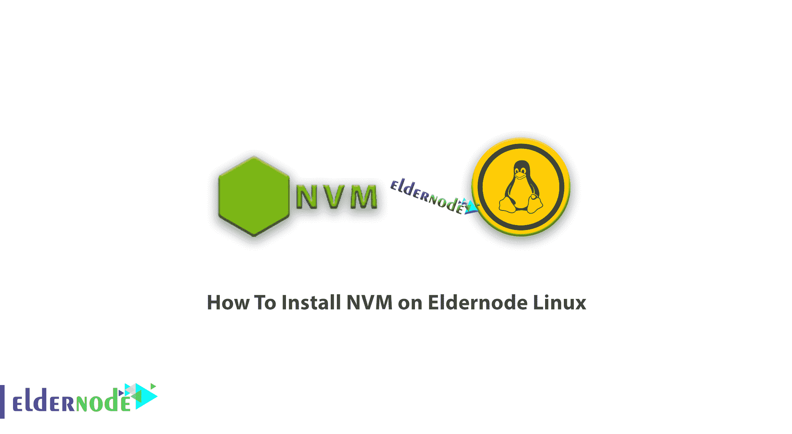
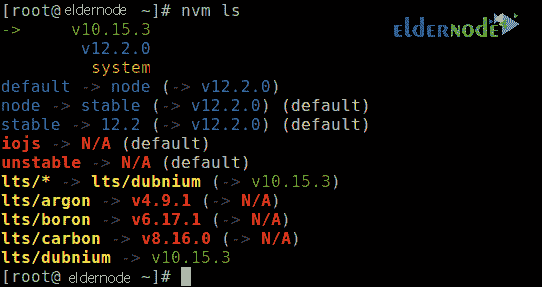
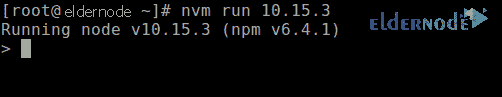
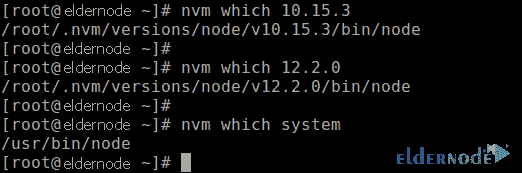
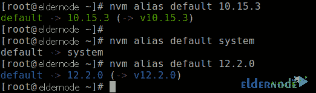

# 如何在 Eldernode Linux | Eldernode 上安装和配置 NVM

> 原文：<https://blog.eldernode.com/nvm-on-eldernode-linux/>



教程**如何在 Eldernode Linux 上安装 NVM**。由于 Node.js 版本的依赖性问题和升级，一些应用程序仍然需要旧版本的 Node.js。在这种情况下，您必须管理两个或更多具有不同版本的 Node.js 的应用程序。您甚至可能需要升级或降级版本，这是问题的来源。没必要担心。可以在一台机器上安装几个不同版本的 Node.js，在不同版本的 Node 上运行不同的程序。Creationix 写的节点版本管理器模块。该脚本管理 Node.js 的不同活动版本，以安装具有不同版本 Node 的程序。如果您需要在[购买 Linux VPS](https://eldernode.com/linux-vps/) 服务器，可以访问 [Eldernode](https://eldernode.com/) 中的软件包。跟随我们学习如何在 Eldernode [Linux](https://blog.eldernode.com/tag/linux/) 上安装 NVM ( **节点版本管理器**)。

## 教程如何在 Eldernode Linux 上安装 NVM

要安装 nvm，您必须在机器上安装 CURL 或 WGET。您可以下载以下自动安装脚本，使用命令行工具在 Eldernode Linux 上安装 NVM:

```
# curl -o- https://raw.githubusercontent.com/nvm-sh/nvm/v0.34.0/install.sh | bash
```

或者

```
# wget -qO- https://raw.githubusercontent.com/nvm-sh/nvm/v0.34.0/install.sh | bash
```

上面的自动安装脚本将 nvm 存储库克隆到 **~/。并将所需的源命令添加到您的 shell 启动脚本中，即 **~/。bash_profile** ， **~/。zshrc** ， **~/。配置文件**，或 **~/。bashrc** ，取决于你使用的 shell 程序。**

在下一步中，您应该**验证**nvm 是否已经安装在您的系统上:

```
# command -v nvm    nvm
```

如果您成功完成了安装过程，您将在输出中看到 **nvm** 消息。

### 在 Linux 上使用 NVM

您可以使用以下命令下载最新版本的 NVM。您也可以使用此命令来更新和安装 NVM:

```
# nvm install node
```

您可以列出节点中可用的版本来安装特定的“**节点**版本，然后安装:

```
# nvm ls-remote  # nvm install 10.15.3 #or 8.16.0, 11.15.0 etc
```

您还可以使用以下命令检查所有已安装的版本:

```
# nvm ls
```



使用以下命令，您可以在任何新的 shell 中使用 **node.js** 版本:

```
# nvm use node #use default
```

或者

```
# nvm use 10.15.3
```

运行如下所示的节点版本(要退出，请按^C):

```
# nvm use node #use default
```

或者

```
# nvm use 10.15.3
```



***注意:*** 您可以查看安装了特定节点版本的可执行文件的路径如下:

```
# nvm which 10.15.3  # nvm which 12.2.0  # nvm which system #check system-installed version of a node using “system” alias
```



要手动设置任何新 shell 中使用的默认节点版本，请使用别名 **default** :

```
# nvm alias default 10.15.3  # nvm alias default system  # nvm alias default 12.2.0
```



***注意:*** 你可以在你的项目根目录或任何父目录下创建一个. nvmrc 初始化文件，并在其中添加一个节点版本号或任何其他 nvm 理解的标志或用法选项。

**结论**

## Node 版本管理器是一个允许程序员在 Node 的不同版本之间无缝切换的工具。在本文中，我们试图教您如何在 Eldernode Linux 上安装 NVM。

Node Version Manager is a tool that allows programmers to seamlessly switch between different versions of Node. In this article, we tried to teach you How To Install NVM on Eldernode Linux.