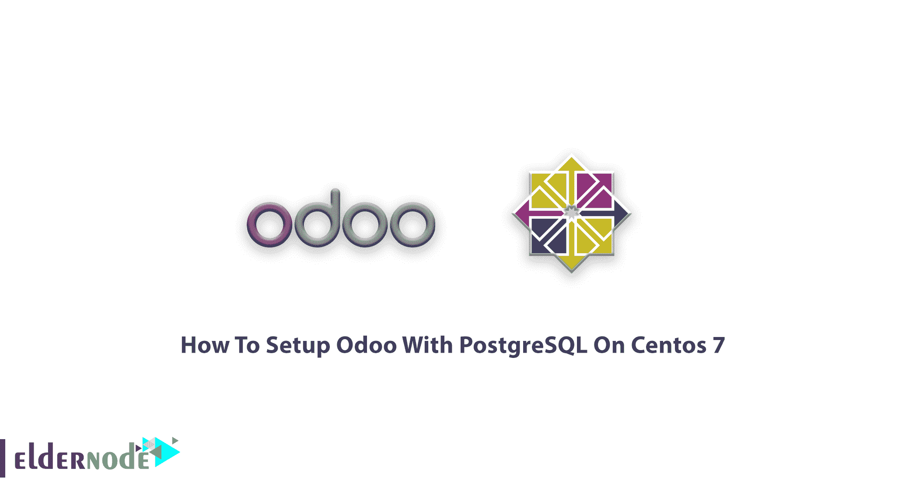
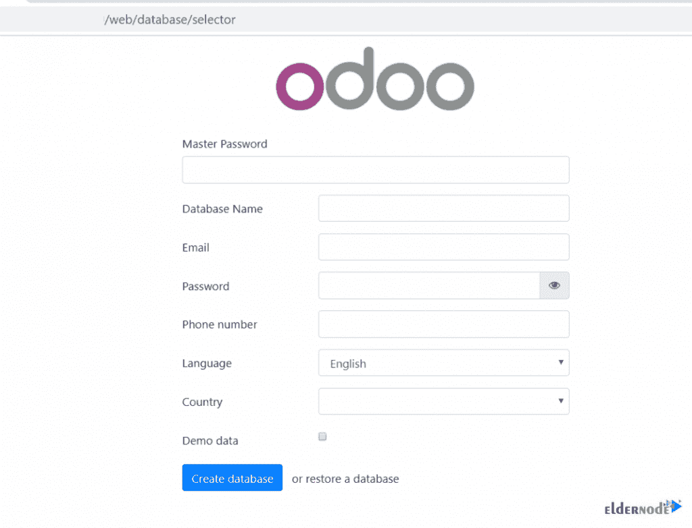
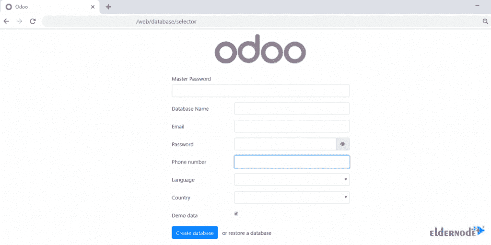
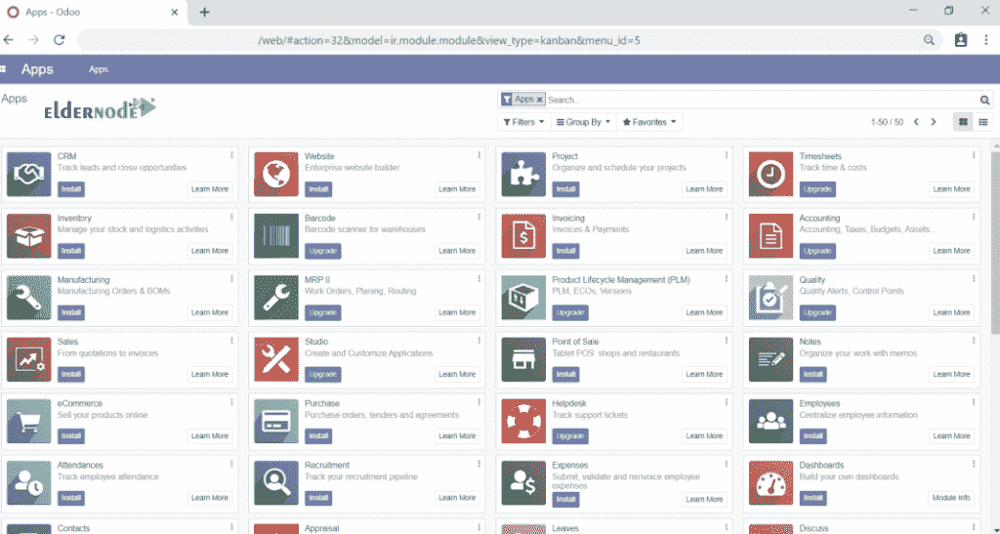
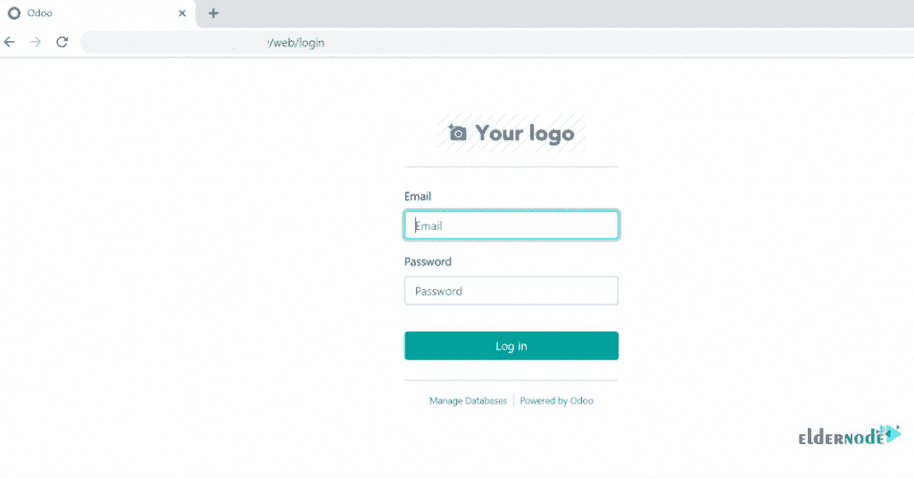

# 如何在 Centos 7 - Eldernode 博客上用 PostgreSQL 设置 Odoo

> 原文：<https://blog.eldernode.com/odoo-with-postgresql-on-centos-7/>



了解如何在 Centos 7 上逐步使用 PostgreSQL 设置 Odoo。如果你是一个喜欢使用一种工具而不是几种工具的人，或者你从一个大商店购物以避免走进许多商店，Odoo 是为你的口味而设计的。因此，任何时候你需要一个 [VPS](https://eldernode.com/vps/) ，记得访问 [Eldernode](https://eldernode.com/) 购买你认为完美的 [CentOS VPS](https://eldernode.com/centos-vps/) 来帮助你停止寻找最好的套餐，因为我们声称为你提供最好的！

## Odoo 是什么？

前 OpenERP，Odoo 是一个业务管理平台。您可以在其中找到一些不同的应用程序，如会计、计费、项目管理、库存等等。这款免费开源的 ERP 是一款基于网络的应用程序，具有许多功能，是任何与销售点、计费和会计、事件管理、电子邮件营销、订单跟踪等相关的工作的必备工具

## 教程在 Centos 7 上使用 PostgreSQL 设置 Odoo】

在下面的开源应用教程中，在本指南中，您将了解 Odoo。所以，让我们通过这篇文章的步骤来完成它，并开始使用这个独特的框架。

## 如何在 CentOS 上安装 Odoo 12

作为一名社区开发人员，你需要使用一款可用性一流的应用，它可以跨所有应用进行扩展。在执行本教程的命令之前，请考虑使用[根用户](https://blog.eldernode.com/create-new-sudo-user-centos-8/)。

### 第一步:更新系统

要更新系统，请运行:

```
yum update
```

你将面临更新的问题，所以输入“y”并等待一段时间来更新你的系统。

### 步骤 2:配置存储库

您需要配置所需的存储库，因此使用下面的命令来启用 Epel 存储库:

```
yum install epel-release
```

然后，键入以下命令以启用软件集合(SCL)存储库:

```
yum install centos-release-scl
```

### 第三步:安装 Python 3.6 及其依赖关系

要安装 Python 36，请运行:

```
yum install rh-python36
```

要安装所需的依赖项，请键入:

```
yum install bzip2-devel freetype-devel nodejs-less libxslt-devel openldap-devel libjpeg-devel gcc
```

### 第四步:创建 Odoo 用户

是时候创建您的 Odoo 用户了，所以运行:

```
useradd -m -U -r -d /opt/odoo -s /bin/bash odoousr
```

### 第五步:安装并配置 PostgreSQL

建议您从[官方网站](https://yum.postgresql.org/repopackages.php#pg11)查看存储库，并为 Centos 7 64bit 安装 Postgres 存储库。

```
rpm -Uvh https://yum.postgresql.org/11/redhat/rhel-7-x86_64/pgdg-redhat-repo-latest.noarch.rpm
```

然后，您就可以安装 PostgreSQL 11 服务器了:

```
yum install postgresql11-server
```

接下来，要在系统上创建数据目录和其他配置文件，可以通过运行以下命令来初始化数据库:

```
/usr/pgsql-11/bin/postgresql-11-setup initdb
```

要检查 PostgreSQL 服务状态，请键入:

```
systemctl status postgresql-11.service
```

如果您遇到系统无法启动的情况，请使用以下命令来启动它:

```
systemctl start postgresql-11.service
```

并在系统启动时启用服务。运行:

```
systemctl enable postgresql-11.service
```

现在，您可以检查和验证 PostgreSQL 安装:

```
su - postgres -c "psql"
```

如果您愿意，可以创建一个密码:

```
 \password postgres
```

然后，您应该创建一个 PostgreSQL 用户:

```
su - postgres -c "createuser -s odoousr"
```

### 第六步:安装 Wkhtmltopdf

Odoo 需要一个开源工具来制作 PDF 格式的 HTML，以便打印 PDF 报告。

```
wget https://downloads.wkhtmltopdf.org/0.12/0.12.5/wkhtmltox-0.12.5-1.centos7.x86_64.rpm
```

如果“wget”不可用，请安装它。

```
yum install wget -y
```

运行以下命令安装下载的软件包:

```
yum localinstall wkhtmltox-0.12.5-1.centos7.x86_64.rpm
```

### 第七步:安装并配置 Odoo 12

首先，您需要在系统上安装 Git:

```
yum install git -y
```

第二，将用户改为 Odoo 用户:

```
su - odoousr
```

第三，您需要从它的存储库中克隆 Odoo 12。所以，下载到“/opt/odoo/odoo12”目录。

```
git clone https://www.github.com/odoo/odoo --depth 1 --branch 12.0 /opt/odoo/odoo12
```

第四，启用 python36:

```
scl enable rh-python36 bash
```

### 步骤 8:如何创建新的虚拟环境

使用下面的命令转到 Odoo 目录:

```
cd /opt/odoo
```

创造一个环境:

```
python3 -m venv odoo12-venv
```

要激活环境，请键入:

```
source odoo12-venv/bin/activate
```

然后，您应该升级 pip:

```
pip install --upgrade pip
```

接下来，安装轮子库，然后安装所有需要的 Python 模块。

```
pip3 install wheel
```

```
pip3 install -r odoo12/requirements.txt
```

安装完成后，停用虚拟环境并返回 root 用户。

### 步骤 9:odoo 12 的其他配置

首先，为定制模块创建一个目录:

```
 mkdir /opt/odoo/odoo12-custom-addons
```

```
chown odoousr: /opt/odoo/odoo12-custom-addons
```

其次，为 Odoo12 创建一个配置文件:

```
vim /etc/odoo12.conf
```

如果 vim 不可用，您可以通过您喜欢的任何编辑器安装它:

```
yum install vim
```

将以下几行添加到文件中:

```
[options]  ; This is the password that allows database operations:  admin_passwd = [[email protected]](/cdn-cgi/l/email-protection)<?Linux  db_host = False  db_port = False  db_user = odoousr  db_password = False  addons_path = /opt/odoo/odoo12/addons,/opt/odoo/odoo12-custom-addons  logfile = /var/log/odoo12/odoo.log
```

现在，您可以保存并退出该文件。然后，您应该创建一个日志文件夹并授予其权限:

```
mkdir -p /var/log/odoo12
```

```
chown -R odoousr: /var/log/odoo12
```

### 第十步:如何手动启动 Odoo12】

在这一步中，您可以启动服务并检查它是否正常工作。为此，您需要更改用户，然后启动命令:

```
su - odoousr
```

```
/usr/bin/scl enable rh-python36 -- /opt/odoo/odoo12-venv/bin/python3 /opt/odoo/odoo12/odoo-bin -c /etc/odoo12.conf
```

然后，尝试检查 Odoo12 端口是否启动并运行，并打开另一个终端，然后键入:

```
netstat -tunlp | grep 8069
```

### 步骤 11:如何配置防火墙

使用以下命令检查防火墙状态:

```
systemctl status firewalld
```

如果您发现服务尚未启动，请运行以下命令启动该服务:

```
systemctl start firewalld
```

要添加防火墙规则并重新加载防火墙类型:

```
firewall-cmd --zone=public --permanent --add-service=http
```

```
firewall-cmd --zone=public --permanent --add-port=8069/tcp
```

```
systemctl reload firewalld
```

### 第十二步:如何浏览应用

```
http://Ip or domain name:8069
```

起始页将显示:



此外，如果您遇到“服务不可用”消息，您可以暂时更改 Selinux 模式。

```
setenforce 0
```

### 步骤 13:配置 Odoo12 作为服务运行

在这一步中，您需要创建一个 systemd 文件，并将以下内容添加到该文件中:

```
vim /etc/systemd/system/odoo12.service
```

```
[Unit]  Description=Odoo12  Requires=postgresql-11.service  After=network.target postgresql-11.service    [Service]  Type=simple  SyslogIdentifier=odoo12  PermissionsStartOnly=true  User=odoousr  Group=odoousr  ExecStart=/usr/bin/scl enable rh-python36 -- /opt/odoo/odoo12-venv/bin/python3 /opt/odoo/odoo12/odoo-bin -c /etc/odoo12.conf  StandardOutput=journal+console    [Install]  WantedBy=multi-user.target
```

现在。您可以保存并退出。

使用以下命令重新加载 systemctl 守护程序。

```
systemctl daemon-reload
```

### 步骤 14:如何停止先前启动的 Odoo12

要检查流程，请运行:

```
ps -aux | grep odoo
```

Odoo 进程 Kill 进程。

```
kill -9 28416 28417 28420
```

**注意**:不要忘记用你的 id 替换进程 id。

### 步骤 15:如何启动 Odoo12 服务

```
systemctl start odoo12
```

要检查状态，请运行:

```
systemctl status odoo12
```

使用以下命令监控日志文件:

```
tail -f /var/log/odoo12/odoo.log
```

然后，检查状态并在系统启动时启用 Odoo 服务:

```
systemctl enable odoo12
```

### 第十六步:如何浏览网站并继续

```
http://Ip Or Domain name:8069
```

一旦您查看了下面的页面，您必须添加主密码、数据库名称和其他详细信息。



然后，要重定向到欢迎页面，您应该单击“创建数据库”



从上述页面退出后，您将进入登录页面。



就是这样！到达这里，您已经完成了安装。

## 结论

在本文中，您了解了如何在 Centos 7 上使用 PostgreSQL 设置 Odoo。从现在开始，您可以使用并享受这款软件的计费、会计、项目管理、制造、仓库和库存应用程序。