# 教程如何在 Windows 防火墙上打开端口- Eldernode 博客

> 原文：<https://blog.eldernode.com/open-a-port-on-a-windows-firewall/>

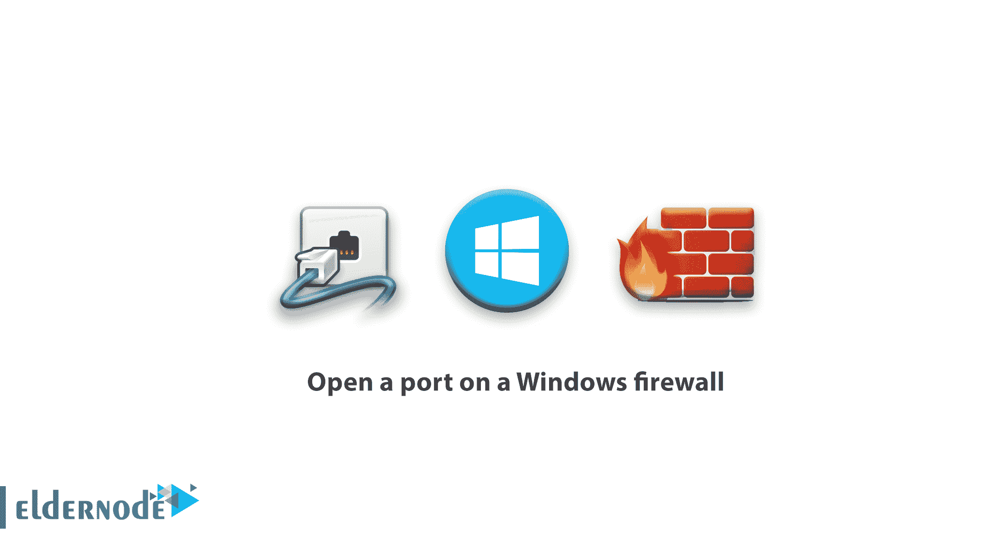

[更新日期:2021-01-27]当一台设备连接到网络上的另一台设备时，一个具有特定编号的端口正在考虑用于此连接。然后打开端口，通知接收设备如何管理与此问题相关的流量以及使用哪个端口。由于 IP ID 指定了哪个设备应该接收来自网络的流量，因此端口也指定了该流量应该可用于哪个应用。在本文中，我们将**学习如何在 windows 防火墙**上打开端口。你可以访问 [Eldernode](https://eldernode.com/) 提供的包来购买 [Windows VPS](https://eldernode.com/windows-vps/) 服务器。

## **教程在 Windows 防火墙上打开一个端口**

默认情况下，Windows 防火墙会阻止来自互联网和网络的所有不需要的请求和流量进入系统。但是，如果您的计算机上运行着游戏服务器之类的东西，您可能需要打开一个端口，以允许来自服务器的流量通过您的防火墙。

### **如何在 Windows 防火墙上打开端口**

防火墙是防止计算机上未经授权的网络入站和出站流量的工具。当然，有时候你希望允许未经授权的流量通过防火墙，而这正是你打开某个端口所需要的。

点击**开始**，搜索“ **Windows 防火墙**，然后点击“Windows Defender 防火墙”。

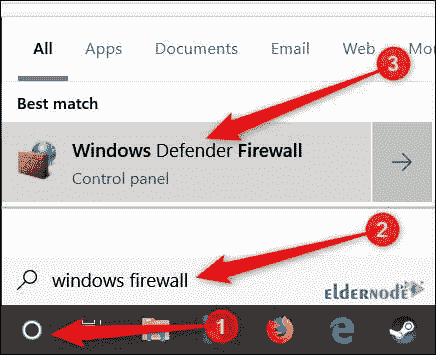

在 **Windows 防火墙**打开后，点击**高级设置**。

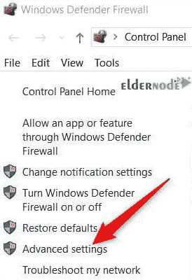

这将打开**具有高级安全性的 Windows Defender 防火墙**窗口。点击左侧面板中的“**入站规则**”类别，然后从右侧面板中选择“**新规则**”。

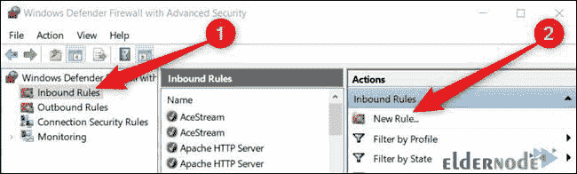

如果您需要为出站流量打开端口，请选择“**出站规则**，而不是点击“**入站** **规则**”。大多数应用在为自己安装时会在“**出站规则**”部分制定一个规则，你不必手动这样做，但有时你需要手动调整这个部分。

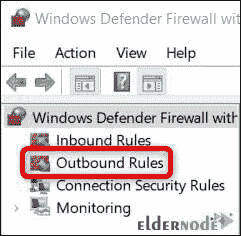

在**规则类型**页面，选择**端口**选项，然后点击**下一步**。

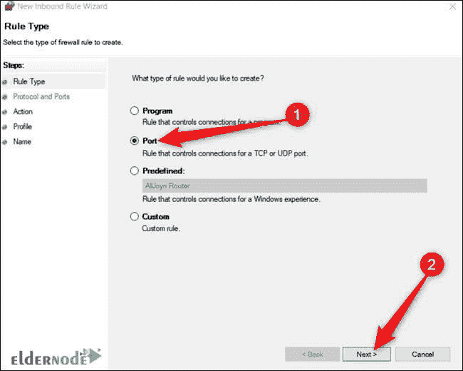

### **在 Windows 10 中打开一个端口**

在下一页，您需要指定您的端口是使用“ **TCP** 协议还是“ **UDP** ”协议。一个应用程序可能会使用这些端口中的任何一个，所以你无法判断选择哪个端口。

端口号可以在 0 到 65535 之间，尽管前 1023 个端口是为某些服务保留的，您不能使用它们。通过这个[维基百科页面](https://en.wikipedia.org/wiki/List_of_TCP_and_UDP_port_numbers)，您可以访问一个非官方的 TCP 和 UDP 端口列表，并找到您的应用程序中使用的端口。如果您不确定您的应用程序使用 UDP 还是 TCP，您可以为每个协议创建一个“**入站规则**”规则。

选择“**特定本地端口**，然后在相应字段中输入您想要的端口。如果要打开多个端口，请使用(，)分隔它们。如果要打开一组端口，可以用破折号(-)指定它们。完成后，点击**下一步**。

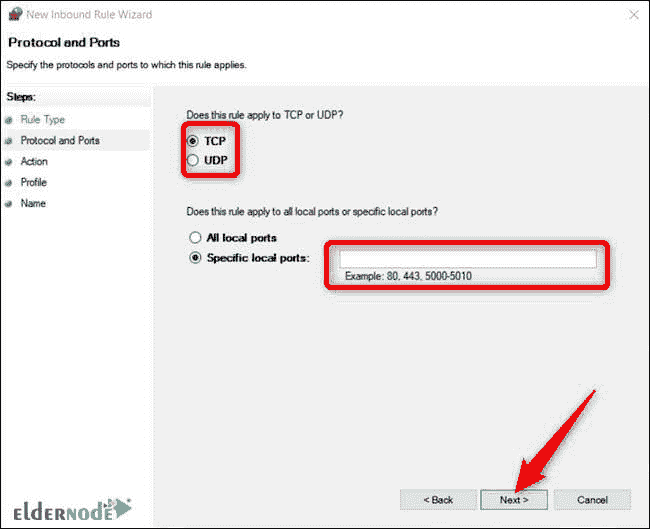

在下一页，点击**允许连接**，然后点击**下一步**。

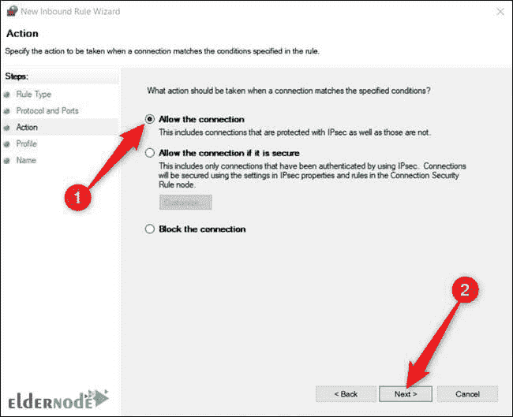

**注意:**在本教程中，我们使用了“**允许连接**选项，因为我们信任我们为其创建了规则的应用程序。

如果你想对你的应用程序的连接更有信心，你可以选择“**如果安全则允许连接**”选项，它使用互联网协议安全系统或“ **IPsec** 来验证连接。可以试试这个选项，但是很多 app 都不支持。

如果您尝试此方法，但结果不成功，您将能够返回到此部分并选择另一个选项。

**在下一步**中，指定该规则应何时实施，然后单击**下一步**。该部分中的选项如下:

***域:*** 当计算机连接到 Windows 可以验证的域时。

***私有:*** 当计算机连接到私有网络时，如家庭网络或任何您信任的网络。

***公共:*** 当一台计算机连接到一个开放的网络，比如咖啡馆、图书馆、机场以及任何人都可以连接且其安全性无法验证的任何地方的网络。

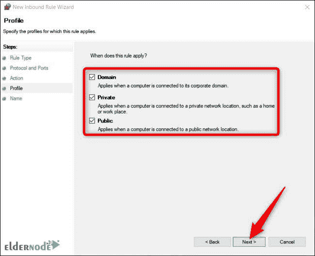

在最后一个窗口中，输入规则的名称和可选描述，然后单击**完成**。

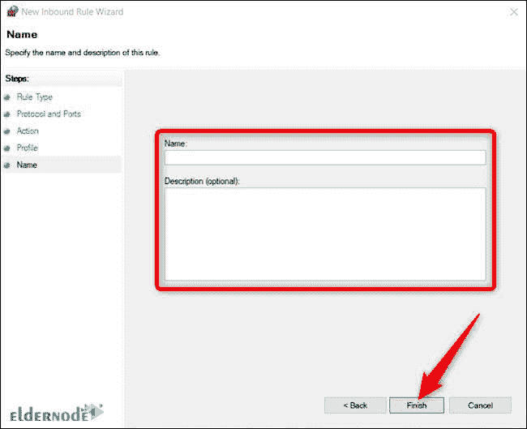

每当您想**禁用该规则**时，您可以在“**入库**或“**出库**”规则列表中找到它，**右键单击它的**，然后点击“**禁用规则**”

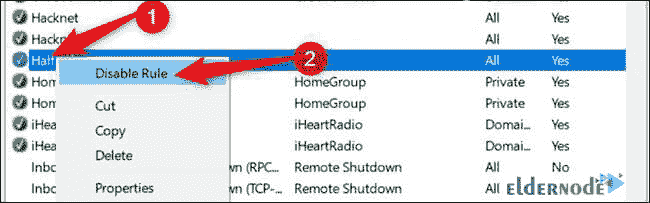

## 结论

防火墙是防止未经授权的网络流量进出计算机的工具。当然，有时候你希望允许未经授权的流量通过防火墙，而这正是你需要打开某个端口的地方。由于这个问题的重要性，如何在 Windows 10 防火墙上打开端口，在本文中有完整直观的讲授。更多信息，请参见[Windows 防火墙环境概述](https://blog.eldernode.com/windows-firewall-environment/)和[如何在 Windows 防火墙中添加规则](https://blog.eldernode.com/add-a-rule-in-windows-firewall/)。