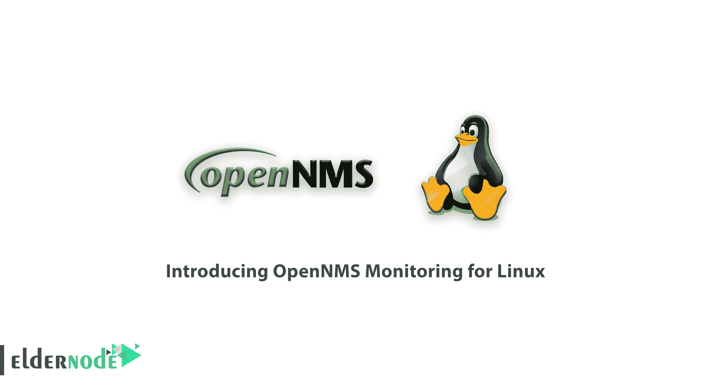
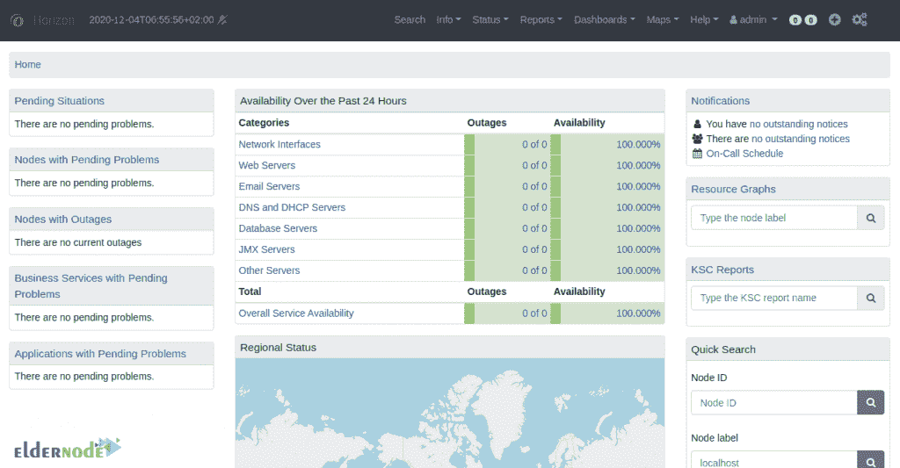
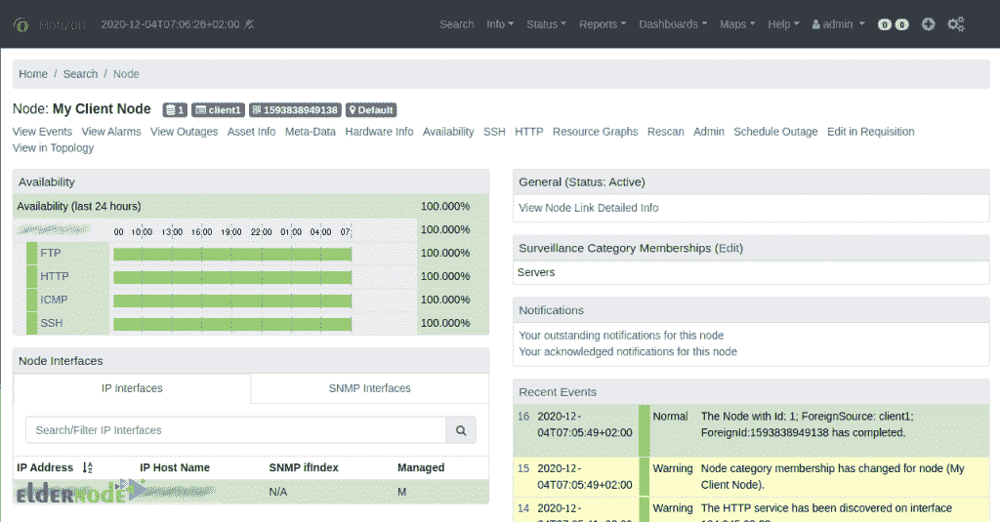

# OpenNMS 监控简介- Eldernode 博客

> 原文：<https://blog.eldernode.com/opennms-monitoring-for-linux/>

OpenNMS 是一个特定于网络的开源工具，用于管理和监控网络，以实现安全高效的通信。该工具为企业、中型公司和新的 IT 生态系统提供了一个完整的监控平台。OpenNMS 允许用户远程控制应用程序，但是 SNMP 陷阱正在用来创建指示危险的高级工作流。该软件的用户界面非常简单，用户可以很容易地进入查看网络点和设置警报以及检查其断开连接的部分。在本文中，我们试图向您介绍用于 Linux 的 OpenNMS 监控。你可以访问 [Eldernode](https://eldernode.com/) 提供的包来购买 [Linux VPS](https://eldernode.com/linux-vps/) 服务器。

## **OpenNMS 监控系统简介**

OpenNMS 成立于 20 世纪 90 年代末，是一个面向大型企业和网络的基于管理的开源监控工具。从那时起，通过一个简单的修改和改进过程，它获得了一个惊人的在线社区。OpenNMS 以其通知系统而自豪，该系统根据 API 监控结果更新中央控制。OpenNMS 的一个独特之处在于它关注与行业标准管理工具的集成。还应注意，综合警报系统附带 Java 通知和外部通知脚本。

## 面向 Linux 的 OpenNMS 监控系统

### OpenNMS 软件有哪些特点？

OpenNMS 是一个企业级网络管理应用程序，提供网络性能测量、自动发现、事件和通知管理等功能。该工具允许管理员查看节点、警报和断开连接，并添加了一个特殊的监控界面。

以下是该工具的一些显著特性:

**1-** 这个软件的一个很好的功能就是自动检测设备和网络节点。

**2-** 可以监控不限数量的网络设备。

**3-** OpenNMS 软件是用 Java 写的。因此，它可以在所有平台上实现。

**4-** 支持 Windows、 [Linux](https://blog.eldernode.com/tag/linux/) 、Unix、Mac、Solaris 操作系统。

**5-** 通过电子邮件发送通知。

**6-** 提供完全图形化的网络仪表板。

### OpenNMS 监控系统软件的优势:

OpenNMS 旨在帮助用户跟踪网络状态。该软件允许用户了解网络性能的参数，并对网络有更多的控制。它可以用于在网络业务中提供客户服务。对主机公司特别有用。以下是 OpenNMS 监控系统的一些好处。我们也会解释这个软件的一些**缺点**。

**答:OpenNMS 提供供应服务**

使用 OpenNMS，可以使用其高级供应系统向管理系统添加许多设备。用户可以指定将设备明确添加到系统中。他们还可以提供描述系统中所有 IP 地址的列表。OpenNMS 准备系统中的适配器用于将其与其他外部软件集成。

**B .监测服务**

OpenNMS 软件帮助用户访问各种基于网络的服务。这些监视器具有邮件传输和屏幕监控的复杂功能。还包括简单的监视器，包括检查 TCP 端口和 ICMP pings。因此，使用 OpenNMS，您可以确保网络处于控制之下。还可以检查其他网络资源的可用性。

**C .数据收集和分析**

OpenNMS 可以从各种网络性能参数中收集数据，然后分析这些数据以确定网络性能。在收集和存储数据之后，OpenNMS 将这些数据制成图表并进行比较。

### OpenNMS 软件的缺点:

**A .延时报警**

一些用户可能遇到的事情之一是接收警报的延迟。然而，任何具有大量连接设备的网络管理系统在报告警报时都会遇到延迟。所以没必要担心。

**B .用于开发和维护的有限资源**

因为 OpenNMS 是免费的，开发者不向用户收费。钱可以通过授权获得。然后致力于这个软件的维护和开发。

**C .低质量用户界面**

OpenNMS 中另一个可以改进的地方是用户界面。鉴于 OpenNMS 包括警报、自动化和“重定向”配置，所有这些特性可能会让 OpenNMS 用户感到困惑。所以学起来可能有点难。

## 结论

OpenNMS 是建立在自由软件或开源模型上的企业级网络监控和管理网络平台。该项目包括一个社区支持的自由软件项目，以及一个提供商业服务、培训和支持的组织。在本文中，我们试图向您介绍适用于 Linux 的 OpenNMS 监控系统，并讨论该软件的特性、优点和缺点。