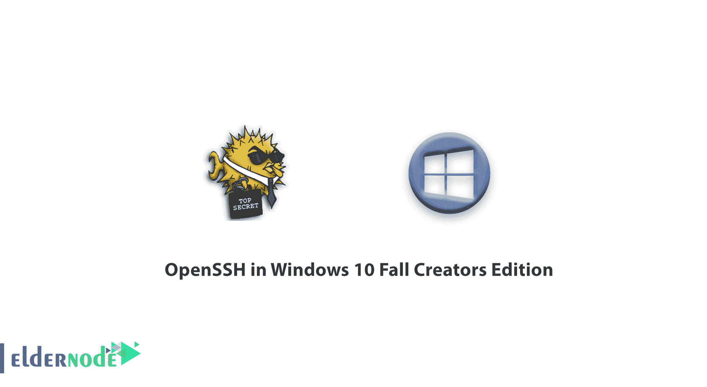

# Windows 10 秋季创造者版中的 OpenSSH 教程 Windows 10

> 原文：<https://blog.eldernode.com/openssh-in-windows-10/>

【更新】在微软为 Windows 10 发布的一个更新(1709)中，Windows 10 增加了一个名为 OpenSSH 的功能。OpenSSH，也称为 OpenBSD 安全 Shell，是一套基于安全 Shell (SSH)协议的安全网络工具。该工具在客户端和客户端体系结构中的不安全网络上提供了一个安全通道。Windows 10 中加入了 OpenSSH，以便用户可以使用它进行远程终端通信。在这篇文章中，我们将讲解 Windows 10 秋季创造者版中的 **OpenSSH。如果你想购买一台 [**Windows VPS**](https://eldernode.com/windows-vps/) 服务器，你可以访问 [Eldernode](https://eldernode.com/) 中提供的软件包。**

## **Windows 10 中的 OpenSSH 介绍**

在多年来因其远程终端连接 CMD 和 PowerShell 与 **Psexec** 和 **WinRM** 而饱受批评之后，微软已经将 [OpenSSH](https://www.openssh.com/) 添加到 Windows 中。很少有人会想到，有了远程桌面， [Windows](https://blog.eldernode.com/tag/windows/) 中的某个人会去远程终端，用 Windows 命令控制 Windows 及其服务。但事实是另一回事！

在很高的级别上运行 Microsoft 服务的专业 Microsoft 用户和管理员总是试图提供最少的对服务器的直接访问，以增加安全性。此外，对通信进行编程，使得不是每个人都可以通过不同的攻击访问主服务器信息，例如 **MitM** 或**嗅探**。

微软为此想出了很多解决方案。在这些解决方案中，我们可以提到 **Psexec** 或 **WinRM** ，这两个解决方案都有其弱点。

**Psexec** 使用最简单的方式进行通信和加密，一个中级黑客可以轻松黑掉它，渗透你的系统。有趣的是，许多网络管理员称之为 Windows 中的安全噩梦。

WinRM 承诺一个强大而完整的系统一经推出。但其耗时的安装和配置，以及建立通信安全的许多步骤，阻止了许多 Windows 用户访问它。

在对这些连接提出批评后，微软最终决定将 OpenSSH 引入 Windows，OpenSSH 被广泛认为是一种安全的标准协议。OpenSSH 已经作为测试版被添加到 Windows 10 的 1709 版本的 **Fall Creators** 更新中。您可以启用它并使用 SSH 连接。

**Windows 10** 中的 OpenSSH 有两个不同的版本，分别叫 **OpenSSH 客户端**和 **OpenSSH 服务器**。

### **什么是 OpenSSH 客户端？**

这个版本只有与 Windows SSH 通信的能力。用户可以通过 CMD 和 PowerShell 环境使用 OpenSSH 客户端。

### 什么是 OpenSSH 服务器？

OpenSSH 服务器版本实际上是能够提供 SSH 服务的服务器端版本。具有客户端版本的系统必须连接到另一个具有服务器版本的系统。

### **在 Windows 中使用 OpenSSH 的好处**

1-简单的设置和配置

2-通信安全性高

3-快速沟通

4-可以在 CMD 和 PowerShell 中使用

5-不同用户访问的能力

6-不需要改变命令结构的类型

7-个性化服务的灵活性

和许多其他好处

## 结论

通过在 Windows 中引入 OpenSSH，微软在服务器间通信的方向上迈出了一大步。这也增加了微软操作系统在这方面的安全性和灵活性。在本文中，我们试图向您介绍 Windows 10 Fall Creators Edition 中的 OpenSSH。如果你愿意，可以参考文章《如何在 Windows Server 2019 上[安装和配置 OpenSSH Server》。](https://blog.eldernode.com/install-and-configure-openssh-server-on-windows-server/)