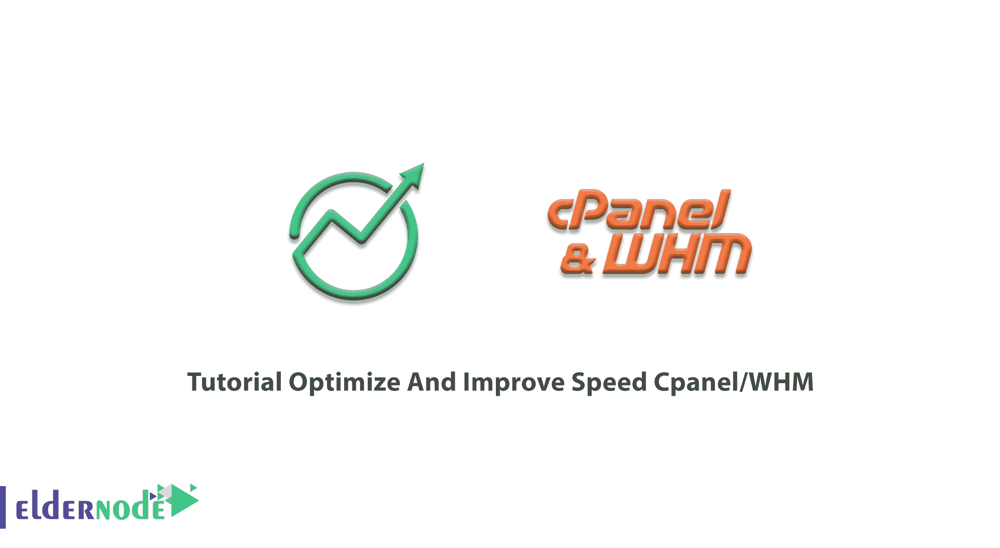

# 教程优化和提高速度 CPanel/WHM - Eldernode 博客

> 原文：<https://blog.eldernode.com/optimize-and-improve-speed-cpanel/>



作为一个最流行的网络托管控制面板，cPanel 是众所周知的，它基于 Linux 操作系统来管理全世界的 Linux 服务器和主机。虽然学习和使用 cPanel 很容易，但是您将能够节省时间和金钱。要在将网站文件发送到互联网之前压缩部分或全部文件，您需要在 cPanel 中优化网站内容。本文将解决**优化和提高 cPanel/WHM** 的速度。不要错过 [Eldernode](https://eldernode.com/) 的新优惠和折扣，购买自己的 [Linux VPS](https://eldernode.com/linux-vps/) 。

## **如何优化提升速度 cPanel/WHM**

如果你是一个希望优化和提高 cPanel 速度的用户，请和我们在一起，遵循这个指南直到最后。

## 逐步优化和提高速度面板

让我们浏览一下本指南的步骤，了解如何优化和提高 [cPanel](https://blog.eldernode.com/tag/cpanel/) 的速度。这里有 5 个建议的步骤，包括一个帮助你优化 cPanel 和加速它的解释。

*第一步:*

### **安装 CloudLinux**

之前，您已经学习了如何在 cPanel 上[安装 CloudLinux。当你在 cPanle 上安装 CloudLinux 时，你是在提高稳定性，因为它限制了资源。安全性和效率将增加，多个 PHP 版本和硬化的内核是这种集成的其他特点。通过这种方式，您可以在 cPanel 和 WHM 软件中提供一个管理界面来轻松管理帐户使用。](https://blog.eldernode.com/install-cloudlinux-on-cpanel/)

当您以 root 用户身份登录时，打开一个 SSH 帐户并运行以下命令:

```
wget https://repo.cloudlinux.com/cloudlinux/sources/cln/cldeploy
```

```
sh cldeploy -k <activation_key> # if you have activation key    or
```

```
sh cldeploy -i # if you have IP based license 
```

```
reboot
```

*第二步:*

### **安装 LiteSpeed webserver**

LiteSpeed 是一个专有的 web 服务器，是 Apache 的替代产品。要安装 LiteSpeed，您需要考虑一些先决条件，如 LiteSpeed Web 服务器许可证。如果您不想购买许可证，可以在内存小于 2GB 的服务器上使用免费的 Starter plan。由于它只适用于 LiteSpeed 企业版，您需要提供试用密钥或企业许可证序列号。还需要使用根权限对 cPanel 服务器进行 SSH 根访问。接下来，您将回顾为 cPanel/WHM 安装 **LiteSpeed Web 服务器插件的步骤。**

建议您通过[一行自动安装程序](https://www.litespeedtech.com/support/wiki/doku.php/litespeed_wiki:cpanel:auto-installer)安装 WHM 插件 LSWS。下面是安装 whm 插件、LSWS 和 PHP 的步骤。

**1。安装 LiteSpeed WHM 插件**

```
cd /usr/src; curl https://www.litespeedtech.com/packages/cpanel/lsws_whm_plugin_install.sh | sh** Uninstall WHM**
```

*卸载 WHM*

您可以通过运行以下命令卸载 WHM LiteSpeed 插件:

```
/usr/local/cpanel/whostmgr/docroot/cgi/lsws/lsws_whm_plugin_uninstall.sh
```

**2。在 WHM 安装 LiteSpeed Speed 网络服务器**

要通过这一步，请逐一遵循以下路径:

1-单击“LiteSpeed 网络服务器”插件

双击“安装 LiteSpeed 网络服务器”

3-填写表格以指定

然后，考虑以下提示:

_ 试用许可证密钥或序列号

_ LiteSpeed 目标安装目录

_ Port Offset(设置为 0 以替换 Apache，否则设置一个类似“2000”的数字，例如在端口 2080 上尝试 LiteSpeed)

_ 是否启用 PHP SuEXEC

_ 您的管理员电子邮件地址。

LWSW 管理控制台的用户名和密码(_ u)

4-单击“下一步”安装 LiteSpeed

**3\. Config PHP**

插件会通过脚本处理 **EA4** 。LiteSpeed 的插件将检测正确的配置，并在需要时纠正它们。因此，您不需要构建匹配的 PHP。

您应该为 **EA3** 构建一个匹配的 PHP 二进制文件。尽管 LSWS 附带了一个预构建的 PHP 4 二进制文件，但是您必须使用与 Apache mod_php 所使用的配置选项相匹配的配置选项来构建自己的 PHP。然后，点击“构建匹配的 LSPHP ”,注意这需要一段时间。

当运行“构建匹配的 LSPHP”时，您可能会看到以下错误消息之一，请尝试将服务器配置调整设置下的侧菜单中的“最大 cPanel 进程内存(最小值:512)”增加到至少 512MB。

```
Found Errors
```

```
ERROR: /usr/local/bin/php -i returns 6
```

```
You can try to build matching PHP from command line:   "/usr/local/cpanel/whostmgr/cgi/lsws/cmd_buildmatchingphp.sh"
```

运筹学

```
Found Errors    ERROR: /usr/local/bin/php -i returns 134    You can try to build matching PHP from command line:   "/usr/local/cpanel/whostmgr/cgi/lsws/cmd_buildmatchingphp.sh"
```

**4。再次启动 LiteSpeed】**

要启动 LiteSpeed，请单击“重启 LiteSpeed”。如果您已经仔细地通过了上述步骤，那么现在一切都应该正常工作了。所以，是时候用 LiteSpeed Web 服务器替换 Apache 了。为此，请单击“更改端口偏移”，并将该值设置为 0(如果您之前没有这样做)。接下来点击“切换到 LiteSpeed”完成。

***非常重要*** :不要取消勾选 WHM 服务管理器下的“Apache Web Server”服务。如果您这样做，WHM 将不会自动重启 LiteSpeed 时，配置已经发生变化。

*第三步:*

### **将 MySQL 数据库升级到 MariaDB**

在这一步优化提升 cPanel 速度中，你需要从 MySQL 升级到 [MariaDB](https://blog.eldernode.com/mariadb-10-3-23-on-cpanel-breaks-the-mysql/) 。由于 MariaDB 被设计成 MySQL 的替代产品，所以这并不具有挑战性。接下来，您将学习如何在 MySQL 服务器上安装 MariaDB。如果您以最简单的方法完成以下步骤，您将成功地继续进行此迁移。

1-用 MariaDB repos 更新您的软件库列表

2-用新的 repos 更新您的 Linux 软件包管理器

3- Stop MySQL

4-用软件包管理器安装 MariaDB

准备好备份后，应完成上述所有步骤。你可以可靠地切换到 MariaDB，然后再切换回 MySQL。选择您的发行版、MariaDB 版本和下载镜像，然后复制并运行向导创建的命令来安装存储库签名密钥，并将存储库配置复制到您的源代码列表中。接下来，运行您的包管理器的 update 命令，停止您的 MySQL 服务器，然后用您的包管理器安装 MariaDB。您的包管理器应该自动运行 *mysql_upgrade* 。这是检查所有表与当前版本的 MariaDB 的兼容性并修复任何不正确之处的必要步骤。如果没有，手动运行 *mysql_upgrade* 。然后重新启动 MariaDB，检查您的日志文件，如果没有错误出现，您就完成了。

*第四步:*

### **模块激活通过 EasyApache(学习优化和提高速度 CPanel)**

在这一步中，为了提高 cPanel 的效率，您可以从 EasyApache 中激活重要的模块。这是一个功能强大且易于使用的工具，内置于 WHM/cPanel 中，您可以使用它来更新和配置您的 Apache 服务器。遵循下面的路径能够通过 EasyApache 安装模块。

登录到 WHM(作为根用户) >点击“软件”>选择 EasyApache3 >选择 Apache 版本并点击“下一步”>一旦进入另一个页面，更改 pho 版本并点击按钮“下一步”>点击“详尽选项列表”以启用模块>选择您希望安装的模块>点击“保存并构建”>当新窗口打开时，点击“确定”以确认操作。

这样，将显示构建页面。阿帕奇重建将需要将近 45 分钟。现在，模块正在通过 EasyApache 安装。

*第五步:*

### **禁用不必要的服务**

提高 cPanel 速度的最新方法是在 cPanel 中禁用不必要的服务。cPanel 通过使用“Chkservd”守护进程来监视服务器上安装的所有服务。它监视安装在服务器上的所有服务，并在任何服务由于某种原因停止时自动重新启动或尝试重新启动它们。简单地从 WHM 面板或从服务器 CLI 管理它。禁用服务驻留在 */var/Cpanel/disabled* 目录中。让我们看看**如何从 cPanel 监控**中禁用服务，只需遵循以下步骤。

1-以 root 用户身份登录 WHM

2-进入“主页>服务配置>服务管理器>

3-取消选中“监控”列中的服务

4-“保存”

**如何通过 CLI 从 Chkservd 禁用服务**

如果您想从命令行界面禁用该服务，请查看以下步骤:

1-以 root 用户身份 SSH 到服务器

2-用您喜欢的文件编辑器打开 Chkservd 配置文件“/etc/chkserv.d/chkservd.conf”

3-使用 0 的可中断服务

4-重新启动“Chkservd”服务。

## **结论**

在本文中，教程优化和提高速度 cPanel/WHM 呈现给你。现在，您可以选择并使用这五个解决方案中的任何一个来加速和优化 cPanel。找到您喜欢的 [VPS 托管计划](https://eldernode.com/vps-hosting/)拥有一个强大的控制面板。如果你有兴趣了解更多，请访问 [cPanel 教程](https://blog.eldernode.com/tag/cpanel/)。