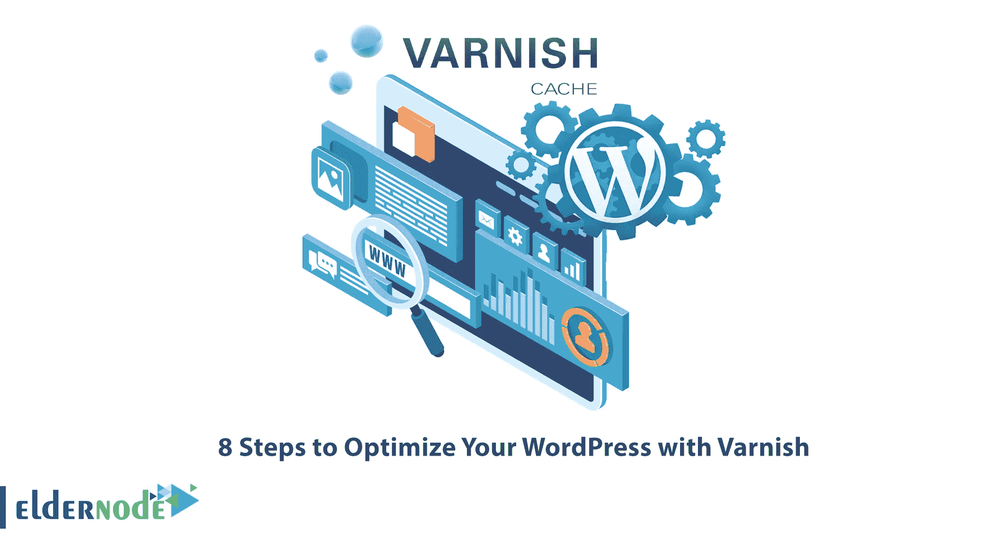
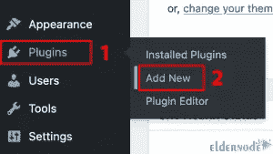

# 用清漆优化你的 WordPress 的 8 个步骤

> 原文：<https://blog.eldernode.com/optimize-your-wordpress-with-varnish/>



缓存系统将静态页面和稳定的代码保存在内存中，当用户访问网站时，缓存服务会给出用户的响应。可以使用各种缓存服务。其中最受欢迎的是清漆。这篇文章将解释用清漆优化你的 WordPress 的 8 个步骤。如果你打算购买一台 Linux VPS 服务器，你可以在 [Eldernode](https://eldernode.com/) 网站上查看提供的软件包。

## **如何用清漆优化你的 WordPress**

[Varnish](https://blog.eldernode.com/varnish-cache-for-apache-on-ubuntu/) 是一个 HTTP 加速器，专注于 HTTP，作为缓存服务放在 Apache 或 Nginx web 服务器前面。它通常是为具有非常高的流量并不断得到服务的 web 服务器而设计的。目前，大型网站使用这一系统，其中包括维基百科和许多在线报纸，以及许多著名的社交网络。你可以使用 Varnish 来优化你的 WordPress。

在这个来自 [WordPress 培训](https://blog.eldernode.com/tag/wordpress/)系列的教程中，你将学习如何用 Varnish 优化你的 WordPress。

### **1-安装清漆**

优化你的 WordPress 的第一步是安装 Varnish。Varnish cache 也称为缓存反向 HTTP 代理，是一个快速、高性能的 web 应用程序，它通过将传入的 HTTP 请求转发到您的 web 服务器来加速您的网站。它位于网络服务器的前面，捕获大多数用户访问的所有网络流量，并将其存储在内存中。通过这样做，它增加了网页的检索时间。这个加速器适用于许多 Linux 发行版，包括 RedHat、CentOS、Debian 和 Ubuntu。要在不同的操作系统上安装 Varnish 缓存，可以在 [Varnish 官网](https://varnish-cache.org/releases/)查看最新发布的版本。

### **2-在 WordPress** 上添加插件

一旦安装了 Varnish，第二步是在 WordPress 上添加 Varnish HTTP cache 插件。你也可以使用几个插件来代替 Varnish HTTP 缓存。为此，打开 WordPress 仪表盘，转到**插件>添加新的**路径:



现在搜索 Varnish HTTP Purge 并单击 Install Now。最后，你应该激活它。

### **3-启用自定义永久链接**

在这一步中，您应该启用 mod_rewrite，并为永久链接和归档使用自定义 URL 结构，以使 Varnish HTTP Purge 正确工作。为此，点击 WordPress 仪表盘中的**设置> >永久链接> >自定义结构**。

现在输入/%year%/%monthnum%/%post_id%并点击**保存更改**。最后，打开命令提示符，输入如下所示的命令:

```
a2enmod rewrite
```

### **4-将阿帕奇移动到不同的港口**

将 Apache 迁移到不同的端口是优化 WordPress 网站的另一个步骤；这是你在配置 Varnish 来处理你的 WordPress 网站的所有流量之前应该做的。请注意，您应该使用文本编辑器在 **/etc/apache2/ports.conf** 中更改所有出现的端口 80，并将**/etc/Apache 2/sites-enabled/**下的任何文件更改为 **8080** 。

### **5-上漆**

端口 80 可用后，更新 Varnish 配置，放在 Apache 和 WordPress 前面。用你想要的文本编辑器打开 **/etc/default/varnish** ，将端口从 **6081** 改为 **80** 。因为默认安装清漆将等待端口 6081 上的连接。

### **6-排除网址**

Varnish 使用后端或源服务器来确定在哪里检索缓存中不持久的内容。有些 URL 不应该缓存。使用您想要的文本编辑器打开 **/etc/varnish/default.vcl** ，添加以下命令:

```
if (req.url ~ "wp-admin|wp-login") {    return (pass);    }
```

### **7-扩展缓存**

在 Cache-Control HTTP 头中，Varnish 使用了 max-age 参数。这可以确定内容在再次联系后端之前多久被视为新鲜。默认情况下，Varnish 使用 120 秒，您可以通过更新 **/etc/varnish/default.vcl** 来延长这个时间段:

```
sub vcl_backend_response {    if (beresp.ttl == 120s) {    set beresp.ttl = 1h;    }  }
```

### **8-处理清除请求并确保清除**

当更新 WordPress 中的内容时，Varnish HTTP Purge 插件将要求 Varnish 将其从缓存中删除。它在下一次请求时从后端检索最新版本。您可以通过在/etc/varnish/default.vcl 中添加以下 vcl_recv 来实现这一点:

```
if (req.method == "PURGE") {    if (req.http.X-Purge-Method == "regex") {    ban("req.url ~ " + req.url + " && req.http.host ~ " + req.http.host);    return (synth(200, "Banned."));    } else {    return (purge);    }  }
```

就是这样！通过这 8 个步骤，你可以用 Varnish 成功优化你的 WordPress。

## 结论

Varnish 是一个缓存 HTTP 反向代理，可以帮助你优化你的 WordPress 网站。在这篇文章中，我们教你如何用 8 个步骤优化你的 WordPress。我希望这篇教程对你有用，帮助你用 Varnish 优化你的 WordPress。如果您有任何问题或建议，可以在评论区联系我们。