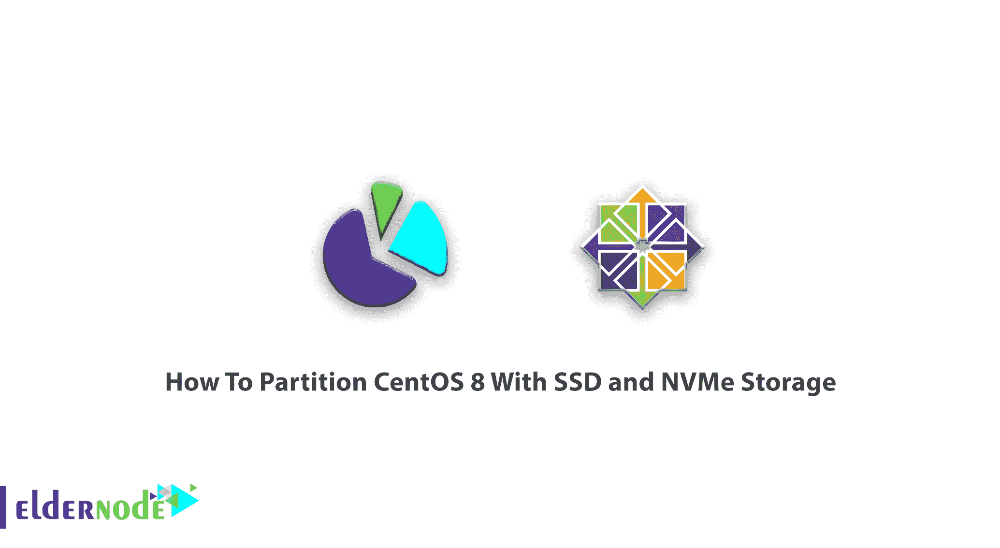

# 教程如何使用 SSD 和 Nvme 对 CentOS 8 进行分区| ElderNode 博客

> 原文：<https://blog.eldernode.com/partition-centos-8-with-ssd-and-nvme/>



在下面的 CentOS 8 教程中，在本文中，您将了解如何使用 [SSD](https://eldernode.com/ssd-vps/) 和 NVME 存储对 CentOS 8 进行分区，以升级服务器容量。为了让这个指南更好地发挥作用，你需要选择和购买自己的 [CentOS 虚拟专用服务器](https://eldernode.com/centos-vps/)。

## 如何使用固态硬盘和 NVMe 存储对 CentOS 8 进行分区

与我们一起浏览这篇文章，更好地熟悉 SSD 和 NVMe 及其在 [CentOS 8](https://blog.eldernode.com/initial-set-up-centos-8/) 上的功能。安装 CentOS 8 时，需要对其进行分区才能完成。如果您正在安装新的硬盘，需要对其进行分区。所以，这个教程对你会很有用。

固态硬盘比硬盘更快、更轻、更小、更冷，而且它们完全没有噪音，无论它们的外形如何。与具有移动部件的硬盘驱动器不同，硬盘驱动器使用非机械的[和](https://en.wikipedia.org/wiki/Flash_memory)基于闪存的结构。硬盘的机械部件限制了它们的速度，产生热量，并使它们容易受到外部冲击和震动。

## 什么是 SSD

**S**solid**S**tate**D**rive 是用于计算机的新一代存储设备。你可以用传统的机械硬盘取代它，使用基于闪存的内存来提高速度。更快的计算机具有低读取访问时间和高吞吐量。固态硬盘是一种快速可靠的内存，旨在取代硬盘。有几种类型的闪存驱动器，都基于闪存 NAND(负与)驱动器单元。尽管 HHD 传统硬盘包含一个圆形磁盘，称为存储数据的盘片，但 SSD 因其芯片数量而提供了更高的速度。因此，这意味着它们可以很容易地取代硬盘安装。

## 固态硬盘是如何工作的？

SSD 或固态驱动器之所以如此命名，是因为与硬盘不同，它的机制不是基于对象的旋转及其内部执行的移动。在固态硬盘中，数据存储在闪存驱动器的海洋中，而不是旋转的磁盘中。Nand 本身由称为浮栅晶体管的组件组成。与 DRAM 或动态随机存取存储器中使用的必须每秒刷新几次的晶体管不同，闪存驱动器被设计成即使没有电源也能保持其充电或放电。慢慢地，这导致了 Nand 在非易失性存储器类别中的分类。

### 固态硬盘的优势

用**少**电
快存取数据
多**可靠性**轻便**轻便**

## 什么是 NVMe

**N**on-**V**ol atile**M**emory**E**xpress 是一种通信接口和驱动程序，它为基于 PCIe 的固态硬盘定义了命令集和功能集，目标是在广泛的企业和客户端系统上提高性能和互操作性。此外，您可以将它用作设备驱动程序和 PCIe 设备之间的一个层，通过强调可伸缩性、低延迟和安全性来标准化规则。NVMe 技术曾被认为是数据存储行业中一个不必要但广泛使用的选项。但是现在这个功能已经成为一个重要的问题，新电脑的购买者应该注意拥有它。如果你刚买了一台电脑，你想提高它的速度，你可以使用这项技术来实现你的目标。

### 提示(使用 SSD 和 NVMe 对 CentOS 8 进行分区的教程)

**N** VMe 固态硬盘内存的 PCIe x4 连接速度比 PCIe x2 更快。 **W** 当你增加 NAND 芯片时，路径和单元也会增加。它们被控制器用来分发和存储信息。无论容量是否来自同一型号，较小的容量都比较大的容量慢。你可以通过选择 NAND 芯片的类型来影响内存的速度。例如，SLC 芯片速度更快，其次分别是 MLC 和 TLC，最后是 QLC 型速度最低。

## CentOS 8 上的分区管理

为什么需要分区？能够为不同类型的文件安装不同的文件系统。一旦将用户数据与系统数据分开，就可以防止系统分区变满并导致系统不可用。毕竟，您也可以更轻松地备份。

**不要忘记**备份您系统上的任何数据。不可预见的情况可能会导致您的所有数据丢失。【T2

每个分区用于形成支持 CentOS 中的一组文件和目录所需的存储的一部分。

您可能需要查看和管理 Linux 系统上的硬盘和分区，因此运行以下命令来完成这项工作。

```
fdisk -l
```

**注**:所有硬盘名称在 Linux 下显示为 **sda** 、 **sdb** 、 **sdc** 等。a、b、c 表示硬盘的排列。

然后，您可以对特定的硬盘进行分区。比如 **/dev/xvdc** 。

```
fdisk /dev/xvdc
```

什么会常用 fdisk 命令？

**n**–创建分区

**p**–打印分区表

**d**–删除一个分区

**q**–退出而不保存更改

**w**–写入更改并退出。

当创建分区时，操作系统不知道在哪里添加了新的分区。有两种方法可以让它了解这个地方。

**第一个**:重启机器

**第二次**:运行零件探测命令

我们能够用 partprobe 命令显示分区的位置，而无需重启机器。所以我们选择第二种方式。建议您在创建分区时运行该命令。

```
partprobe  fdisk -l
```

如果需要格式化磁盘，请键入以下命令:

```
mkfs.ext4 /dev/xvdc1
```

挂载分区使其存储从指定目录开始可用，完成格式化后，可以挂载分区:

```
mount /dev/xvdc1 /data
```

使用以下命令检查文件系统磁盘空间使用情况和分区的装载点:

```
df -h
```

您可以创建一个安装分区的目录。

```
mkdir /disk1
```

通过键入以下命令，可以在创建的目录上挂载分区:

```
mount  /dev/sdb1   /disk1
```

运行以下命令查看装载的分区:

```
df –h
```

此外，要卸载分区，请键入以下命令:

```
umount    /dev/sdb1
```

结论

在本文中，您了解了如何对 CentOS 8 进行分区。您可以使用本指南添加或删除任何您需要的分区，以及当您需要安装 SSD 和 NVMe 存储时。你也可以阅读更多关于使用硬盘的 PowerShell 命令。