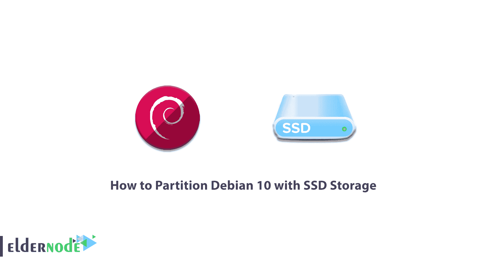
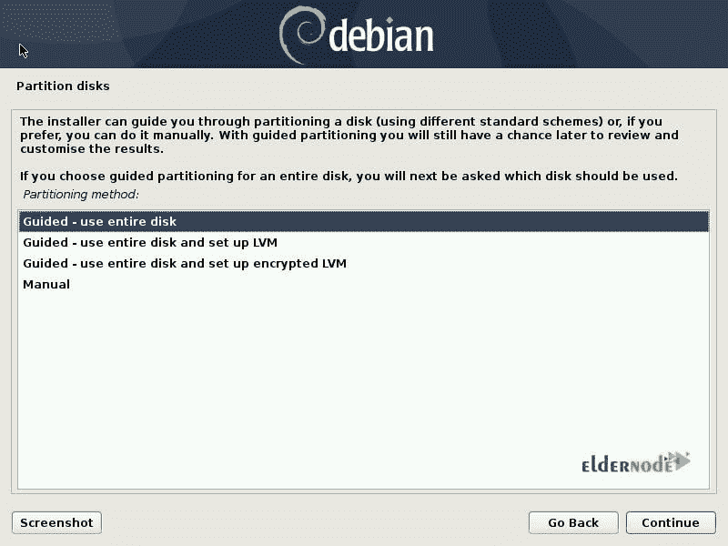
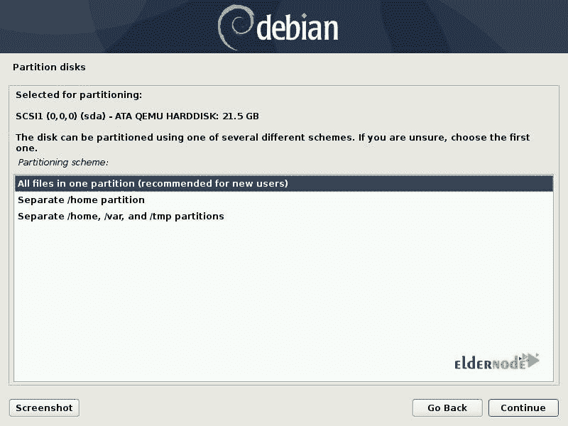
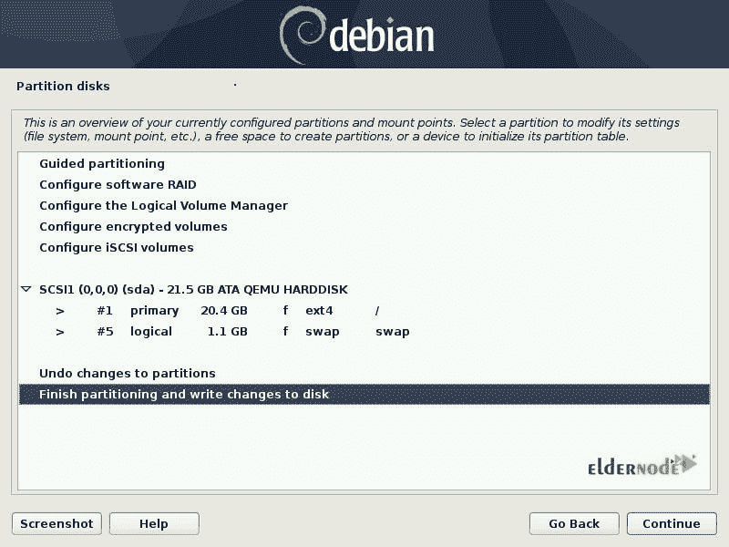

# 如何用 SSD 存储对 Debian 10 进行分区- Eldernode 博客

> 原文：<https://blog.eldernode.com/partition-debian-10-with-ssd-storage/>

固态硬盘使用闪存来提供卓越的性能和耐用性。SSD 比 hhd 更快更耐用，并且没有任何像它们一样的移动部件。支持读写数据，容量大很多，人们更喜欢用。内部固态硬盘像硬盘一样连接到电脑。在这篇文章中，你将学习**如何用 SSD 存储**对 Debian 10 进行分区。人们认为时间是不可购买的，但你可以用 SSD 做到这一点。因此，请访问 [Eldernode](https://eldernode.com/) 购买 [SSD VPS](https://eldernode.com/ssd-vps/) ，享受进步和创新的速度。

## **教程用 SSD 存储分区 Debian 10**

### **【磁盘分区(用 SSD 分区 Debian 10)**

如果您希望正确安装服务器，您需要进行分区。当您创建一个或多个存储区域并单独管理每个区域时，这被称为[磁盘](https://blog.eldernode.com/add-a-new-disk-to-linux-server/)分区。您可以在创建任何文件系统之前以及准备新安装的磁盘时执行此操作。在一个被称为分区表的区域中，分区的位置和大小信息被存储在磁盘中。操作系统将在读取磁盘的任何其他部分之前读取这些信息。Debian 开发人员已经考虑了几种分区程序，用于各种类型的硬盘和计算机架构，如 partman、fdisk 和 cfdisk。

### **推荐分区方案**

如果您有多用户系统或有大量磁盘空间的系统，建议您将/var、/tmp 和/home 分别放在它们自己的分区上，与/分区分开。如果你想安装许多不属于 Debian 发行版的程序，你需要一个单独的/user/local 分区。如果您的计算机是邮件服务器，请将/var/mail 作为单独的分区。如果您正在设置一个有很多用户帐户的服务器，建议使用一个单独的大/主分区。

### **用 SSD 对 Debian 10 进行分区**

当你开始安装你的 [Debian](https://blog.eldernode.com/tag/debian/) 服务器并通过所需步骤时，你将到达分区的步骤。这根本不是一个可选步骤，而是安装过程中必不可少的步骤。此外，您将选择要使用的文件系统。它帮助您控制数据安全和服务器的管理。

### **分区工具**

如果您是一个新用户，传统的分区对您来说会很困难，因为您必须定义存储 Linux 文件系统和虚拟内存(swap)的磁盘的各个分区。此外，如果你有另一个操作系统，你想保留它。这样，您需要确保不改变它的分区并调整它们的大小，直到它们不会损坏您的机器。

**注意**:您可以使用分区软件提供的“引导”模式。这个软件的建议接近你想要做的。在这里你必须选择你的**分区模式**。

如果您只使用 Linux，建议您选择“引导–使用整个磁盘”选项来启动引导分区。但是如果 Linux 和其他已经存在的分区一起工作，应该选择手动分区。引导分区还可以建立 [LVM](https://blog.eldernode.com/partition-centos-8-with-ssd-and-nvme/) 逻辑卷来代替分区。

### **【引导分区(用 SSD 分区 Debian)**

引导式分区提供了三种分区方法，包括“一个分区中的所有文件”、“独立/主分区”和“独立/主、var 和/tmp 分区”。

所有文件都在一个分区中
这种简单而健壮的分区非常适合个人或单用户系统。使用这种方法将创建两个分区:第一个将存放完整的系统，第二个是虚拟内存(交换)。

**分隔/主分区**
该方法将文件一分为二:一个分区包含 Linux 系统(/)，第二个包含“主目录”

**分离/home、var 和/tmp 分区**

对于服务器和多用户系统，最好选择第三种方法。它将文件树分成许多分区。这种划分有几个优点，因为用户不会因为耗尽所有可用的硬盘空间而锁定服务器，也不会阻塞系统的其余部分。

### **验证分区**

当您选择分区类型时，软件会计算出一个建议，并在屏幕上进行描述。如果您愿意，还可以修改它，如果标准选择不合适，可以选择另一个文件系统。但是，您将面临一个合理的分区，这有助于您接受它并选择“完成分区并将更改写入磁盘”条目。

### **手动分区**

在选择分区模式的部分，您看到了“手动”选项，可以像其他选项一样进行选择。当您决定手动分区时，您将有一些优势，如顺利备份，恢复过程，能够维护特别分配的分区的不同部分的存储，等等。如果您选择手动分区，它会更加灵活，并且由您来决定分区的大小。

可用磁盘、它们的分区以及任何可能的空闲空间(尚未分区)都显示在第一个屏幕上。因此，您可以选择它们中的每一个，或者通过选择它来擦除磁盘上的所有分区。

要手动创建新的[分区](https://blog.eldernode.com/partition-ubuntu-20-04-with-nvme-storage/)，请选择磁盘上的可用空间。引导式分区也可以为您做到这一点。

但是在选择分区时，你必须做什么呢？

试着指出你将使用它的方式。下面的列表帮助你如何考虑它们。但是，您可以选择不使用它，保持不变。

1-格式化它，并通过选择一个挂载点将其包含在文件树中。

2-将它用作交换分区。

3-使其成为“用于加密的物理卷”。4-将它用作 RAID 设备。
最后可以回顾一下分区。在列表底部，选择“完成分区并将更改写入磁盘”。

## **结论**

在本文中，您了解了如何使用 SSD 存储对 Debian 10 进行分区。当您开始使用 SSD 时，您的系统速度将提高约 200%。如果您有兴趣了解更多信息，请找到我们的相关文章[什么是固态硬盘及其工作原理](https://blog.eldernode.com/what-is-ssd-hard/)。