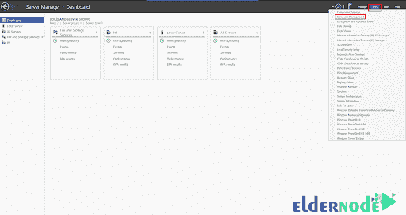

# 如何用密码保护 IIS - ElderNode 博客中的文件夹

> 原文：<https://blog.eldernode.com/password-protect-folders-in-iis/>

[更新] IIS 是一个灵活、安全且易于管理的 Web 服务器，可用于托管 Web 上的任何内容。在 IIS 中，通过取消匿名用户对目录或文件的访问来实现密码保护。为此，您可以将匿名用户的拒绝规则直接添加到应用程序的 web.config 文件中，或者在 IIS 管理器中完成这些步骤。关于服务器安全性，对于用户和企业主来说，重要的是要确保这些部分不是不安全的，并且在网站上创建新部分时不会被用户看到。创建文件夹或域时，锁定的方法有很多。这将使用 IIS 内置的名为密码保护的安全特性来保护一个文件夹或整个网站。在这篇文章中，你将学习**如何用密码保护 IIS** 中的文件夹。在 [Eldernode](https://eldernode.com/) 上选择您认为合适的计划，购买您自己的 **[VPS 托管](https://eldernode.com/vps-hosting/)** 服务器。

## **教程 IIS 中的密码保护文件夹**2012

IIS 是默认的 web 服务器，它与 Windows 服务器软件包集成在一起。IIS 有一个图形界面，用于管理微软 [Windows 服务器](https://blog.eldernode.com/tag/windows/)。为了在构建网站时不使网站的各个部分变得不安全并对用户可见，您需要锁定一个文件夹或域，因此，请加入我们的这篇文章，来回顾一下在 IIS 中用密码保护文件夹的方法。

### **密码保护介绍**

IIS 已经实现的特性之一，叫做 **。网络授权**。这些功能允许您自定义规则集，以描述谁有权访问文件夹或网站。

添加这些自定义规则时，我们有多个选项可供选择，**允许**或**拒绝**规则。其中一些规则包括以下选项:

**1_ 所有用户:** 该规则将 **拒绝** 任何试图访问文件夹的用户访问该文件夹。

如果您想要阻止所有人的内容，请确保该规则位于所有其他规则的列表顶部。

**2_ 所有匿名用户:** 该规则将 **阻止** 所有未经认证的用户访问。换句话说，任何试图访问文件夹或站点的用户都必须被授予特定的访问权限。

任何需要访问的用户必须将添加到**用户和组**部分，否则将被 **阻塞** 。

**3_ 指定角色或用户组:** 该规则将 **阻止** 所有没有基本用户 **帐户** 和 **密码** 的用户访问。

### **如何阻止所有人访问**

要阻止任何人访问，请按照下列步骤操作:

从**窗口开始**按钮打开你的 **IIS 管理器** 。

从**左侧菜单**中选择您想要编辑的站点。

打开**打开。Net 授权** 规则，点击 **添加规则** ，选择**类型的规则**你想要 **添加** 。

现在，您应该指定它将应用到的用户:

点击 **确定** 。

您的站点现在有了一个自定义规则。您可以添加任意数量的自定义规则:

## **自定义文件夹保护**

用于认证和保护的另一种方法称为 **认证** 。在此部分中，您有多个选项可用于修改:

**1。活动目录客户端证书认证:**

这是一种身份验证形式，要求 **IIS 7** 服务器成为活动目录域的成员，以及存储在活动目录中的用户帐户。

**2。匿名认证:**

这是一个提供访问您网站公共区域的功能。如果 **FTP** 被启用，默认情况下将允许用户访问网站内容。

**3。ASP。网名冒充:**

这是一个[安全](https://blog.eldernode.com/tag/security/)特性，允许特定用户 **执行** 代码。

此功能用于没有**凭证的**匿名用户。****

******4。基本认证:******

****此选项为在 **服务器的域中拥有帐户的用户提供访问权限。******

****为了访问 **面向公众的** 内容，应启用基本认证，以允许用户在 **本地用户和组** 中设置密码。****

*******注:*** 访问内容时， **密码** 是**通过 **明文格式** 发送给**的，因此被认为是不安全的。****

****5。摘要认证:****

**该选项类似于 **基本认证** ，但是使用哈希而不是纯文本以更安全的方式发送凭证。这种方法提供了更多的安全性，并且还需要设置一个 **用户的密码** 。**

****6。表单认证:****

**该选项通过检查 **表单的认证票** 来认证用户，该认证票通常包含在用户的 cookies 集合中。**

****7。Windows 认证:****

**Wwindows 身份验证选项用于更多的企业环境，或者网络中有大量用户的情况。该认证在**客户端**和 **Windows IIS 服务器**之间使用 **基于 Windows 的认证** 来验证尝试访问的用户必须拥有 Windows 帐户。**

### ****如何使用基本认证** 和 **摘要** **认证****

**在我们看到的所有保护文件夹的选项中，我们发现最好使用 **基本认证** 或 **摘要** **认证**。 两个选项都需要一个 **用户名** 和 **密码** 。**

**让我们回顾一下如何设置:**

****1。** 打开 **服务器管理器** 仪表盘。**

****2。**右侧下下**工具**下选择**电脑管理** 。**

****

****3。** **导航**到 **本地用户和组** 部分。**

****4。** 点击 **用户** ，在**右侧**选择 **更多操作> >新增用户。****

****5。** 在这里您可以为一个用户设置一个**新用户名**和**密码**，一旦完成， **保存** 以提供访问权限。**

****

****6。** 要选择一个文件夹，让我们打开我们的 IIS 管理器，选择您想要**限制** **访问**的 **站点** 或 **文件夹** 。**

****

****7。** 将打开类型认证部分。**

*****注意:*** 禁用匿名认证并启用基本或摘要对站点或文件夹的认证。**

## **结论**

**在本文中，您了解了如何在 IIS 中对文件夹进行密码保护。从现在起，您可以安全地在您的网站上工作，没有外部用户可以访问它，直到您完成它，因为您已经设置了域和文件夹安全。如果您有兴趣了解更多信息，请参考 Plesk 中的[如何对网站进行密码保护。](https://blog.eldernode.com/password-protect-sites-in-plesk/)**