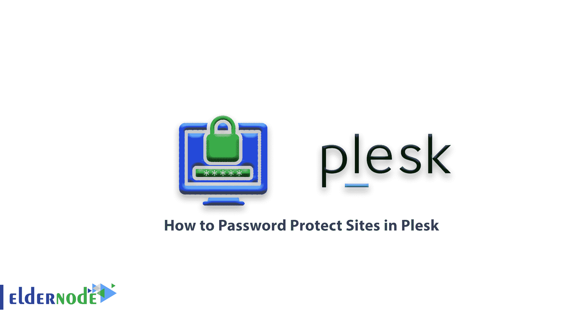
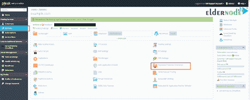
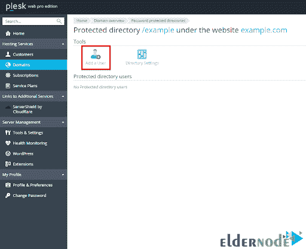

# 如何在 Plesk 中用密码保护网站-教程 Plesk

> 原文：<https://blog.eldernode.com/password-protect-sites-in-plesk/>

如何在 Plesk 中用密码保护网站？在上一篇文章中，我们教了你如何用密码保护 IIS 中的文件夹。在本节中，我们将回顾如何使用 Plesk 保护 Windows 服务器上的文件夹和域。

**Plesk 的保护功能**将为您的网站和内容增加一层额外的安全保障。 [Plesk](https://www.plesk.com/) 比仅仅使用 Windows IIS 服务管理器更容易设置。

[**在 Eldernode**](https://eldernode.com/windows-vps/) 选择您的完美 Windows 虚拟专用服务器包

Plesk 简介

## Plesk 是一个用于服务器管理的托管平台。它将允许您管理您的网站、 DNS 区域、插件、数据库、电子邮件账户、经销商账户等。通过 **基于网络的** 界面。

密码保护设置

### **1。** 开启 Plesk 。

**2。** 导航至域名 **>** 您要编辑的域名 **>** 密码保护的目录。

**3。**T3 点击添加保护目录。

**4。** 输入要限制的目录的路径，以及访问者可以看到的标题。

**5。**T3 点击确定。

将用户添加到密码保护列表

### 您必须允许一个或多个用户访问受密码保护的目录。为此，请遵循以下说明:

**1。** 导航到你的域名 >域名，你要编辑> 密码保护的目录。

**2** 。单击要添加用户的目录。

**3。** **设置**用户名和密码。

**4。T3 点击确定。**

干得好！保护对您的域和文件夹的访问可以很容易地完成。

**尊敬的用户**，我们希望您能喜欢这个[教程](https://eldernode.com/category/tutorial/)，您可以在评论区提出关于本次培训的问题，或者解决[老年人节点培训](https://eldernode.com/blog/)领域的其他问题，请参考[提问页面](https://eldernode.com/ask)部分，并尽快提出您的问题。腾出时间给其他用户和专家来回答你的问题。

如何在 Plesk 中用密码保护网站？

好运。

Goodluck.