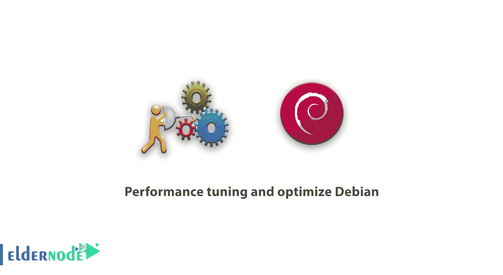

# 性能调优和优化 Debian 10/9/8 - Eldernode 博客

> 原文：<https://blog.eldernode.com/performance-tuning-and-optimize-debian/>



Debian 是世界上最大和最广泛的合作项目。Debian GNU/Linux 项目成功的最重要原因是这个 Linux 发行版是由 1000 多名程序员编写的。在本文中，我们打算提供关于**性能调优和优化 Debian** 的信息。如果您需要购买 [Linux VPS](https://eldernode.com/linux-vps/) 服务器，可以访问 [Eldernode](https://eldernode.com/) 中的软件包。

## 性能调优和优化 Debian 10/9/8

Debian GNU/ [Linux](https://blog.eldernode.com/tag/linux/) 套件目前包括超过 50，000 个甚至是为 8 处理器架构设计的软件包。通过改变 Debian 操作系统的源代码并对其进行修改，到目前为止，已经发布了 120 多种新的 Linux 发行版，所有这些发行版都被称为基于 Debian，它代表了这个操作系统的强大。在本文中，我们打算通过应用一系列设置来提高 Debian 发行版的性能。

### 如何在 Debian 10/9/8 上安装 Tuned

您可以使用以下命令在 Debian 中轻松安装和激活优化的软件包:

```
sudo apt update    sudo apt install tuned tuned-utils tuned-utils-systemtap
```

在 Debian 中使用以上命令安装调优的包之后，现在必须输入 **systemctl start tuned** 命令来启动。然后，您可以使用 **$ systemctl status tuned** 命令查看以下输出。在命令后的第二行和第三行，您可以检查服务的激活状态:

———————————————————————————————————–

$ systemctl 状态已调整

●tuned . service–动态系统调优守护进程
加载:**加载**(/usr/lib/systemd/System/tuned . service；已启用；厂商预置:**使能** )
激活:**激活**(运行中)自世界协调时 Tue 2020-11-06 04:10:52；6 天前
docs:man:tuned(8)
man:tuned . conf(5)
man:tuned-ADM(8)
main PID:936(tuned)
c group:/system . slice/tuned . service
└─936/usr/bin/python 2-es/usr/sbin/tuned-l-p
…..

———————————————————————————————————–

### 如何在 Debian 上选择调优配置文件

优化配置文件是基本配置文件，主要包含在基本优化包中。它们针对不同的目标，并提供性能优化，但也有针对低功耗、低延迟等的配置文件。鉴于对配置文件的讨论非常广泛，我们可以简单地说，调优的配置文件分为两类:节能配置文件和性能提升配置文件。在下文中，我们将逐一解释:

#### 省电模式

与默认启用的节能机制相比，节能配置文件包含默认情况下通常不启用的节能设置。因为它们会显著影响系统的延迟/性能。此外，性能配置文件在设置功耗时会禁用额外的节能机制。因为它们对吞吐量或延迟有负面影响。

#### 性能提升配置文件

性能提升概要文件包括我们将在下面解释的方面:

***1。延迟-性能**T3*

低延迟性能调优配置文件。禁用节能机制。CPU 调控器被设置为 performance 并锁定到低 C 状态(通过 PM QoS)。CPU 能源性能偏向于性能。

***2。吞吐量-性能***

典型吞吐量性能调优的配置文件。禁用节能机制并启用 sysctl 设置，以提高磁盘和网络 IO 的吞吐量性能。CPU 调控器设置为 performance，CPU 能耗性能偏差设置为 performance。增加了磁盘预读值。

***3。虚拟主机***

基于吞吐量-性能配置文件为虚拟主机优化的配置文件。此外，它还支持更积极的脏页写回。

***4。虚拟机-性能***

tuned utility 是一种调优配置文件交付机制，它使 Debian 适应某些工作负载特性，例如 CPU 密集型任务或存储网络吞吐量响应的要求。它提供了许多预配置的调整配置文件，以在许多特定的使用案例中增强性能并降低功耗。您可以编辑这些配置文件或创建新的配置文件，以创建适合您的环境(包括虚拟化环境)的性能解决方案。

### 教程在 Debian 上选择一个调优配置文件

您可以使用 **tuned-adm** 命令更改调优的守护程序设置。您可以使用以下命令检查活动的优化配置文件:

```
$ tuned-adm active  Current active profile: virtual-guest
```

另外，如下所示，您可以使用 tuned-adm list 命令列出所有可用的优化配置文件:

```
**Available profiles:**
```

```
- balanced                      - General non-specialized tuned profile
```

```
- desktop                       - Optimize for the desktop use-case
```

```
- latency-performance           - Optimize for deterministic performance at the cost of increased power consumption
```

```
- network-latency               - Optimize for deterministic performance at the cost of increased power consumption, focused on low latency network performance
```

```
- network-throughput            - Optimize for streaming network throughput, generally only necessary on older CPUs or 40G+ networks
```

```
- powersave                     - Optimize for low power consumption
```

```
- throughput-performance        - Broadly applicable tuning that provides excellent performance across a variety of common server workloads
```

```
- virtual-guest                 - Optimize for running inside a virtual guest
```

```
- virtual-host                  - Optimize for running KVM guests
```

```
Current active profile: virtual-guest
```

下面是一个最大化吞吐量的示例。请注意，使用 tuned-adm profile 命令，您可以从一个活动配置文件切换到另一个活动配置文件:

```
sudo tuned-adm profile throughput-performance
```

#### 了解如何在 Debian 上查看推荐的调优配置文件

根据您的系统规格，可能建议使用基于 tuned-adm 命令的优化配置文件。该命令可以根据系统是虚拟机还是其他虚拟机来推荐这些规范。

```
$ tuned-adm recommend  virtual-guest
```

应该注意，您还可以使用以下命令将您的配置文件设置为推荐值:

```
sudo tuned-adm profile virtual-guest
```

要查看配置文件及其详细信息，请运行以下命令查看结果:

```
$ tuned-adm profile_info virtual-guest    Profile name:  virtual-guest    Profile summary:  Optimize for running inside a virtual guest    Profile description: 
```

### 教程关闭 Debian 上的调优配置

有时，您可能已经做出了更改，但现在您想要撤销这些更改。有两种方法可以做到这一点，你可以去另一个配置文件或禁用调优守护进程。但是要关闭优化活动和您所做的设置，您可以使用以下命令:

```
$ tuned-adm off
```

## 结论

在本文中，我们试图详细解释性能调优和优化 Debian。我们还试图提供关于如何安装 Tuned，如何选择调优配置文件，以及如何在 Debian 上检查推荐的调优配置文件的教程。