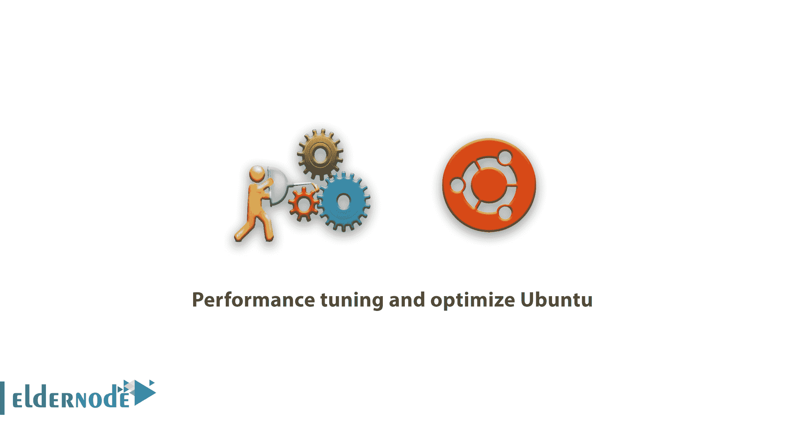

# 性能调优和优化 Ubuntu 20/18/16 - Eldernode 博客

> 原文：<https://blog.eldernode.com/performance-tuning-and-optimize-ubuntu/>



如何对 Ubuntu 20/18/16 进行性能调优和优化？ **[Ubuntu](https://blog.eldernode.com/tag/ubuntu/)** 是基于 Linux Debian 发行版的最流行的 Linux 发行版之一。操作系统支持 armhfp、i686、PowerPC 和 x86 & 64 架构，默认桌面软件为 Unity。Ubuntu Linux 操作系统最有意思的一个特点就是可以同时放在新人类别、桌面、服务器甚至中间用户，而这对于一个操作系统来说是一个非常积极的因素。在本文中，我们试图教你如何**性能调优和优化 Ubuntu** 。你可以在 [Eldernode](https://eldernode.com/) 看到可用的包来购买 [Ubuntu VPS](https://eldernode.com/ubuntu-vps/) 服务器。

## 性能调优和优化 Ubuntu

总的来说，我们把 Ubuntu 称为一个非常强大的桌面产品。为 Ubuntu 创建的社区基于 GNU/Linux 的思想和结构。正如所料，这个社区的目标是软件应该免费提供给人们，这样用户就可以很容易地使用它，并根据他们的语言进行本地化。他们还可以对软件源进行任何他们喜欢的更改。

## 教程性能调优和优化 Ubuntu 20/18/16

Ubuntu 这个词是一个古老的非洲词，意思是对他人的仁慈。随着 Ubuntu 的推出，世界上的软件行业实际上有了一种新的精神。Ubuntu 是由一家名为 Canonical Ltd 的英国公司创建的，这家公司由一个名叫马克·舒托沃尔斯的南非人经营。该公司通过提供与 Ubuntu 操作系统相关的支持服务获得资金。本文的其余部分描述了 Ubuntu 的性能调优和优化。

### 如何让 Ubuntu 保持最新

因为更新 Ubuntu 修复了常见的 bug， [Canonical](https://canonical.com/) 持续这样做以提高系统性能。Ubuntu 的新版本每年发布两次，并对系统进行了重大修改。这些变化最大限度地提高了系统性能。您可以在 Linux 终端中键入以下命令来搜索和更新 Ubuntu:

```
sudo apt-get update
```

但是要找出是否有原始版本，请键入并运行以下命令:

```
sudo apt-get upgrade
```

执行上述命令后，会询问您是否要继续？您必须按下“ **Y** 才能继续。

***注意:*** 更新前一定要备份好自己的文件。

### 如何删除旧文件

Ubuntu 的性能随着硬盘上可用空间的增加而提高。因为它不需要处理很多文件。最常见的可以被删除而没有安全问题的文件夹是下载文件夹，它们可以很容易地通过互联网重新下载。您也可以键入并执行以下命令来清除缓存:

```
sudo apt-get clean
```

您还可以使用以下命令在 Ubuntu 终端中键入并执行未使用的包和依赖项:

```
sudo apt-get autoremove
```

### 使用固态硬盘代替旧硬盘

SSD 对 HDD 做同样的事情，并在上面存储数据。它甚至在电脑关闭时也能保护它们，但里面没有活动部件。这个硬盘就像一个闪存盘。数据存储在闪存芯片上。固态硬盘芯片比 u 盘和硬盘快得多，也贵得多。因此，我们建议您将 Ubuntu 安装在固态硬盘上。

### 如何在 Ubuntu 上预装

由于“预加载操作”是将必要的文件保存在 RAM 中，这比将文件放在硬盘上要快得多。守护进程预加载通过在后台运行和监控最常用的应用程序来工作。预加载让系统更好地理解所需的程序。最后，这减少了启动时间。要在 Ubuntu 上安装 Preload，请运行以下命令:

```
sudo apt-get install preload
```

预加载安装完成后，重新启动系统。当系统启动时，预加载在后台运行。

### 如何升级 RAM

计算机的速度与虚拟内存(RAM)量的增加直接相关。另一方面，Ubuntu 至少需要 2 GB 的 RAM 才能流畅运行。解决这个问题的一个简单方法是安装更多的内存。你的电脑有一定数量的内存插槽，你可以插入芯片。要了解它使用哪种类型的 RAM，请务必搜索您的设备的特定型号。要查看 Ubuntu Destroyer 中的内存量，请在 Ubuntu 终端中键入并运行以下命令:

```
free –m
```

您还可以运行以下命令来查看 RAM 的类型和速度:

```
sudo lshw -c memory
```

### 如何使用本地镜像

如你所知，Ubuntu 软件库在世界各地都有镜像。因此，为了在更新软件时获得最佳的下载速度，您需要确认您使用的镜像离您的位置很近。
要做到这一点并对镜像设置进行更改，请遵循以下步骤:

**–**进入**软件**。

**–**然后点击页面左上角的**菜单**按钮。

**–**下一步，选择**软件和更新**。

**–**在 Ubuntu 软件标签中，选择**从**下载。

**–**最后选择**其他**然后选择离你最近的服务器。

### 如何使用轻型桌面替代品

你可能有兴趣知道 Ubuntu 版本 18.04 使用了 **GNOME 3** 桌面。GNOME 3 旨在平衡软图形和资源效率。因此，如果你有一个旧的系统，你可能会有一些高级功能的问题。Ubuntu 的轻量级桌面替代品包括 Lubuntu，它基于高效的 LX 桌面环境。您可以使用下面的命令来**安装 Lubuntu** :

```
sudo apt-get install lubuntu-desktop
```

***注:*** 安装好 Lubuntu 后，点击名字旁边的图标即可从登录页面下载。

### 如何控制启动程序

当您安装更多的程序时，由于进入系统的程序数量增加，设备的速度会变慢。另一方面，Linux 想要使用你的系统内存。

Ubuntu 有一个叫做“启动应用”的图形程序。如果你想看到完整的列表，从 GNOME 目录启动它。你也可以用鼠标点击单个程序，选择“删除”来阻止程序启动。需要注意的是，在 Ubuntu 18.04 中，你可以通过执行以下命令**列出所有已启动的服务**:

```
service --status-all
```

您也可以使用以下命令来**停止运行服务**:

```
sudo service <name> stop
```

最后，你可以使用下面的命令**删除 Ubuntu 中你想要的程序**:

```
sudo apt-get remove <program name>
```

## 结论

安装后，Ubuntu 操作系统需要进行一系列的设置优化，才能更好地运行。在本文中，我们试图解释一些优化 Ubuntu 性能的方法。如果你对 [CentOS](https://blog.eldernode.com/tag/centos/) 和 Debian 发行版感兴趣，可以参考文章[性能调优和优化 Debian 10/9/8](https://blog.eldernode.com/performance-tuning-and-optimize-debian/) 和[性能调优和优化 CentOS 7【最佳方式】](https://blog.eldernode.com/tuning-and-optimize-centos-7/)。