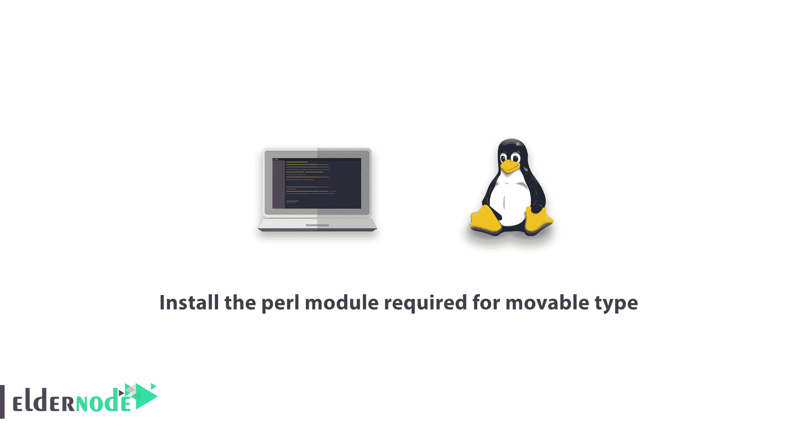

# 教程安装可移动类型| Eldernode 所需的 perl 模块

> 原文：<https://blog.eldernode.com/perl-module-required-for-movable-type/>



[更新日期:2020/12/26] PERL 模块是编程语言中的一个软件组件，使用此界面，您将能够从主机控制面板存储库到您的网站搜索 PERL 模块。注意，在使用 PERL 程序之前，您必须安装 PERL 模块。在本文中，我们想向您学习如何在 [Linux](https://blog.eldernode.com/tag/linux/) 服务器上安装可移动类型所需的 perl 模块。你也可以访问 [Eldernode](https://eldernode.com/) 中可用的包来购买 [Linux VPS](https://eldernode.com/linux-vps/) 服务器。

## **如何安装可移动类型所需的 perl 模块**

全面的 Perl Archive Network (CPAN)是一个由 12，000 多人用 Perl 编程语言编写的超过 250，000 个软件模块和 39，000 个发行版的文档库。

Perl 充当网络的用户界面，并作为包管理器的自动安装程序。CPAN 的大多数软件都是开源的。CPAN 于 1993 年设计，自 1995 年 10 月以来一直在使用。它基于 CTAN 模型，是统一 Perl 编程语言的分散文档的地方。

Perl 是一种由拉里·沃尔编写的高级编程语言，其他程序员也参与了这种语言的开发。Perl 是一种全面的 C 编程语言，包含少量 sed、awk、Unix shell 和至少 12 种其他工具和语言。

在本文的后续部分，我们将教您如何安装可移动类型所需的 perl 模块。请加入我们。

### **安装可移动类型所需的 perl 模块**

要安装可移动类型所需的 perl 模块，我们必须首先在服务器上安装 cpan。要使用 [yum](https://en.wikipedia.org/wiki/Yum_(software)) 安装 cpan，请在 ssh: ‌中输入以下命令

```
yum install cpan 
```

然后我们用 cpan 安装 perl 模块:

```
perl -MCPAN -e 'install Bundle::DBD::mysql' 
```

您还可以输入以下命令来安装 cpan，然后安装 perl 模块:

```
wget http://www.cpan.org/modules/by-module/DBD/DBI-1.618.tar.gz  tar xvzf DBI-1.618.tar.gz  cd DBI-1.618  unset LANG;  perl Makefile.PL  make  make install 
```

```
cd ..  wget http://www.cpan.org/modules/by-module/DBD/DBD-mysql-4.020.tar.gz  tar xvzf DBD-mysql-4.020.tar.gz  cd DBD-mysql-4.020  unset LANG;  perl Makefile.PL  make  make install 
```

安装完成。

## 结论

Perl 模块是 Perl 编程语言软件的一个单独的磁盘组件。从技术上来说，这是一组被普遍接受的使用 Perl 包机制的特殊契约。在本文中，我们试图教您如何安装可移动类型所需的 perl 模块。