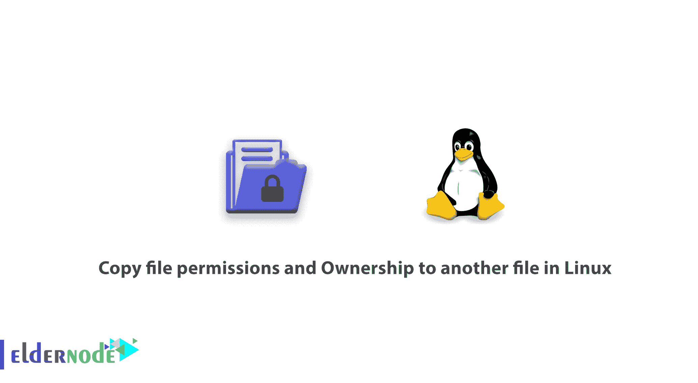
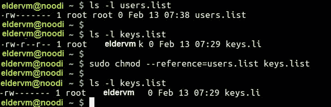

# 如何在 Linux - Eldernode 中将文件权限和所有权复制到另一个文件

> 原文：<https://blog.eldernode.com/permissions-ownership-linux/>



一个 Linux 系统管理员需要知道一些 Linux 技巧。在本文中，您将学习如何将文件权限和所有权复制到 Linux 中的另一个文件。当您有两个文件或刚刚创建了一个新文件时，您需要拥有与旧文件相同的权限和所有权，这种情况很常见。

分别使用 **chmod** 和 **chown** 命令，你将学习如何做到这一点。

## 如何将文件权限和所有权复制到 Linux 中的另一个文件

如果您有两个文件，或者您刚刚创建了一个新文件，并希望它拥有与旧文件相同的权限和所有权。

### 将文件权限复制到另一个文件

当您需要将文件权限从一个文件复制到另一个文件时，您可以在下面的 [Linux](https://www.linux.org/) 语法中使用带有–引用开关的 **chmod** 命令，其中 **reference_file** 是将从中复制权限的文件，而不是指定文件的模式。

```
chmod --reference=reference_file file
```

你可以看看下面的例子。

```
ls -l users.list  $ ls -l keys.list  $ sudo chmod --reference=users.list keys.list  $ ls -l keys.list     
```

[购买 Linux 虚拟私有服务器](https://eldernode.com/linux-vps/)

### `将文件所有权复制到另一个文件`

`同样，当您决定从另一个文件复制所有权时，您可以使用带有–reference开关的 **c** **hown 命令**，也可以使用以下语法，其中 **reference_file** 是将从中复制所有者和组的文件，而不是为该文件指定 **owner:group** 值。`

```
`chown --reference=reference_file file`
```

`**你可能也会感兴趣:**`

> `[如何暂时或永久禁用 SELinux】](https://eldernode.com/disable-selinux-temporarily-permanently/)`

`现在，让我们看看上面的命令示例。`

```
`ls -l keys.list  touch api.list  ls -l keys.list  sudo chown --reference=keys.list api.list  ls -l api.list`
```

``

`此外，您可以使用下面的命令将权限和所有权从一个文件复制到多个文件`

```
`sudo chmod --reference=users.list users1.list users2.list users3.list  sudo chown --reference=users.list users1.list users2.list users3.list`
```

`如果您想获得更多信息，请参考 **chown** 和 **chmod** 手册页。`

```
`man chown  man chmod`
```

`**如果您还需要更多信息，请查看:**`

`[SSH 和 Linux 中最常用的 21 个命令](https://eldernode.com/most-used-commands-in-ssh-and-linux/)`

`[如何在 Linux 中运行带时间限制的命令](https://eldernode.com/run-command-with-time-limit-linux/)`

`亲爱的用户，我们希望本教程能对你有所帮助，如有任何问题或想查看我们的用户关于本文的对话，请访问 [提问页面](https://eldernode.com/ask) 。也是为了提高自己的见识，准备了这么多有用的教程给 [Eldernode 培训](https://eldernode.com/blog/) 。`