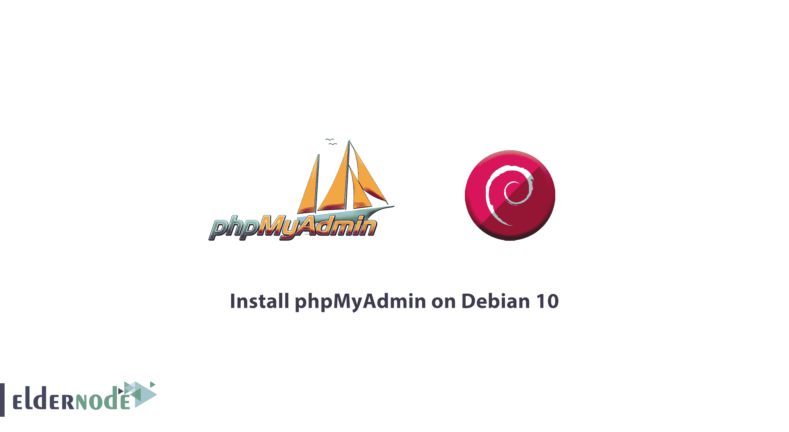
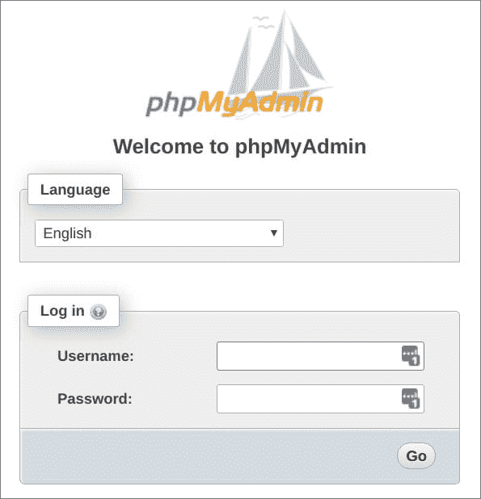
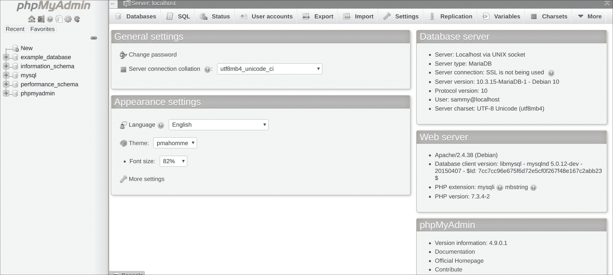

# 如何在 Debian 10 上安装 phpMyAdmin

> 原文：<https://blog.eldernode.com/phpmyadmin-debian-10/>



在本文中，您将学习如何在 Debian 10 上安装 phpMyAdmin。作为一个用户，你需要一个像 [MariaDB](https://eldernode.com/mariadb-installation-on-debian-10/) 这样的数据库管理系统，但是由于他们都不习惯仅仅通过 MariaDB 提示符与系统交互。

所以我们引入了[**phpMyAdmin**](https://www.phpmyadmin.net/)，其中用户通过 web 接口与 MariaDB 交互。请加入本教程，了解更多信息，并回顾如何从源代码安装和保护 phpMyAdmin，以便在 Debian 10 系统上安全地使用它和管理您的数据库。

**先决条件**

如果您知道以下内容，本教程可能会更有用:

*   一个拥有 sudo 权限的非 root 用户和一个配置了 ufw 的防火墙。
*   要设置，请按照 Debian 10 的[初始设置](https://eldernode.com/initial-setup-with-debian-10/)
*   安装在你的 Debian 10 服务器上的 LAMP ( **L** inux、 **A** pache、 **M** ariaDB、 **P** HP)栈。

## 如何在 Debian 10 上安装 phpMyAdmin

虽然 MariaDB 是社区开发的 [MySQL](https://eldernode.com/install-mysql-on-debian-10/) 的分支，但它们是密切相关的。phpMyAdmin 是为管理 MySQL 数据库而设计的，所以您需要确保 MariaDB 的安装能够与 phpMyAdmin 一起正常工作。

要开始安装，您必须考虑一些重要的安全提示，如:

*   与您的 MariaDB 安装直接通信
*   使用 MariaDB 凭据处理身份验证
*   执行任意 SQL 查询并返回结果

正如您所看到的，您不应该通过普通的 HTTP 连接在远程系统上运行 phpMyAdmin，因为它是一个广泛部署的 PHP 应用程序，您可能经常面临攻击。

### 安装 phpMyAdmin 和推荐包

为了启用某些功能并提高性能，您需要在服务器上安装一些 PHP 扩展，然后开始安装和配置。

要解释更多，我们建议您查看下面的内容。

*   php-mbstring :一个 php 扩展，用于管理非 ASCII 字符串并将字符串转换成不同的编码
*   php-zip :支持上传的 php 模块。将文件压缩到 phpMyAdmin
*   php-gd :另一个 php 模块，支持 gd 图形库

首先，您需要更新服务器的包索引。

```
sudo apt update
```

要下载文件并安装在你的系统上，使用 apt 

```
sudo apt install php-mbstring php-zip php-gd
```

我们在本教程中使用了全语言包，但是你只能安装英语包。

要将 tarball 下载到您的服务器，请将下面的 wget 命令中的链接替换为下载链接，然后按回车。

```
wget https://files.phpmyadmin.net/phpMyAdmin/4.9.0.1/phpMyAdmin-4.9.0.1-all-languages.tar.gz 
```

然后提取 tarball:

```
tar xvf phpMyAdmin-4.9.0.1-all-languages.tar.gz 
```

通过运行下面的命令，将 `phpMyAdmin-4.9.0.1-`全语言目录及其所有子目录移动到 /usr/share/ 目录。

```
sudo mv phpMyAdmin-4.9.0.1-all-languages/ /usr/share/phpmyadmin 
```

### 手动配置 phpMyAdmin

要创建一个 phpMyAdmin 存储其临时文件的新目录，请运行以下命令。

```
sudo mkdir -p /var/lib/phpmyadmin/tmp 
```

要设置 Linux 用户配置文件，请键入以下命令。

```
sudo chown -R www-data:www-data /var/lib/phpmyadmin
```

然后，复制您提取的文件，将其用作基本配置文件。你需要把它保存在 /usr/share/phpmyadmin 目录下，并重命名为【config.inc.php】T2:

```
sudo cp /usr/share/phpmyadmin/config.sample.inc.php /usr/share/phpmyadmin/config.inc.php
```

选择你最喜欢的文本编辑器，打开下面的文件

```
sudo nano /usr/share/phpmyadmin/config.inc.php 
```

默认情况下，phpMyAdmin 使用 cookie 认证方法，并允许您以任何有效的 MariaDB 用户身份登录 phpMyAdmin。

```
`. . .`
```

```
`$cfg['blowfish_secret'] = ''; /* YOU MUST FILL IN THIS FOR COOKIE AUTH! */  . . .`
```

``该短语仅供 AES 算法内部使用:``

```
``. . .  $cfg['blowfish_secret'] = 'STRINGOFTHIRTYTWORANDOMCHARACTERS'; /* YOU MUST FILL IN THIS FOR COOKIE AUTH! */  . . .``
```

``**注意**:要生成一个真正随机的字符串，你可以安装并使用 pwgen 程序``

```
``sudo apt install pwgen``
```

``接下来，要指向一个安全的您选择的密码，通过删除前面的斜杠取消对 controluser 和 controlpass 指令的注释。然后更新 controlpass 指令。它有助于不保留默认密码，并且未知用户无法通过 phpMyAdmin 接口轻松访问您的数据库。所以你会看到:``

```
``. . .  /* User used to manipulate with storage */  // $cfg['Servers'][$i]['controlhost'] = '';  // $cfg['Servers'][$i]['controlport'] = '';  $cfg['Servers'][$i]['controluser'] = 'pma';  $cfg['Servers'][$i]['controlpass'] = 'password';  . . .``
```

``如果您删除每一行开头的斜杠，并取消这一部分中每一行的注释，您将看到如下所示。``

```
``. . .  /* Storage database and tables */  $cfg['Servers'][$i]['pmadb'] = 'phpmyadmin';  $cfg['Servers'][$i]['bookmarktable'] = 'pma__bookmark';  $cfg['Servers'][$i]['relation'] = 'pma__relation';  $cfg['Servers'][$i]['table_info'] = 'pma__table_info';  $cfg['Servers'][$i]['table_coords'] = 'pma__table_coords';  $cfg['Servers'][$i]['pdf_pages'] = 'pma__pdf_pages';  $cfg['Servers'][$i]['column_info'] = 'pma__column_info';  $cfg['Servers'][$i]['history'] = 'pma__history';  $cfg['Servers'][$i]['table_uiprefs'] = 'pma__table_uiprefs';  $cfg['Servers'][$i]['tracking'] = 'pma__tracking';  $cfg['Servers'][$i]['userconfig'] = 'pma__userconfig';  $cfg['Servers'][$i]['recent'] = 'pma__recent';  $cfg['Servers'][$i]['favorite'] = 'pma__favorite';  $cfg['Servers'][$i]['users'] = 'pma__users';  $cfg['Servers'][$i]['usergroups'] = 'pma__usergroups';  $cfg['Servers'][$i]['navigationhiding'] = 'pma__navigationhiding';  $cfg['Servers'][$i]['savedsearches'] = 'pma__savedsearches';  $cfg['Servers'][$i]['central_columns'] = 'pma__central_columns';  $cfg['Servers'][$i]['designer_settings'] = 'pma__designer_settings';  $cfg['Servers'][$i]['export_templates'] = 'pma__export_templates';  . . .``
```

``最后，找到最下面的文件，添加下面一行来配置 phpMyAdmin，使用您之前创建的 /var/lib/phpmyadmin/tmp 目录作为它的临时目录。为了更快地加载页面，phpMyAdmin 将使用这个临时目录作为模板缓存。``

```
``. . .  $cfg['TempDir'] = '/var/lib/phpmyadmin/tmp';``
```

``如果你用了 nano ，现在按 CTRL + X，Y 保存并关闭文件，然后进入。``

``是时候创建 phpMyAdmin 存储数据库和表了。当您安装 phpMyAdmin 时，它附带了一个名为 create_tables.sql 的文件。``

``要创建配置存储数据库和表，运行以下命令以使用 create_tables.sql 文件。``

```
``sudo mariadb < /usr/share/phpmyadmin/sql/create_tables.sql`` 
```

```打开 MariaDB 提示符并创建管理用户 **pma** 。```

```
```sudo mariadb``` 
```

``运行以下命令来创建 **pma** 用户，并授予其适当的权限``

```
``mariaDB [ (none) ] > NGRANT SELECT, INSERT, UPDATE, DELETE ON phpmyadmin.* TO 'pma'@'localhost' IDENTIFIED BY 'password';``
```

``创建一个普通的 MariaDB 用户，用于通过 phpMyAdmin 管理数据库。尝试使用不同于 **pma** 用户的另一个帐户登录，并创建一个对数据库中所有表都有权限的用户。``

```
``mariaDB [ (none) ] > GRANT ALL PRIVILEGES ON *.* TO 'noodi'@'localhost' IDENTIFIED BY 'password' WITH GRANT OPTION;`` 
```

``然后，退出 MariaDB shell:``

```
``mariaDB [ (none) ] > exit``
```

``现在 phpMyAdmin 已经完全安装并配置在您的服务器上了。``

```[购买 Linux 虚拟私有服务器](https://eldernode.com/linux-vps/)```

### ```配置 Apache 服务 phpMyAdmin```

```安装过程会自动创建一个 Apache 配置文件，并将其放在/etc/Apache 2/conf-enabled/目录中。```

```在/etc/Apache 2/conf-available/目录下创建一个名为 phpmyadmin.conf 的文件```

```
```sudo nano /etc/apache2/conf-available/phpmyadmin.conf```
```

``将以下内容添加到文件中``

```
``phpMyAdmin default Apache configuration    Alias /phpmyadmin /usr/share/phpmyadmin    <Directory /usr/share/phpmyadmin>      Options SymLinksIfOwnerMatch      DirectoryIndex index.php        <IfModule mod_php5.c>          <IfModule mod_mime.c>              AddType application/x-httpd-php .php          </IfModule>          <FilesMatch ".+\.php$">              SetHandler application/x-httpd-php          </FilesMatch>            php_value include_path .          php_admin_value upload_tmp_dir /var/lib/phpmyadmin/tmp          php_admin_value open_basedir /usr/share/phpmyadmin/:/etc/phpmyadmin/:/var/lib/phpmyadmin/:/usr/share/php/php-gettext/:/usr/share/php/php-php-gettext/:/usr/share/javascript/:/usr/share/php/tcpdf/:/usr/share/doc/phpmyadmin/:/usr/share/php/phpseclib/          php_admin_value mbstring.func_overload 0      </IfModule>      <IfModule mod_php.c>          <IfModule mod_mime.c>              AddType application/x-httpd-php .php          </IfModule>          <FilesMatch ".+\.php$">              SetHandler application/x-httpd-php          </FilesMatch>            php_value include_path .          php_admin_value upload_tmp_dir /var/lib/phpmyadmin/tmp          php_admin_value open_basedir /usr/share/phpmyadmin/:/etc/phpmyadmin/:/var/lib/phpmyadmin/:/usr/share/php/php-gettext/:/usr/share/php/php-php-gettext/:/usr/share/javascript/:/usr/share/php/tcpdf/:/usr/share/doc/phpmyadmin/:/usr/share/php/phpseclib/          php_admin_value mbstring.func_overload 0      </IfModule>    </Directory>    # Authorize for setup  <Directory /usr/share/phpmyadmin/setup>      <IfModule mod_authz_core.c>          <IfModule mod_authn_file.c>              AuthType Basic              AuthName "phpMyAdmin Setup"              AuthUserFile /etc/phpmyadmin/htpasswd.setup          </IfModule>          Require valid-user      </IfModule>  </Directory>    # Disallow web access to directories that don't need it  <Directory /usr/share/phpmyadmin/templates>      Require all denied  </Directory>  <Directory /usr/share/phpmyadmin/libraries>      Require all denied  </Directory>  <Directory /usr/share/phpmyadmin/setup/lib>      Require all denied  </Directory>``
```

``保存并关闭该文件，然后通过键入以下命令来启用它。``

```
``sudo a2enconf phpmyadmin.conf`` 
```

``要使配置更改生效，请重新加载 apache2 服务``

```
``sudo systemctl reload apache2``
```

``然后，您将能够通过在 web 浏览器中导航到以下 URL 来访问 phpMyAdmin 登录屏幕:``

```
``https://your_domain/phpmyadmin    ``
```

``您可以使用您配置的 MariaDB 用户名和密码登录界面，然后您将看到用户界面。``

````

### ``保护 phpMyAdmin 实例``

```由于 phpMyAdmin 是攻击者的一个常见目标，所以您应该格外小心以防止未经授权的访问。通过使用 Apache 内置的在整个应用程序前面放置一个网关。htaccess 认证和授权功能是最好的保护方式之一。```

```编辑放置在 Apache 配置目录中的链接文件:```

```
```sudo nano /etc/apache2/conf-available/phpmyadmin.conf``` 
```

``在配置文件的 <目录/usr/share/phpmyadmin > 段中添加一个 AllowOverride All 指令。``

```
``<Directory /usr/share/phpmyadmin>      Options FollowSymLinks      DirectoryIndex index.php      AllowOverride All        <IfModule mod_php5.c>      . . .``
```

``添加该行后，保存并关闭文件。为了实现您所做的更改，重新启动 Apache，运行下面的命令。``

```
``sudo systemctl restart apache2`` 
```

``启用后。htaccess ，用于您的应用程序，您需要创建一个来实际实现一些安全性。然后创建必要的文件，并使用 root 权限在文本编辑器中打开它，输入:``

```
``sudo nano /usr/share/phpmyadmin/.htaccess`` 
```

``输入以下内容``

```
``AuthType Basic  AuthName "Restricted Files"  AuthUserFile /usr/share/phpmyadmin/.htpasswd  Require valid-user``
```

``如果你需要知道这些线的意思:``

``AuthType Basic :这一行指定您正在实现的认证类型。此类型将使用密码文件实现密码身份验证。``

``AuthName :设置认证对话框的消息。您应该保持这种通用性，以便未经授权的用户不会获得任何有关受保护内容的信息。``

``AuthUserFile :设置用于认证的密码文件的位置。这应该在所提供的目录之外。我们将很快创建这个文件。``

``Require valid-user :这指定只有经过身份验证的用户才能访问这个资源。这实际上阻止了未经授权的用户进入``

``完成后，保存并关闭文件。创建这个文件，并使用 htpasswd 实用程序将它传递给一个初始用户:``

```
``sudo htpasswd -c /usr/share/phpmyadmin/.htpasswd username`` 
```

``然后，您将被要求为您正在创建的用户选择并确认一个密码，因此该文件是使用您输入的散列密码创建的。``

``此外，如果您想输入一个额外的用户，您需要在不使用-c 标志的情况下使用``

```
`**`sudo htpasswd /etc/phpmyadmin/.htpasswd additionaluser`**` 
```

``**`当您访问 phpMyAdmin 子目录时，会要求您添加刚刚配置的帐户名和密码。`**``

``**`https://your _ domain _ or _ IP/phpmyadmin`**``

``**``**``

``**`最后，要输入您的 MariaDB 凭证，在输入 Apache 身份验证之后，您将看到常规的 phpMyAdmin 身份验证页面。`**``

``**`亲爱的用户，我们希望这篇关于如何在 Debian 10 上安装 phpMyAdmin 的教程对你有所帮助，如果你有任何问题或者想查看我们的用户关于这篇文章的对话，请访问[提问页面](https://eldernode.com/ask)。也为了提高你的知识，有这么多有用的教程为[老年节点培训](https://eldernode.com/blog/)准备。`**``