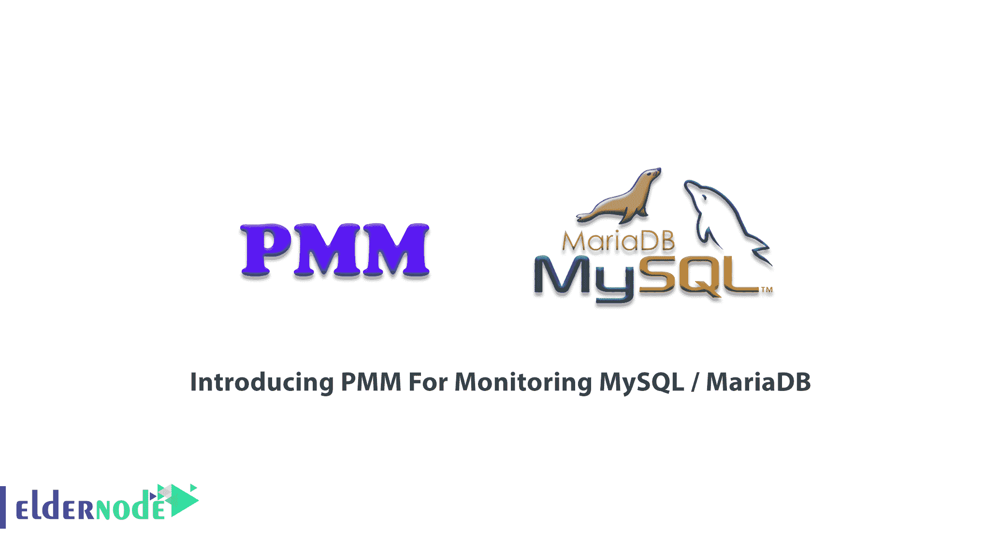
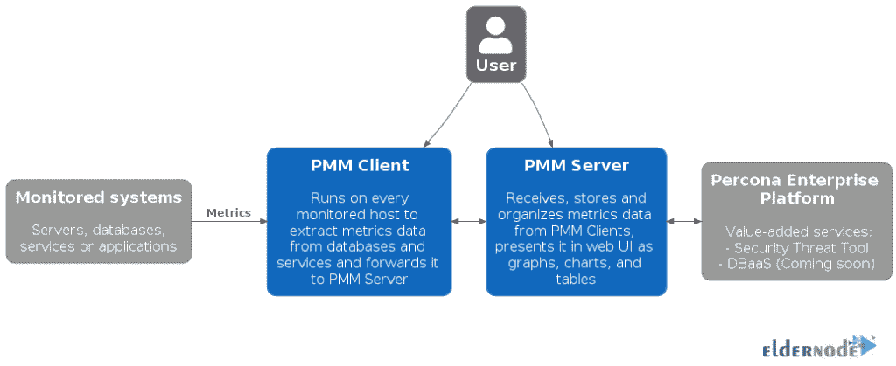
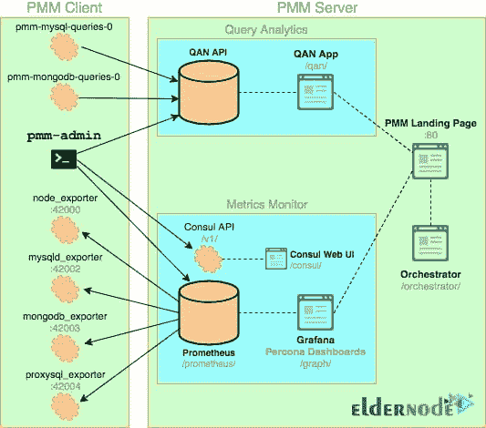
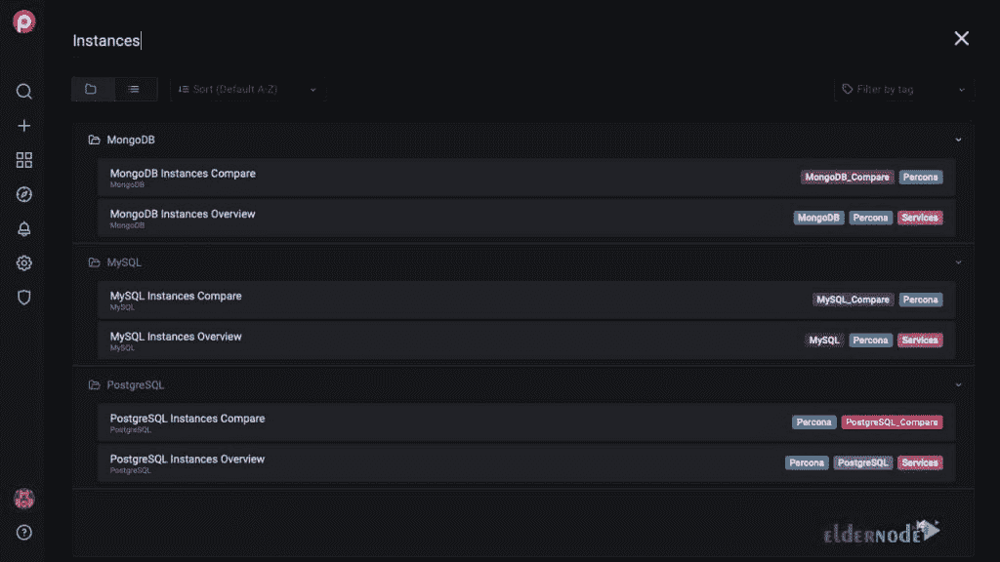
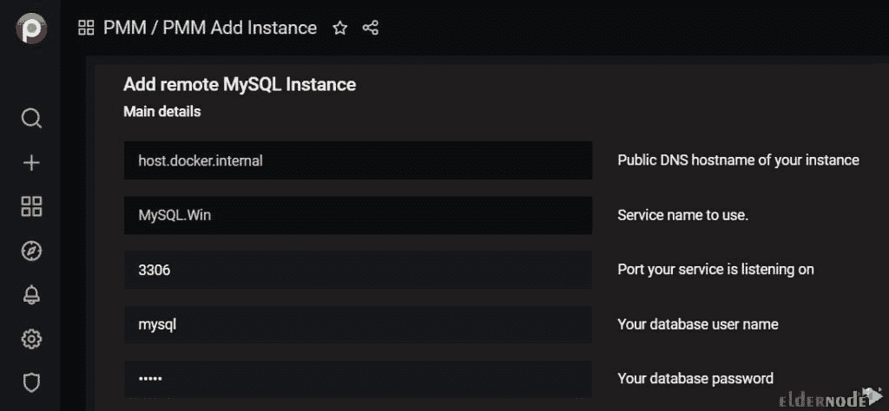

# 介绍用于监控 MySQL / MariaDB - Eldernode 博客的 PMM

> 原文：<https://blog.eldernode.com/pmm-for-monitoring-mysql-mariadb/>



ercona**M**monitoring and**M**management 是一个免费的开源数据库。它被用作 MySQL、PostgreSQL、MongoDB 和 ProxySQL 及其运行的服务器的系统监控工具。使用 **PMM** 可以帮助您提高数据库实例的性能，简化它们的管理，并增强它们的安全性。作为一种流行的监控解决方案，它也是一种高效、快速设置且易于使用的系统监控工具。本文**介绍了用于监控 MySQL / MariaDB** 的 PMM。如果你访问 [Eldernode](https://eldernode.com/) 的可用包，你可以找到你考虑的[VP](https://eldernode.com/vps/)。

## **介绍用于监控 MySQL 的 PMM**

PMM 基于客户机/服务器原理工作，是一个客户机/服务器应用程序，由 Percona 使用自己和第三方开源工具构建。由于 PMM 采用客户机/服务器模型，所以您必须下载并安装客户机和服务器应用程序。如果您只有一台 [MySQL](https://blog.eldernode.com/install-mysql-on-linux-ubuntu-20-04/) 或 [MongoDB](https://blog.eldernode.com/install-mongodb-ubuntu-20/) 服务器，您可以在一台数据库主机上安装并运行服务器和客户端。使用该工具时，您将获得以下能力:

–可视化各种现成的系统性能指标

–跨复杂的多供应商系统拓扑收集和分析数据

–深入了解并发现效率低下的原因

–预测性能问题，解决现有问题

–注意潜在的安全问题并采取补救措施



### **PMM 服务器**

PMM 服务器从客户端接收数据，收集并存储数据，充当 PMM 的心脏。您可以看到，这些指标在仪表板中被绘制成表格、图表和图形，每个都是基于 web 的用户界面的一部分。PMM 服务器包提供 pmm 管理的查询分析、Grafana 和 VictoriaMetrics。

### **PMM 客户端**

当您需要监控任何数据库主机或节点时，您可以使用 PMM 客户端。它将收集服务器指标、一般系统指标和查询分析数据，并将其发送到服务器。PMM 客户端包提供了不同数据库和系统类型的导出器，以及管理工具和代理。

### **PMM 建筑**

PMM 基于客户机-服务器模型，有利于可伸缩性。这里是 **PMM 的建筑**和细节。



### **PMM 功能(PMM 用于监控 MySQL / MariaDB)**

PMM 能够在无法安装 PMM 客户端的情况下监控外部服务。回顾其功能的一些标题。其中一些是最近 2020 年新增的。

1-查询搜索

查询分析中的双十字准线

3-系统信息

4-新的安全威胁工具

5-标签

6-查询分析(QAN)

7-QAN 的新过滤面板

8-从 PMM 清单仪表板中轻松删除服务或节点

### **PMM 优势**

以下是 PMM 最重要的五大好处:

1-始终开放源代码

2-性能和速度

3-混合和云支持

4-导航多数据库

5-简单快捷

### **PMM 劣势**

**在上一节回顾了 PMM 的优势后，我们现在要解决 PMM 的三个最重要的劣势:**

**Grafana 太多**

**2-无法获得 ssh 连接**

**3-困难的文档**

## ****PMM 用于监控 MySQL/Maria db****

**您了解到 PMM 是最好的开源数据库监控解决方案。为了降低复杂性、优化数据库性能并提高业务关键型数据库环境的[安全性](https://blog.eldernode.com/tag/security/)，您可以使用 Percona 监控和管理。它将处理最近的点，而不考虑它们的位置或部署。PMM 还将监控并提供 MySQL 变体的可操作性能数据，包括 MySQL 的 Percona 服务器、Percona XtraDB 集群、Oracle MySQL 社区版、Oracle MySQL 企业版和 [MariaDB](https://blog.eldernode.com/whats-mariadb-how-it-works/) 。PMM 有一个专门的仪表板，显示具体的引擎细节，指标和数据由 PMM 收集。**

**在这里，您可以看到监控 MySQL 实例所需的特权**

```
`GRANT SELECT, PROCESS, SUPER, REPLICATION CLIENT, RELOAD ON *.* TO 'pmm'@'localhost';`
```

### ****如何利用 PMM** 监控 MySQL/Maria db**

**由于 MySQL 数据库软件是大多数企业应用战略的关键部分，您可能需要使用免费和开源的 Percona 软件来优化您的 web 应用程序、数据库服务器。借助 Percona 发行版，即使是要求最苛刻的工作负载，您也将获得更好的性能和并发性。让我们通过本节的步骤来回顾一下 PMM 是如何监控 MySQL 的。以下路径也适用于 PostgreSQL。**

**第一步:**

**进入左侧菜单的**搜索**按钮，搜索**添加实例**。**

****

**第二步:**

**单击 **PMM 添加实例**图标，并选择您希望监控的数据库类型。对于远程 MySQL 数据库，选择添加远程 MySQL 实例选项。最后，添加数据库凭证。**

****

**一旦添加了感兴趣的数据库，就可以检查执行的查询，并查看哪些查询花费的时间最长或者每秒执行的次数最多。**

**结论**

## **在本文中，您回顾了介绍用于监控 MySQL / MariaDB 的 PMM。您可以使用它的仪表板在 Percona Monitoring and management 中获得 MySQL / MariaDB 实例的概述。使用 PMM 有助于您对发生的一切有一个非常完整的视图，允许您选择想要研究的时间间隔，并选择想要单独查看的数据库，从而改善用户体验。**

**In this article, you reviewed Introducing PMM For Monitoring MySQL / MariaDB. You can use its dashboard to get an overview of your MySQL / MariaDB instances in Percona Monitoring and management. Using PMM helps you to have a very complete view of everything that happens, allowing you to select the time interval you want to study and select the database you want to see individually, improving the user experience.**