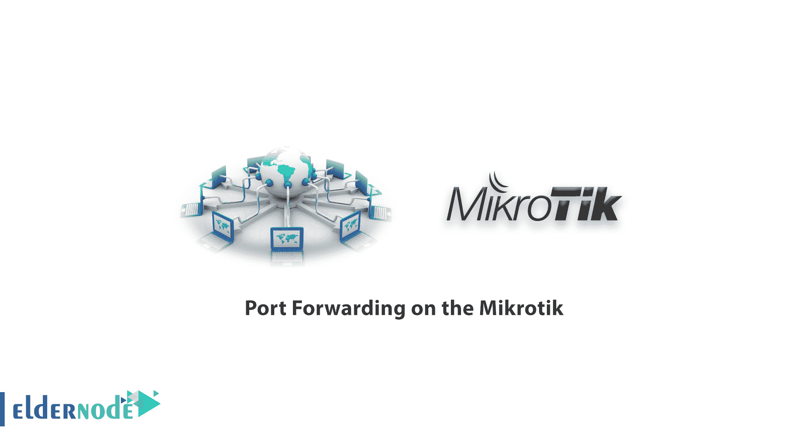
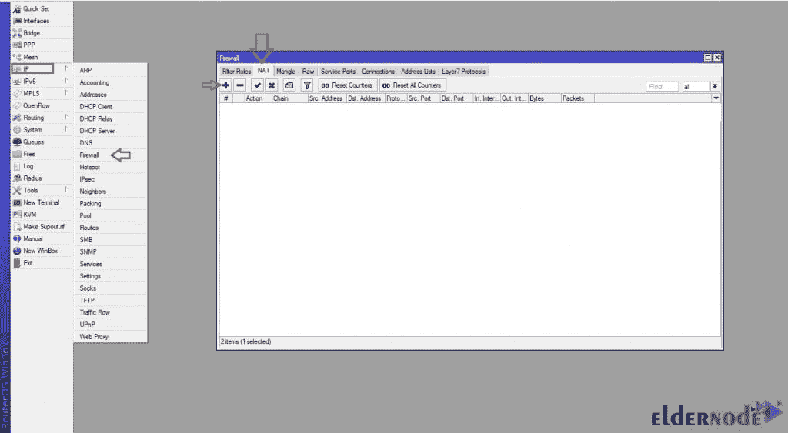
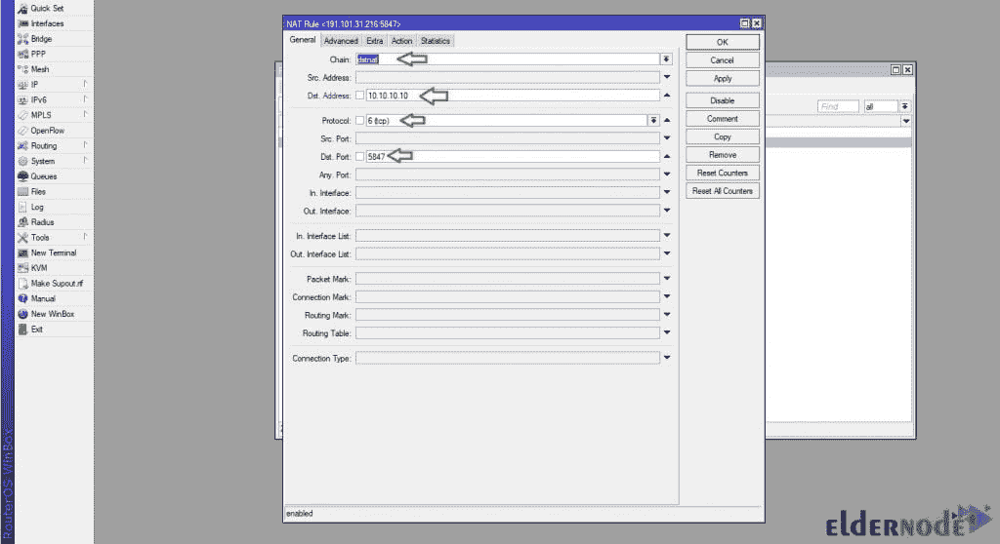
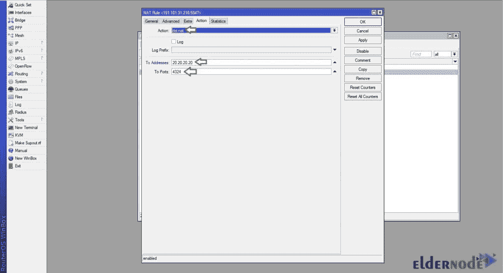

# Mikrotik 上的端口转发[完成] - Mikrotik 服务器| Eldernode 博客

> 原文：<https://blog.eldernode.com/port-forwarding-on-the-mikrotik/>

[更新] Mikrotik 是一款功能强大的路由器，用于提高启动速度以提供自动化性能。它为世界上大多数国家的互联网连接提供硬件和软件。MikroTik 自带复杂的路由器，在网络管理方面具有很高的灵活性。当您在 PC 上安装 RouterOS 时，它会将 PC 变成一个具有所有必要功能的路由器，如路由、防火墙、带宽管理、无线接入点、回程链路、热点网关、VPN 服务器等。在本文中，您将了解 Mikrotik 上的**端口转发。您可以在 [Eldernode](https://eldernode.com/) 上查看可用的 [Mikrotik VPS](https://eldernode.com/mikrotik-vps-server/) 服务器服务，并订购您需要的服务。**

## **mikro tik 路由器上的端口转发教程**

拦截流向计算机 IP/端口组合的数据流量并将其重定向到不同的 IP 和/或端口的过程称为端口转发。使用 [Mikrotik](https://blog.eldernode.com/tag/mikrotik/) 可以帮助你做到这一点。因此，您可以将特定端口分配给网络上的特定服务，以便用户可以通过在他们的软件或浏览器中输入该端口来访问它。例如，您的组织内部有一个端口为 8080 的网站，Mikrotik 作为路由器位于组织的内部网络路径和 Internet 之间。现在，如果您正在考虑将带有端口的 IP 地址或域外包给组织内的软件，您应该使用转发端口。

### **什么是端口转发？**

为了理解端口转发的定义，我们需要先解释一下路由器。如您所知，您的互联网服务提供商会为您的互联网连接分配一个 IP 地址。但是当互联网上的所有电脑都需要一个唯一的 IP 地址时，如果你家里有多台电脑，只有一个地址，该怎么办？端口转发是在路由器中设置的。使互联网上的计算机可以访问您家庭或企业网络上的计算机(即使它们在路由器后面)。所以，你需要做端口转发。在玩游戏、设置[安全](https://blog.eldernode.com/tag/security/)摄像头或下载文件的情况下，你需要遵循这个指示。

## 如何在 MikroTik 上配置端口转发

作为一名 IT 管理员，当你创建一个大型网络时，用户可能会要求远程连接到你的 [VPS 服务器](https://eldernode.com/vps/)或[专用服务器](https://eldernode.com/dedicated-server/)。毫无疑问，出于安全考虑，你不会和他共享服务器 IP。因此，您将在 MikroTik 路由器上使用端口转发来处理所有请求。让我们看看实现这个目的需要哪些步骤。

第一步:

使用 Winbox 以管理员权限登录到您自己的 **MikroTik 服务器**。

第二步:

然后在 **IP** 菜单中点击**防火墙**。

第三步:

从防火墙页面，点击 **NAT** (网络地址转换)选项卡，打开其设置，处理路由器收到的数据包。

第四步:

在 **NAT** 选项卡中，点击 **+** 项创建一条规则。

第五步:

在这一步中，您应该点击“**常规**选项卡。从**链**下拉列表中选择 **dstnat** 。在"**夏令时。地址**字段输入此 IP (10.10.10.10)。从“**协议**列表中，选择连接协议，如(TCP、xdp、ddp)。在“夏令时。端口”字段，类型 5847。

此外，我们假设路由器连接到 IP (10.10.10.10 ),我们希望将来自(10.10.10.10:5847)的所有请求转发到(20.20.20.20:4324)。

然后按如下方式调整设置:

**链** :将该段设置为 dstnat。

**协议** :如果您想只转发特定的协议数据包，请设置协议选项。

**dst 端口** :在此部分，输入您想要访问互联网的端口。

然后转到**动作**选项卡:

**动作** :将该选项设置为 dst-nat。

**至地址** :在此输入贵单位内部服务器的地址。

**至端口** : 输入您要将流量传输到的内部服务器端口。

***注意:*** 您可以输入和输出端口相同，也可以输入端口不同。

第六步:

现在，点击“**动作**选项卡。从“操作”下拉列表中，选择“dst-nat”。在“**至地址**”字段中键入此 IP(20.20.20.20)，并在“至端口”字段中键入 4324。

第七步:

在最后一步，您应该点击**应用**和**确定**来保存和添加规则。

结论

在本文中，您了解了如何在 Mikrotik 上进行端口转发。使用 Mikrotik 可以管理任何与网络相关的事情。遵循上述步骤有助于您在 Mikrotik 上进行端口转发。如果您有兴趣了解更多信息，请参考[如何在 Mikrotik](https://blog.eldernode.com/ip-settings-in-mikrotik/) 中配置 IP 设置。

## Conclusion

In this article, you learned How To Port Forwarding On Mikrotik. Using Mikrotik allows you to manage anything related to networking. Following the mentioned steps helps you to do port forwarding on Mikrotik. If you are interested in reading more, refer to [How to Configure IP settings in Mikrotik](https://blog.eldernode.com/ip-settings-in-mikrotik/).