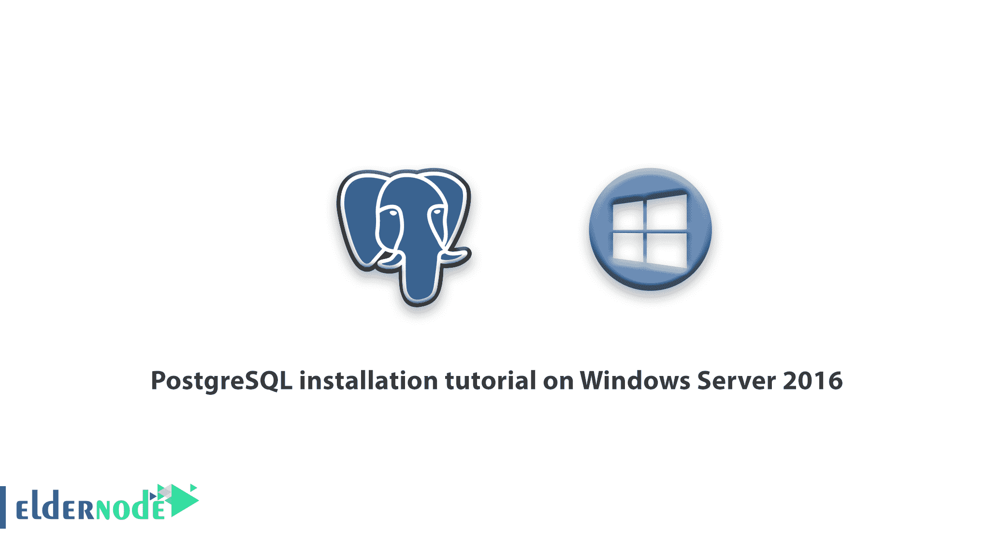
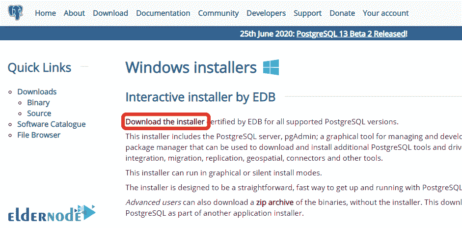
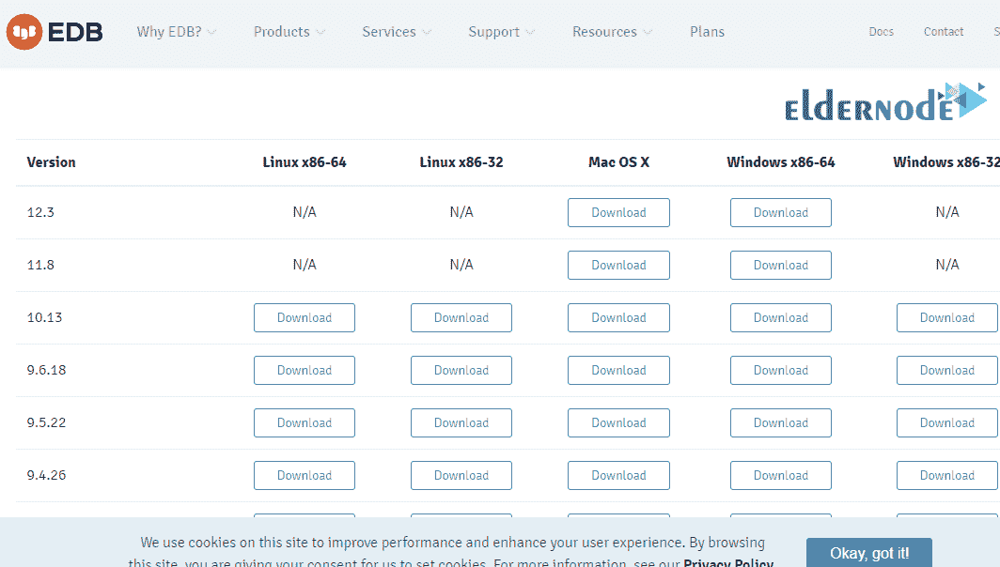
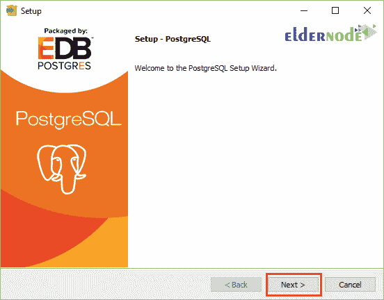
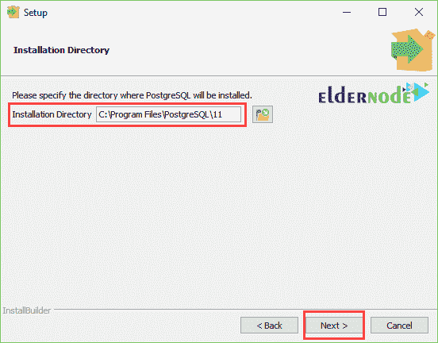
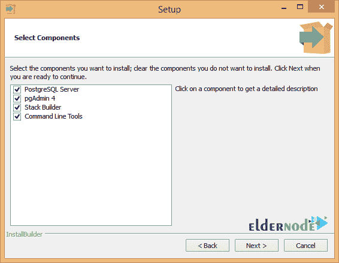
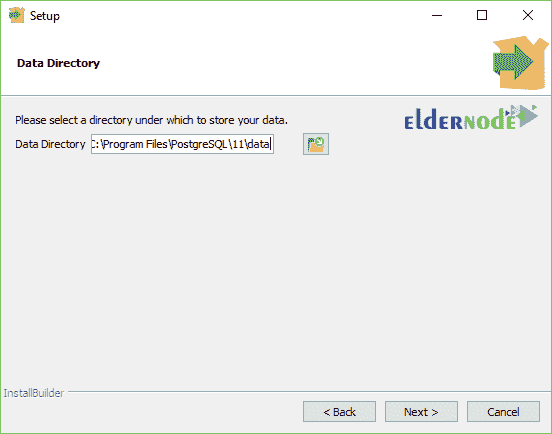
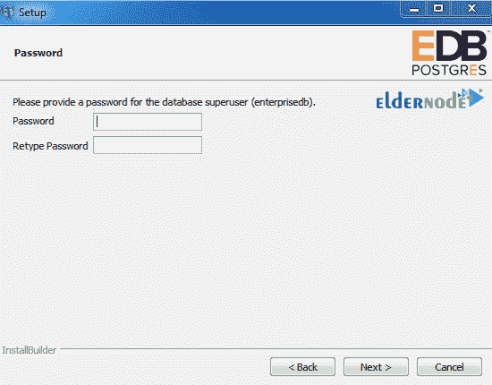
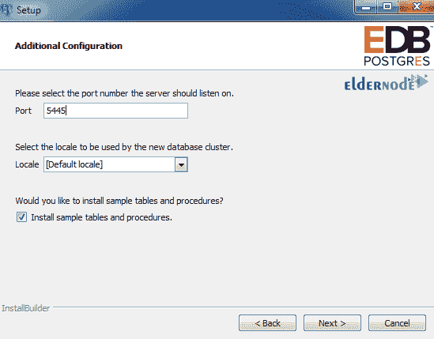
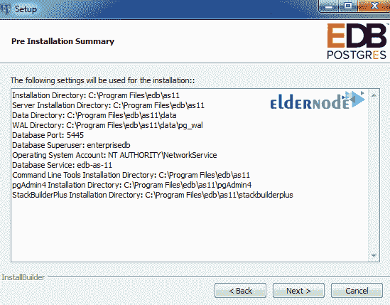

# Windows Server 2016 上的 PostgreSQL 安装教程- Eldernode

> 原文：<https://blog.eldernode.com/postgresql-installation-tutorial/>

Windows Server 2016 上的 PostgreSQL 安装教程。在本文中，我们希望与您一起了解如何在 Windows Server 2016 上安装 PostgreSQL。

PostgreSQL 是什么？

## PostgreSQL 是一个标准的、灵活的数据库，它使用 SQL 语言来分发和描述数据。这个数据库有时被称为 Postgres，由一个同名的团队控制和开发。目前，这个数据库也在小型和大型项目中使用，并且由于它的灵活性和自由性，它吸引了许多爱好者。

PostgreSQL 有各种版本，可以安装在 Windows 、 Linux 甚至 MacOS 上。

加入我们这篇关于如何用 PGadmin 在 Windows Server 2016 上安装 PostgreSQL 的文章。

Windows Server 2016 上的 PostgreSQL 安装教程

### **1-** 首先，进入你的 Windows Server 2016 环境。

**2-** 然后通过以下链接下载 Windows 版的 PostgreSQL 包。

[**下载 PostgreSQL for Windows**](https://www.postgresql.org/download/windows/)

**注意** 点击 PostgreSQL 网站上的下载链接后，会要求您提供 Windows 版本，您必须准确指定 32 位或 64 位操作系统和架构。

**3-** 下载完成后，双击下载的文件开始安装过程。

开始安装过程后，点击下一步的。

**4-** 在此部分，您必须选择 PostgreSQL 存储和安装路径的地址，然后点击下一步。

**5-** 下一步，你要选择想要的组件，点击下一步。

**注意** 如果需要 [pgadmin](https://www.pgadmin.org/) 对 PostgreSQL 进行 web 访问，必须在此阶段选择。

**6-** 在这一步选择好组件后，指定存储数据或数据库的路径，点击下一步。

**7-** 第七步，必须输入超级用户的密码，点击下一步。

**8-** 在此部分，输入 PostgreSQL 通信端口，点击下一步。

**9-** 在最后一部分，选择系统所需的时区，点击下一步。

**注意** : 注意，端口，例如本教程中的 5445，必须在 Windows 防火墙中打开。

如果您需要使用 Windows 防火墙的信息，请学习如何在 Windows 防火墙中打开端口。

> **注意:** 建议您将此选项设置为默认区域设置来设置您窗口的日期和时间。
> 
> **10-** 最后，显示您想要显示的设置摘要。如果确认，点击下一步开始安装过程。

**11-** 复制完文件及其设置后，PostgreSQL 安装完成，可以使用了。

访问 PostgreSQL

要通过开始菜单访问 Pgadmin ，请搜索 Pgadmin，然后点击它。
要访问 Shell 环境，在开始菜单中搜索 SQL Shell 并打开它。

### **尊敬的用户**，我们希望您能喜欢这个[教程](https://eldernode.com/category/tutorial/)，您可以在评论区提出关于本次培训的问题，或者解决[老年人节点培训](https://eldernode.com/blog/)领域的其他问题，请参考[提问页面](https://eldernode.com/ask)部分，并尽快提出您的问题。腾出时间给其他用户和专家来回答你的问题。

Windows Server 2016 上的 PostgreSQL 安装教程

好运。

**同样，参见**

[教程 PostgreSQL 安装 Ubuntu 20.04](https://eldernode.com/tutorial-postgresql-installation-ubuntu-20/)

[教程在 Ubuntu 18.04 上安装使用 PostgreSQL](https://eldernode.com/install-postgresq-ubuntu-18-04/)

**Also, see**

[Tutorial PostgreSQL installation Ubuntu 20.04](https://eldernode.com/tutorial-postgresql-installation-ubuntu-20/)

[Tutorial install and use PostgreSQL on Ubuntu 18.04](https://eldernode.com/install-postgresq-ubuntu-18-04/)