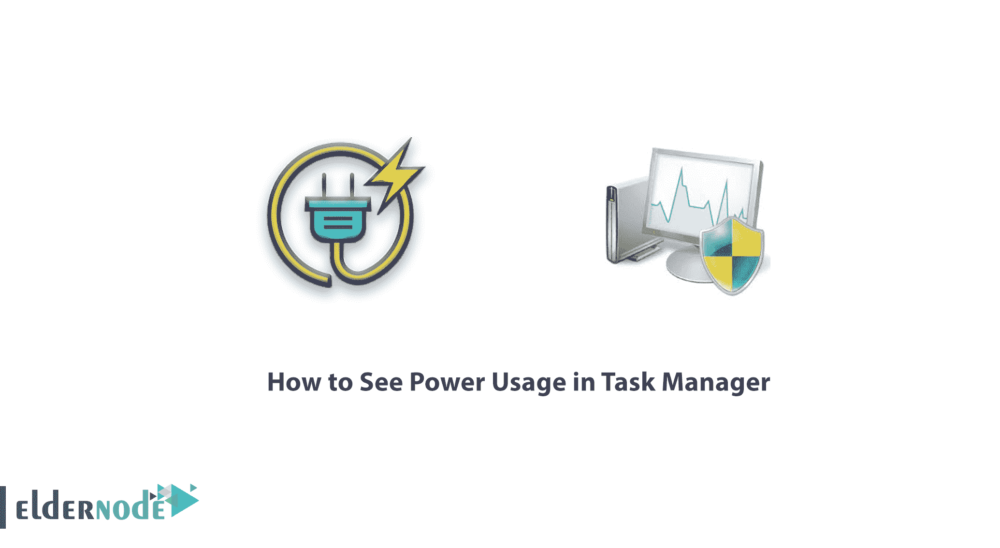
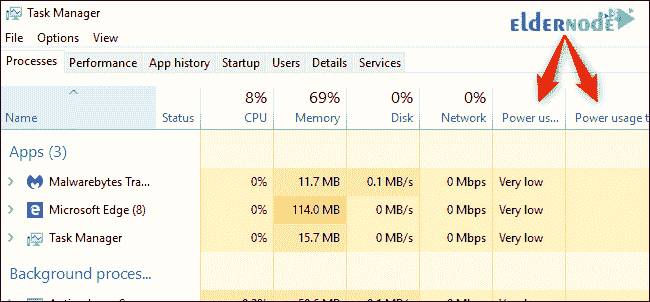
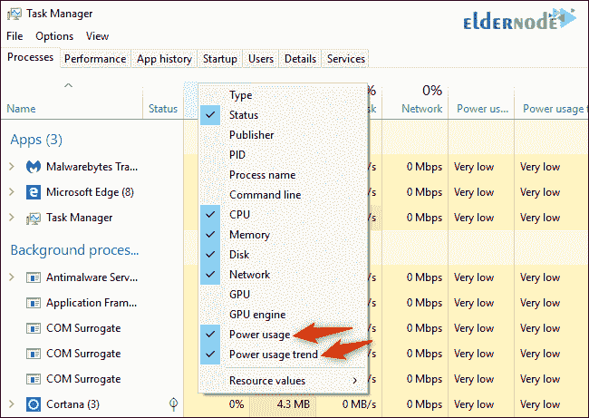
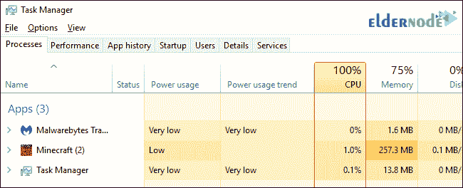
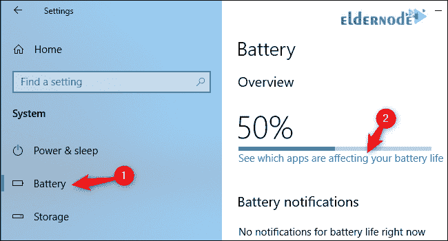
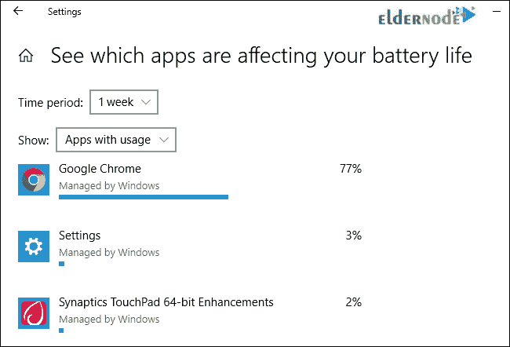

# 如何在任务管理器- ElderNode 博客中查看电源使用情况

> 原文：<https://blog.eldernode.com/power-usage-in-task-manager/>

如何在任务管理器中查看电源使用情况？Windows 10 的一个很酷的功能是通过[任务管理器](https://en.wikipedia.org/wiki/Task_manager)显示每个操作系统进程消耗的能量。

Windows 10 的任务管理器现在可以显示你系统上每个进程的用电量。该功能是【2018 年 10 月更新中的新增功能。

[***在 Eldernode***](https://eldernode.com/vps-hosting/) 买便宜的 VPS 主机

### 教程进程的用电详细信息

**–**通过**右键**你的任务栏打开任务管理器。

**–**选择任务管理器或者按 Ctrl+Shift+Esc 。

**注意:** 如果没有看到完整的任务管理器窗格，点击底部的更多详情。

此信息出现在“进程”窗格中，但被小窗口隐藏了。

通过点击并拖动角上的按钮来放大窗口，直到您看到电源使用和电源使用趋势栏，或者向右滚动。您也可以拖放标题来重新排序列列表。

如果您没有看到这些列，**右键单击此处的标题**并启用用电量和用电量 趋势列。

### 用电量和用电量趋势

用电量栏告诉您此时进程使用了多少电量，而用电量趋势栏则显示了的长期趋势。

**注:** 您可以点击各列，按任一类型用电量排序。

某个进程目前可能并没有使用太多的能量，但是通常可能会使用很多的能量。或者，一个进程可能正在使用大量的能量，但是它倾向于使用非常少的能量。

关注趋势，以便更好地了解一个进程使用了多少功率。

**不幸的是**，Windows 在这里不给你精确的数字。它只是给你一个大概的功耗概念，对于你系统中的大多数进程来说，功耗应该很低。

如果一个进程使用的电量比这个多，特别是当它在后台运行时，你可能想要退出那个进程以节省笔记本电脑或平板电脑的电池电量。

微软还没有解释这里的各种单词的确切含义。

### 如何查看哪些应用程序耗电最多

要查看电脑上哪些应用使用了最多的电池电量，请前往设置 > > 系统 > > 电池。

点击查看哪些应用影响了您的电池寿命选项。

电池部分仅在您使用笔记本电脑、平板电脑或其他带电池的设备时可用。

无论如何，在没有电池的台式电脑上，你不需要查看哪些应用程序耗电最多。

此屏幕显示了对您的电池寿命影响最大的应用程序列表。您可以选择查看最近一周的用电量、 24 小时或 6 小时。

即使一个应用程序接近列表的顶部，它也可能不会消耗太多的电力。这可能只是意味着你经常使用这个应用程序。

例如，无论你使用什么样的网络浏览器，都可能会因为你用得太多而名列前茅。

它使用了大量的电池能量，即使它在很长一段时间内有效地使用了电池能量。

这些新列延续了向任务管理器添加信息的流行趋势。

**注:** 在秋季 Creators 更新中，微软向任务管理器添加了 GPU 使用数据。

**亦作，见:**

[如何在 Windows 10 中启用终极性能电源计划](https://eldernode.com/enable-ultimate-performance-power-plan/)

**尊敬的用户**，我们希望您能喜欢这个[教程](https://eldernode.com/category/tutorial/)，您可以在评论区提出关于本次培训的问题，或者解决[老年人节点培训](https://eldernode.com/blog/)领域的其他问题，请参考[提问页面](https://eldernode.com/ask)部分，并尽快提出您的问题。腾出时间给其他用户和专家来回答你的问题。

好运。