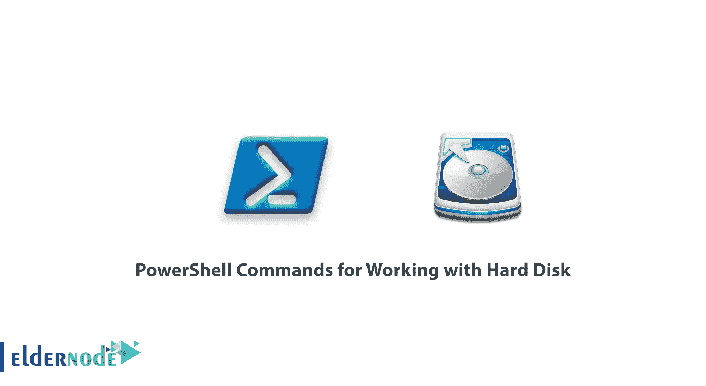
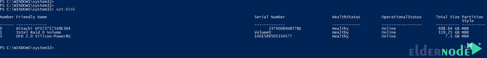
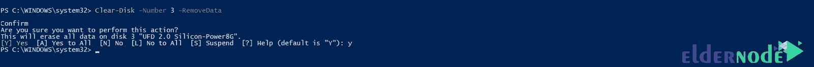
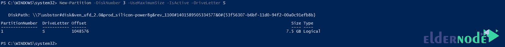
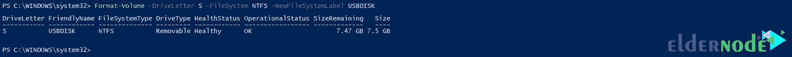

# 用于硬盘的 PowerShell 命令- Windows VPS 服务器

> 原文：<https://blog.eldernode.com/powershell-commands-for-hard-disk/>



使用硬盘的 PowerShell 命令。[用于操作硬盘的 Powershell 命令](https://eldernode.com/tag/powershell-commands/)，与我们在 PowerShell 教程中向您解释的其他 PowerShell 命令一样，具有统一的结构。

在 CMD 中，必须使用 Diskpart 等外部命令才能使用命令提示符内核中没有的命令。但是考虑到 Windows 中 PowerShell 的强大和发展，你将在一个结构中拥有所有可用的命令。

在这篇文章中，我们想让你熟悉 [PowerShell](https://docs.microsoft.com/en-us/powershell/scripting/overview#:~:text=PowerShell%20is%20a%20cross%2Dplatform,NET%20objects.) 操作硬盘的命令，这样你就可以用它来管理和分区所有的存储设备，比如u 盘、硬盘、 SD 卡等。

[**在 Eldernode**](https://eldernode.com/windows-vps/) 选择您的完美 Windows 虚拟专用服务器包

在本文中，为了有用和理解使用硬盘的说明，我们将在一个完整的场景中解释:

**这个场景的各个部分是:**

**1-** 从闪存中删除所有信息并分区

**2-** 重新分配

**3-** 格式化并给它分配一个名称和盘符

## 用于处理硬盘的 PowerShell 命令

**1-** 首先，用管理员权限打开 PowerShell 。

**2-** 然后输入以下命令让获取连接到系统的硬盘信息:

```
Get-Disk
```

正如您在下图中看到的，通过输入上述命令，将为您显示已连接硬盘的完整信息:



**3-** 然后输入以下命令删除所需磁盘上的数据和分区。

```
Clear-Disk -Number 3 -RemoveData
```

通过输入上述命令，您已经指示 PowerShell 选择在 Get-Disk 部分中指定的编号为 3 的磁盘，并删除其所有信息。

执行该命令后，PowerShell 会要求您确认所有数据的删除和所选磁盘分区，您可以通过输入 **Y** 来允许操作。



**4-** 从 flash 中删除所有信息后，我们输入以下命令创建一个新的分区:

```
New-Partition -DiskNumber 3 -UseMaximumSize -IsActive -DriveLetter S
```

上面的命令为磁盘 1 创建一个具有最大大小的分区，并激活它，给它分配字母**T5 ST7。**



**注意:** 如果你打算让你的硬盘或闪存盘变小，只需使用短语 -Size 1GB 而不是 -UseMaximumSize 来创建一个所需大小的分区。请注意，您可以输入硬盘空间范围内的任何容量，而不是 1GB 。

### 制作任意大小隔板的示例

```
New-Partition -DiskNumber 3 -Size 1GB -IsActive -DriveLetter S
```

**5-** 最后，您必须通过输入以下命令格式化创建的分区:

```
Format-Volume -DriveLetter S -FileSystem NTFS - NewFileSystemLabel USBDISK
```

输入上述命令后，flash 名称将被重命名为 USBDISK ，并格式化为 NTFS 文件系统。



这样，通过 Get-Disk 、 Clear-Disk 、 New-Partition 和 Format-Volume 命令，您可以使用 PowerShell 命令完全控制您的硬盘驱动器。

**亦作，见:**

[Windows PowerShell 简介](https://eldernode.com/introduction-to-windows-powershell/)

[了解重要的 PowerShell 命令](https://eldernode.com/important-powershell-commands/)

[如何在 PowerShell 中下载文件](https://eldernode.com/download-files-in-powershell/)

**尊敬的用户**，我们希望您能喜欢这个[教程](https://eldernode.com/category/tutorial/)，您可以在评论区提出关于本次培训的问题，或者解决[老年人节点培训](https://eldernode.com/blog/)领域的其他问题，请参考[提问页面](https://eldernode.com/ask)部分，并尽快提出您的问题。腾出时间给其他用户和专家来回答你的问题。

好运。