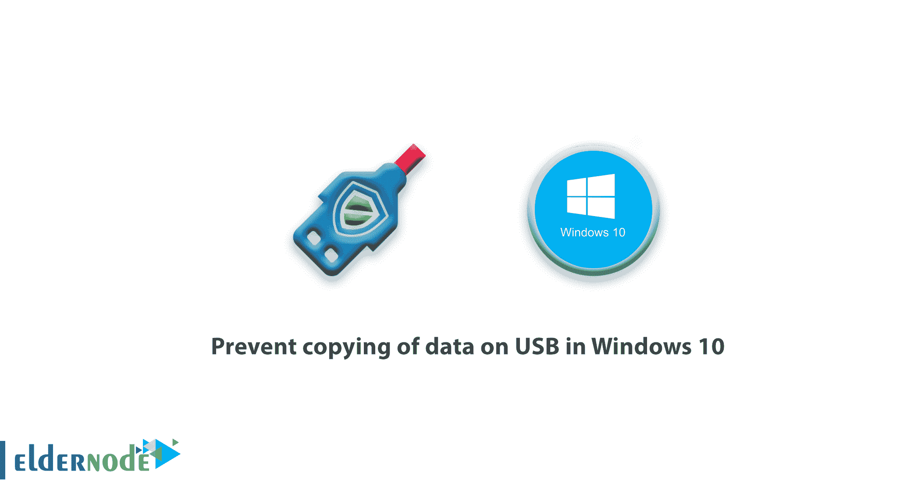
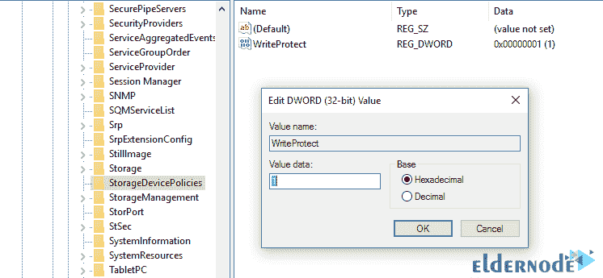
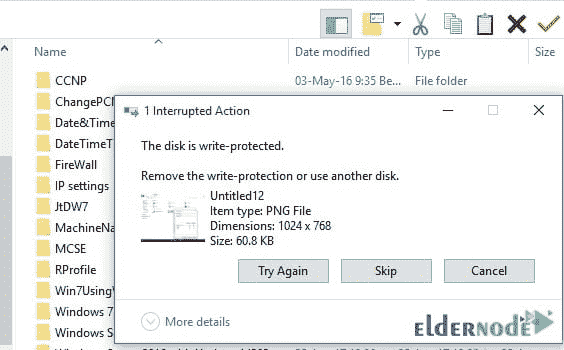

# 防止在 Windows 10 中复制 USB 上的数据- Eldernode

> 原文：<https://blog.eldernode.com/prevent-copying-of-data-on-usb/>

直到现在，硬件形式的信息传输只能通过软盘，最后是光盘来完成。但是随着技术的进步，今天 u 盘在用户手中已经很普及了。由于系统上数据的不安全性，这引起了网络管理员的一些关注。通过这种方式，任何人都可以通过将其闪存连接到 USB 来轻松传输系统硬盘上的信息。为了保护数据安全，我们决定教你如何在 Windows 10 中防止复制 USB 上的数据。

## 在 Windows 10 中防止复制 USB 上的数据

在本[教程](https://eldernode.com/category/tutorial/)中，我们将讨论如何在 Windows 10 操作系统上编辑[注册表](https://support.microsoft.com/en-us/help/4027573/windows-10-open-registry-editor)防止写入，以防止数据被未授权用户复制到 USB。这实际上给 Windows 10 增加了一层安全保障。

### 如何防止 Windows 10 中通过注册表拷贝 USB 上的文件

**1)** 按下 **Windows + R** 键打开运行屏幕。

**2)** 写 **regedit** 。

**3)** 输入以下路径:

***HKEY _ LOCAL _ MACHINE \ SYSTEM \ current Control set \ Control***

**4)** 右击**控制**文件夹，然后选择**新建** > **按键**。

**5)** 将新密钥命名为**存储设备策略**然后按**回车**。

**6)** 选择这个新键，在屏幕右侧点击右键，选择 **New** > **DWORD** (32 位)。

**7)** 将新单词名称设置为**写保护**然后按**回车**。

**8)** 双击新创建的 **DWORD** ，将其值从 0 改为 1。

现在，任何将 USB 连接到您的计算机并试图从计算机复制数据的用户都会遇到一条**写保护**消息。

结论

## 本教程一步步讲解了如何在 Windows 10 中防止通过注册表拷贝 USB 上的文件。

This tutorial explained how to prevent copying files on USB in Windows 10 through the registry step by step.