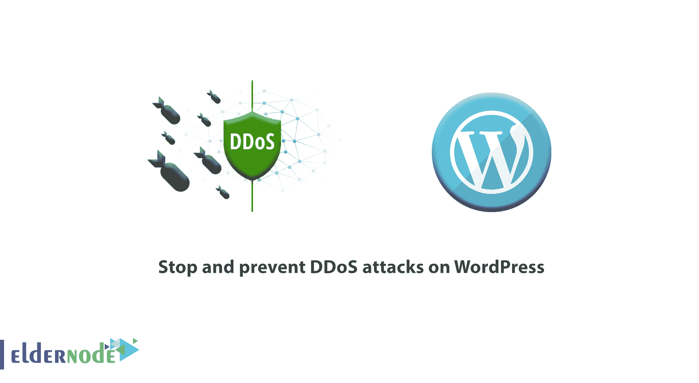
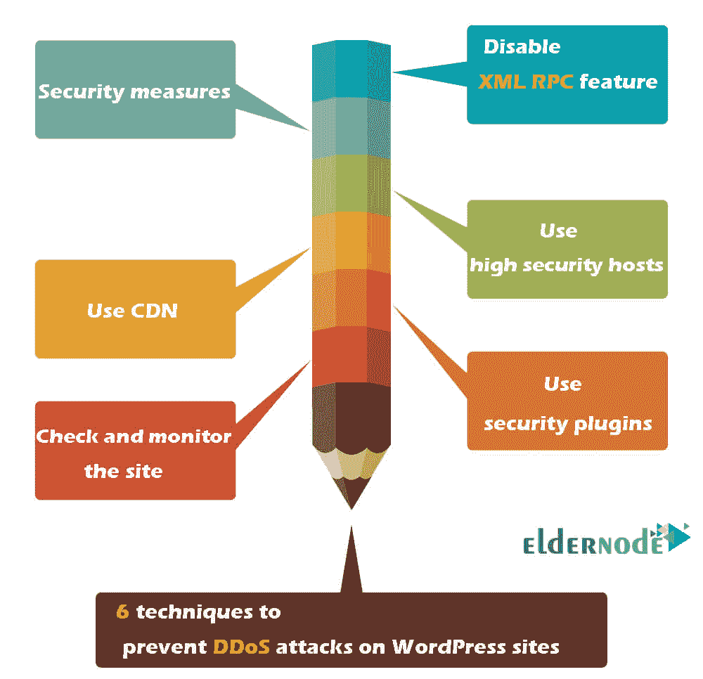
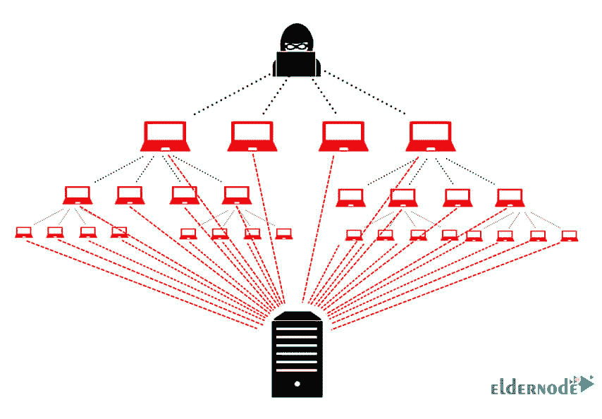
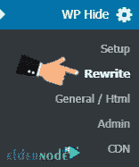
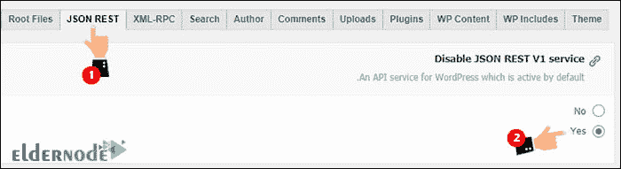
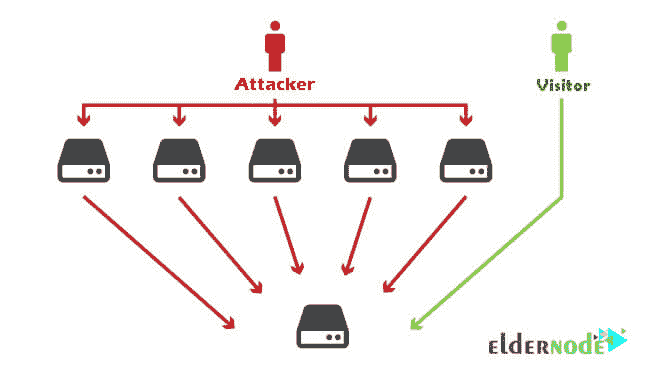
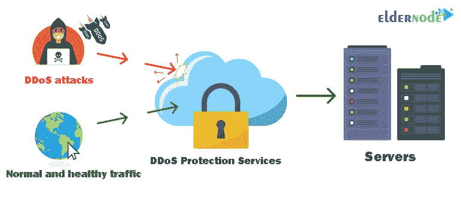
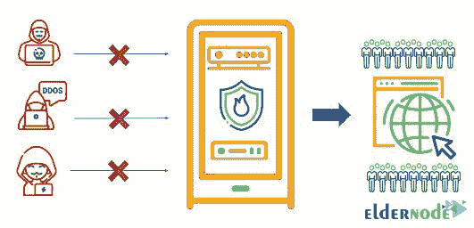

# 教程停止和防止对 WordPress - 6 金钥匙的 DDoS 攻击

> 原文：<https://blog.eldernode.com/prevent-ddos-attacks-on-wordpress/>



在这篇文章中，我们将教你教程**停止和防止 WordPress** 上的 DDoS 攻击。有几种方法可以增加流量并将目标用户导向网站。**例如**，一些人使用电子邮件营销技术，一些人使用社交媒体活动，其他人使用制作有原则的内容从长远来看能够显著增加他们的网站流量。所以你要使用**[WordPress VPS hosting](https://eldernode.com/vps-hosting/)**等强大的托管服务为你提供高带宽。但在此期间，奸商，竞争对手和敌人也可以在互联网上找到谁不想增加您的网站流量。因此，您的站点可能会突然受到攻击。

事实上，成千上万的请求同时被发送到您的站点，并且这些请求将继续，直到服务器不再响应。像这样的失败最终会导致你的网站无法访问。对于许多网站来说，这种情况每天都会发生。因此，如果你不在网站成长之前采取措施应对潜在的风险和攻击，你将无法在强大的在线业务市场中占有一席之地，你将在网站成长之前被摧毁。

***注意:没有办法 100%预防或控制网络攻击！***

在这篇文章中，我们要教你**在 WordPress 中防止 [DDOS 攻击](https://en.wikipedia.org/wiki/Denial-of-service_attack)的 6 个重要技巧**。

DDOS 攻击，和其他网络攻击一样，多少有点**可控**。事实上，这些威胁可以通过一系列的安全措施最小化。



## 如何在 WordPress 上防止 DDoS 攻击

**DDoS 攻击的背后是什么？**然后会发生什么？在你涉足的每一个领域，你都必须熟悉它的危险性。在网络世界表演是一个很大的优势，因为它会增加你的观众。但相反，你的竞争对手会更多，你离网络攻击不远了。所以你需要知道什么是 DDOS ？

在这种类型的攻击中，许多请求被发送到服务器，最终导致服务器停机。这将使受害者网站无法访问。你的网站抵御攻击的能力取决于你采取的安全措施和服务器的能力及其安全设备。

## DDoS 攻击后会发生什么？

后果会因你的网站受到何种网络攻击而异，但所有这些攻击都旨在破坏网站并使其变得脆弱，且带有恶意。

基本上，在 **DDoS 攻击**中，目标是通过发送大量请求并依赖于目标系统来占用带宽。发送这些项目的结果是，服务器由于无法管理和响应流动的流量而停机。

相应地，面对这样的攻击，主机服务提供商必须对攻击者采取行动。如果可能的话，屏蔽区域的 IP 或者屏蔽被攻击的网站，以免危及服务器上的其他网站。

***以下是 WordPress 中防止 DDoS 攻击的 6 个预防性安全措施。***

**注意:** 这些物品必须在攻击前实施。



## 教程阻止和防止对 WordPress 的 DDoS 攻击

### 1- 禁用 WordPress 中的 XML RPC 功能

在 [WordPress](https://eldernode.com/category/wordpress/) 中减少伤害和防止 DDoS 攻击最重要的步骤之一就是**禁用** XML RPC 。

#### WordPress 上的 XML RPC 是什么？

当 WordPress 的 3.5 版本发布时，一个叫做的 XML-RPC 的特性也被公开，以使一些事情变得更容易。另一方面，它降低了安全级别，因为可能有第三方潜伏在您的活动背后。

这个功能对于 pingback 和追踪事物非常有用，但是因为它掩盖了网站的安全性，大多数人更愿意禁用它。

**注意:** 这个功能从 WordPress 3.5 版本开始默认开启。

为了**禁用**该功能，您必须遵循以下步骤:

**1。登录**到您的 Cpanel、 DirectAdmin、或其他控制面板。

**2。**的找到了[。htaccess](https://eldernode.com/htaccess-and-its-applications/) 文件。**右键点击**并选择编辑。

**3。** 然后给它添加下面的代码:

```
# Block WordPress xmlrpc.php requests  <Files xmlrpc.php>  order deny,allow  deny from all  </Files>
```

**4。终于**，保存文件。这将**禁用 WordPress 的 XML-RPC 特性。**

### 禁用 WordPress REST API

为了提高网站的安全性，禁用 REST API 也被认为是明智之举。因为它是个人和网络罪犯未经授权访问的另一个渠道。

禁用 REST API 最简单的方法之一就是使用隐藏&安全增强器 **插件**。这个插件是完全免费的，不需要特殊的设置和配置。

**1。先**，登录到你的 WordPress 仪表盘。

**2。** 启动隐藏&安全增强器插件。

**3。** 在安装和激活插件后，一个名为 WP Hide 的菜单将被添加到你的 WordPress 仪表盘中。点击重写子菜单。



**4。在打开的页面中，点击 JSON Rest 标签页。根据下图，将该选项设置为“是”:**



这将禁用 WordPress REST API 特性。

**注意:** 如果需要，只要再走一遍你走过的路，将你在步骤 4 中禁用的选项设置为 **否** 。



### 2- 安全措施及现场支持

另一种防止 DDoS 攻击的方法是完全外包安全。

由于规模庞大，一些企业将安保工作外包出去。事实上，他们得到了第三方的帮助，并把网站的所有安全问题都留给了这个团队。这样，这个集合将负责支持您的站点和管理更新、漏洞检测、代码检查、可疑活动、攻击控制。这组备份通过在您的站点和恶意活动之间**创建安全层**来防止潜在风险。

备份集合负责的事情包括:

**1。** 限制用户访问

**2。** IP 限制

**3。** 过滤机器人

**4。** 检查安全漏洞

**5。** 调查可疑活动

在这个领域有几套活动，你可以选择其中一套具有成本效益的和适当的计划进行综合审查，并从安全事务方面的高级专家那里获得帮助，以避免可能出现的问题。

### 3- 为你的网站使用高安全性主机

为站点选择合适的主机是非常重要的，因为很大一部分安全性都在站点主机服务器上。

如果你使用**非常低安全的旧服务器**，攻击者渗透你网站的机会就会成倍增加。这个服务器会直接影响你网站的速度和性能。另一方面，安全中的一个关键角色将是你预防和阻止 DDoS 攻击的能力。一个错误的选择会使你的网站非常容易受到网络威胁和攻击。



大多数人在购买主机时关心成本，但不知道其他好处，如安全性。事实上，选择一个安全的主机对一个网站来说是一项有价值的投资。因此，及早检测和处理攻击非常重要。一些提供商使用特殊功能，如硬件防火墙。



### 4- 利用 WordPress 安全插件应对 DDoS 攻击

插件扩展了的功能。WordPress 的核心有很好的安全性，并且每隔一段时间就更新一次，但是在网站旁边放一个安全插件也不是一无是处。

除了简化事情，安全**插件** 加快你的性能，节省你的时间和精力。

在安全插件的应用中，防止 WordPress 中的 DDoS 攻击，并检查可疑的 IP 这是非常明智的，安装一个带有内部用户界面的安全插件，可以通过 WordPress 计数器进行管理，你可以准确地统计你的网站的状态。

***要经常复习的项目中有:***

**—** 登录尝试不成功

**—** 不良网址

**—** 检测意图恶意操作的 IP

**—** 检查现场的卫生状况

**—** 可疑用户行为

**—** 复审请求

### 5- 教程用CDN阻止和防止 WordPress 上的 DDoS 攻击

[CDN](https://eldernode.com/what-is-cdn-content-delivery-network) 是一个内容分发网络，从离用户位置最近的服务器读取站点信息，并发送给访问者。这个功能用来提高性能、速度，有时增加安全性。

Cloudflare 服务也为你的网站增加了一层安全，这将在一定程度上减少 T2 的 DDoS 攻击。虽然这项服务提供各种高级计划，但你可以免费使用其 CDN 全球计划。

**在这篇“教程停止和防止 WordPress 上的 DDoS 攻击”中，我们提到 Cloudflare 是因为这项服务与 WordPress 完全兼容。**

### 6- 对网站的持续审查和监控

说到安全，你需要记住，保护你网站的最好方法是采取预防措施来降低风险，将阻止 WordPress 中 DDoS 攻击的几率降到最低。

这可以通过定期审查网站，密切和全面的监测。持续的审查将增加你对网站现状的了解，并最大限度地降低网站的脆弱性。

你可以通过定期**监控**网站并检查可疑活动来挽救你的网站，以免为时过晚。遭到攻击后，您的网站可能会遭受不可挽回的损失。

***您可以做的活动包括:***

**—**WordPress 内核、插件和模板的定期更新

**—** 正常运行时间监控

**—** 定期备份

**—** 检查现场性能状态和速度

**—** 不断扫描网站，清除恶意软件

## 本文的结论和总结

在这篇教程“*教程阻止并防止 WordPress* 上的 DDoS 攻击”中，我们介绍了 6 个安全提示，可以为你的网站增加良好的安全层:

**1。** 禁用 XMLR RPC 和 REST WordPress API。

**2。** 考虑安全措施。

**3。** 选择云托管或功能强大的安全托管服务。

**4。** 使用 CDN 等安全服务

**5。** 使用 WordPress 安全插件

**6。** 定期对网站进行维护和检查

**亲爱的用户**，我们希望你能喜欢**教程在 WordPress** 上阻止和防止 DDoS 攻击，你可以在评论区询问关于这个培训的问题，或者解决 [Eldernode 博客](https://eldernode.com/blog/)领域的其他问题，请参考提问页面，并尽快提出你的问题。腾出时间给其他用户和专家来回答你的问题。

**好运。**