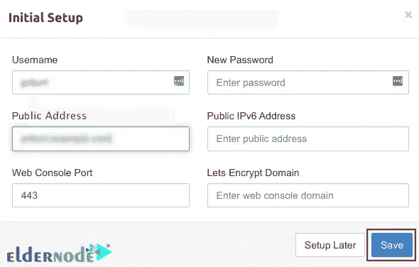
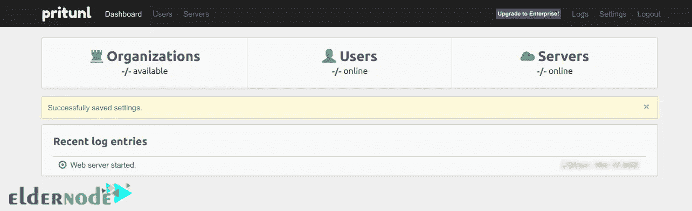
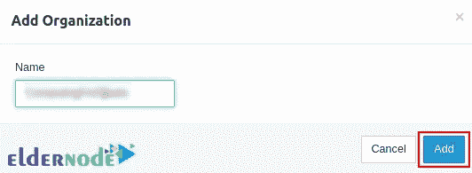
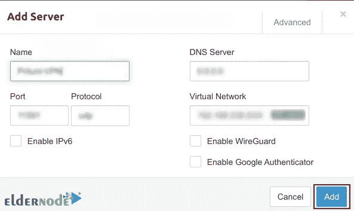
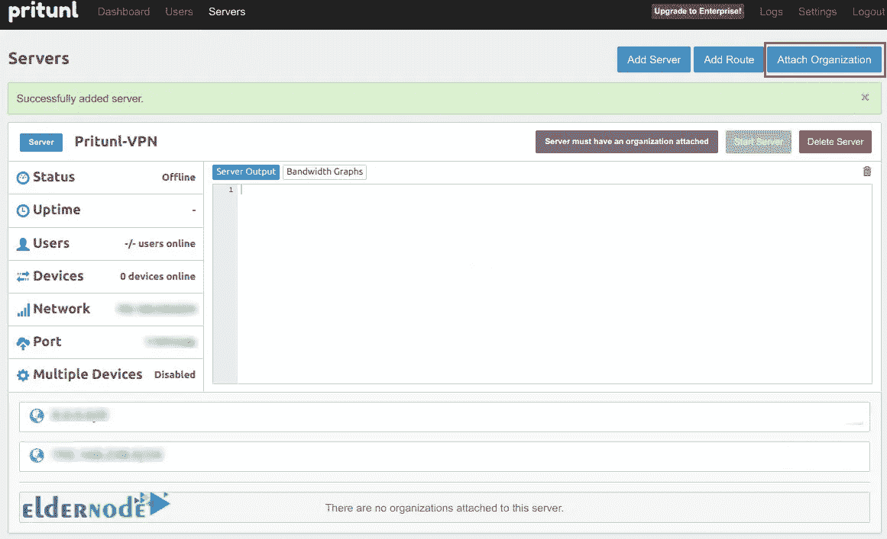
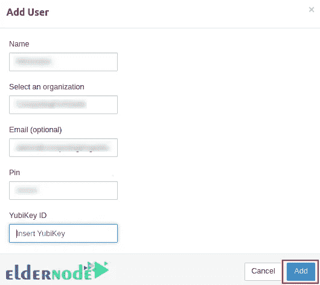

# 在 Debian 11 - Eldernode 上安装和配置 Pritunl VPN 服务器

> 原文：<https://blog.eldernode.com/pritunl-vpn-server-on-debian-11/>


VPN 服务器是一种虚拟服务器，配置为托管并向全球用户提供 VPN 服务。服务器是 VPN 硬件和 VPN 软件的组合，允许用户连接到安全的专用网络。Pritunl 是一个 VPN 服务器。在本文中，我们将解释**如何在 Debian 11** 上安装和配置 Pritunl VPN 服务器。如果你想从 [Eldernode](https://eldernode.com/) 网站上提供的软件包中购买 [**Linux VPS**](https://eldernode.com/linux-vps/) 服务器。

## **如何在 Debian VPS 上安装 Pritunl VPN 服务器**

### **什么是 Pritunl VPN 服务器？**

Pritunl VPN Server 是一款开源的企业 VPN 软件，提供了一个简单且用户友好的 web 界面。这种 VPN 服务器可以创建广泛的云 VPN 网络，可以作为 Aviatrix 和 Pulse 安全解决方案的替代方案。您可以在几分钟内虚拟化数据中心的专用网络。

Pritunl 是世界上最安全的 VPN 服务器之一，客户和服务器之间的所有流量都是加密的。Pritunl 还提供了几层保护，包括 2FA、移动认证、用户 PIN 等等。它提供了一个官方客户端包，并支持大多数设备和操作系统的所有 OpenVPN 客户端。

### **Pritunl 特征**

–支持多云 VPN 对等

–支持 Wireguard 和 OpenVPN 客户端

–配置多达五层身份验证，以提高安全性

–通过 VPC 对等为多云站点到站点链路进行配置

–易于安装、配置和管理

–对数千用户高度可扩展

在这篇来自 [Debian 培训](https://blog.eldernode.com/tag/debian/)系列的文章的续篇中，我们打算一步一步地教你如何在 Debian 11 上安装和配置 Pritunl VPN 服务器。

## **在 Debian 11 上安装 Pritunl VPN 服务器**

首先，作为一个拥有 Sudo 特权的用户或者根用户登录到你的 Debian 机器，然后**更新你的系统**:

```
sudo apt update 
```

```
sudo apt -y full-upgrade
```

现在，您应该检查您的系统是否需要重新启动:

```
[ -f /var/run/reboot-required ]   sudo reboot -f
```

下一步，您需要**添加 MongoDB** 和 **Pritunl 库**。

为此，首先**再次更新您的系统**并安装所需的基本实用程序包:

```
sudo apt update 
```

```
sudo apt install gpg curl gnupg2 software-properties-common apt-transport-https lsb-release ca-certificates
```

现在您应该**将 MongoDB APT 存储库密钥**导入到您的系统中，如下所示:

```
curl -fsSL https://www.mongodb.org/static/pgp/server-5.0.asc 
```

```
sudo gpg --dearmor -o /etc/apt/trusted.gpg.d/mongodb-5.gpg
```

然后使用以下命令**导入 Pritunl VPN GPG 密钥**:

```
sudo apt-key adv --keyserver hkp://keyserver.ubuntu.com --recv 7AE645C0CF8E292A
```

接下来，您可以通过运行以下命令来添加 Pritunl 存储库:

```
echo "deb http://repo.pritunl.com/stable/apt $(lsb_release -cs) main" 
```

```
sudo tee /etc/apt/sources.list.d/pritunl.list
```

向**添加 MongoDB 库**:

```
echo "deb [ arch=amd64,arm64 ] https://repo.mongodb.org/apt/debian buster/mongodb-org/5.0 multiverse" 
```

```
sudo tee /etc/apt/sources.list.d/mongodb-org-5.0.list
```

现在是时候通过运行以下命令来安装 Pritunl 和 Mongo 服务器包了:

```
sudo apt install mongodb-org pritunl
```

然后您可以使用下面的命令**启动 Pritunl 和 MongoDB** :

```
sudo systemctl start pritunl mongod
```

并对**启用**它:

```
sudo systemctl enable pritunl mongod
```

安装过程已成功完成！

### **如何在 Debian 11 上配置 Pritunl VPN 服务器**

在此之前，您应该**通过网络浏览器服务器的 IP 访问 Pritunl 网络控制台**:

```
http://<your_server_ip>
```

然后，您将看到以下页面，询问您设置密钥:


您可以使用以下命令生成安装密钥:

```
sudo pritunl setup-key
```

输入设置密钥和 MongoDB URL 后，您将看到登录 Pritunl 页面。输入您的**用户名**和**密码**，点击**登录**:


如果您想**创建一个默认的用户名和密码**，只需运行以下命令:

```
sudo pritunl default-password
```

登录后，您将看到以下页面，您可以**设置域，让我们加密 SSL** ，更改管理员用户和密码:



现在，您应该配置组织、用户和服务器:



您应该到**用户**部分添加 VPN 用户。点击**添加组织**到**创建新组织**:


然后为自己选择一个名字，点击**添加**:



转到**服务器**部分，点击**添加服务器**到**创建一个 VPN 服务器**。然后在打开的页面上，填写信息，点击添加:



您可以通过点击**连接组织**，然后选择您的组织，将服务器连接到组织:



如果您想**在您的 VPN 服务器上创建一个用户档案**，点击**添加用户**:



请记住，您可以通过点击 web 界面上的**批量添加用户**功能一次添加多个用户。

就是这样！

## 结论

Pritunl 是目前最安全的 VPN 服务器之一，它可以在不同的虚拟专用云网络之间提供可靠的互连。该 VPN 服务器提供多达五层的身份验证。在本文中，我们教你如何在 Debian 11 上安装和配置 Pritunl VPN 服务器。我希望这篇教程对你有用。